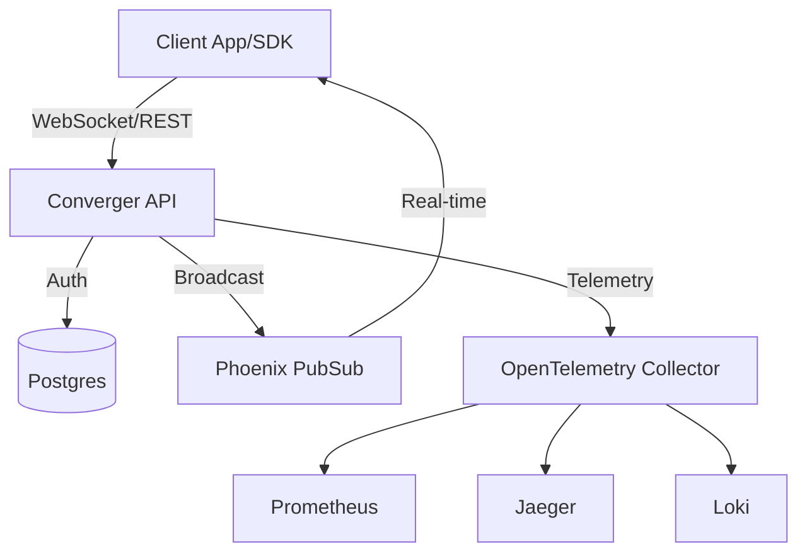

# 🚀 Converger

**Multi-tenant, high-performance real-time messaging backbone.**

Converger is a scalable messaging infrastructure built with **Elixir** and **Phoenix Channels**. It enables applications to create isolated conversations, exchange activities, and stream messages in real-time with ultra-low latency.

---

## ✨ Key Features

- **Multi-tenant by Design**: Full data isolation and tenant-scoped authentication via API Keys.
- **Real-time Engine**: Powered by Phoenix Channels for instant, bidirectional messaging.
- **High Performance**: Validated to handle **5,000+ messages/second** on a single node.
- **Observability Stack**: Built-in support for **OpenTelemetry**, Prometheus, Grafana, Jaeger, and Loki.
- **Reliability & Safety**:
    - **Idempotency**: `x-idempotency-key` support to prevent duplicate activities.
    - **Transaction Safety**: Atomic persistence before real-time broadcast.
    - **Rate Limiting**: Tenant and IP-level throttling.
- **Admin Panel**: IP-restricted LiveView interface for managing tenants, channels, and conversations.

---

## 🛠️ Tech Stack

- **Linguagem/Framework**: [Elixir](https://elixir-lang.org/) / [Phoenix Framework](https://www.phoenixframework.org/)
- **Database**: [PostgreSQL](https://www.postgresql.org/)
- **Background Jobs**: [Oban](https://github.com/soren/oban)
- **Monitoring**: OpenTelemetry, Prometheus, Grafana
- **Traces**: Jaeger
- **Logs**: Loki

---

## 🏎️ Performance Benchmarks

In recent stress tests on a live PostgreSQL database:
- **Simulated Concurrency**: 1,000 concurrent WebSocket sessions.
- **Peak Throughput**: **~5,200 messages/second**.
- **Sustained Load**: Stable **~4,300 msgs/sec** during 100,000 message bursts.
- **Efficiency**: Optimized connection pool management (pool size: 100).

---

## 🚀 Quick Start

### Prerequisites
- Elixir 1.15+
- PostgreSQL 14+
- Docker (optional, for observability stack)

### Installation
1.  **Clone the repository**:
    ```bash
    git clone https://github.com/username/converger.git
    cd converger
    ```
2.  **Install dependencies**:
    ```bash
    mix deps.get
    ```
3.  **Setup the database**:
    ```bash
    mix ecto.setup
    ```
4.  **Start the server**:
    ```bash
    mix phx.server
    ```

The API will be available at `http://localhost:4000`.

---

## 📊 Observability

Converger comes pre-configured with a full observability stack. To launch it:

```bash
docker-compose up -d
```

- **Grafana**: `http://localhost:3000` (Dashboards enabled)
- **Jaeger**: `http://localhost:16686` (Distributed Tracing)
- **Prometheus**: `http://localhost:9090`

---

## 🏗️ Architecture



---

## 📄 License
This project is commercially licensed. See `LICENSE` for details (if applicable).
