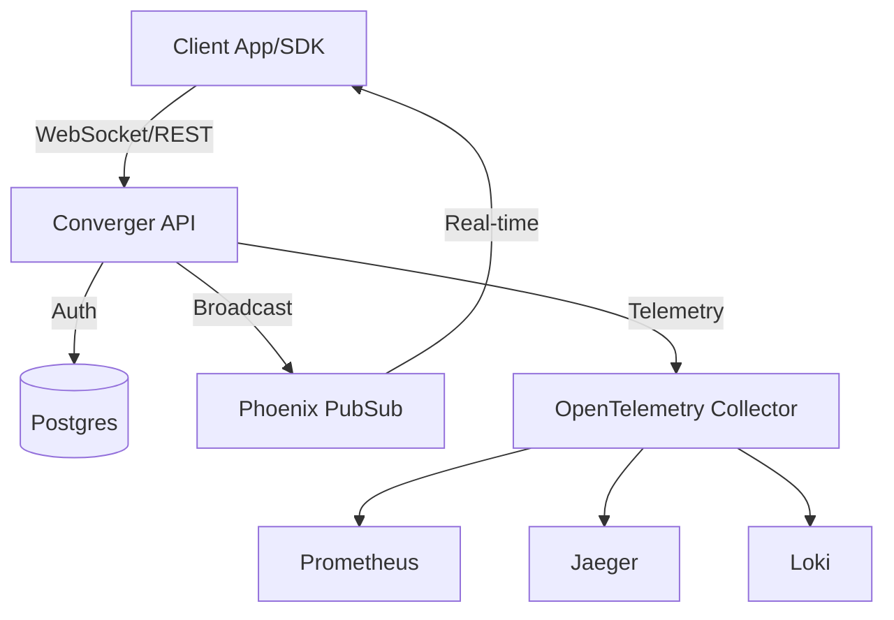

# 🚀 Converger

**Multi-tenant, high-performance real-time messaging backbone.**

Converger is a scalable messaging infrastructure built with **Elixir** and **Phoenix Channels**. It enables applications to create isolated conversations, exchange activities, and stream messages in real-time with ultra-low latency.

## Documentation

Full documentation lives at **[converger.aimtune.dev](https://converger.aimtune.dev)**: getting started, concepts,
architecture, channel adapters, REST and WebSocket APIs, security and operations.

- [Getting started](https://converger.aimtune.dev/getting-started)
- [Architecture decision records (ADR index)](https://converger.aimtune.dev/adr) ([source](docs/adr/index.md))
- [Contributing](https://converger.aimtune.dev/contributing): every PR updates the relevant `docs/` pages and adds an
  ADR for architectural decisions.

The site is built with Docusaurus from [`website/`](website/) and uses [`docs/`](docs/) as its content.

---

## ✨ Key Features

- **Multi-tenant by Design**: Full data isolation and tenant-scoped authentication via API Keys.
- **Real-time Engine**: Powered by Phoenix Channels for instant, bidirectional messaging.
- **High Performance**: Validated to handle **5,000+ messages/second** on a single node.
- **Observability Stack**: Built-in support for **OpenTelemetry**, Prometheus, Grafana, Jaeger, and Loki.
- **Reliability & Safety**:
    - **Idempotency**: `x-idempotency-key` support to prevent duplicate activities.
    - **Transaction Safety**: Atomic persistence before real-time broadcast.
    - **Rate Limiting**: Tenant and IP-level throttling.
- **Admin Panel**: IP-restricted LiveView interface for managing tenants, channels, and conversations.

---

## 🛠️ Tech Stack

- **Linguagem/Framework**: [Elixir](https://elixir-lang.org/) / [Phoenix Framework](https://www.phoenixframework.org/)
- **Database**: [PostgreSQL](https://www.postgresql.org/)
- **Background Jobs**: [Oban](https://github.com/soren/oban)
- **Monitoring**: OpenTelemetry, Prometheus, Grafana
- **Traces**: Jaeger
- **Logs**: Loki

---

## 🏎️ Performance Benchmarks

In recent stress tests on a live PostgreSQL database:
- **Simulated Concurrency**: 1,000 concurrent WebSocket sessions.
- **Peak Throughput**: **~5,200 messages/second**.
- **Sustained Load**: Stable **~4,300 msgs/sec** during 100,000 message bursts.
- **Efficiency**: Optimized connection pool management (pool size: 100).

---

## 🚀 Quick Start

### Prerequisites
- Elixir 1.19 / OTP 28 (see `.tool-versions`; the `Dockerfile` uses the same versions)
- PostgreSQL 14+
- Docker (optional, for observability stack)

### Installation
1.  **Clone the repository**:
    ```bash
    git clone https://github.com/username/converger.git
    cd converger
    ```
2.  **Install dependencies**:
    ```bash
    mix deps.get
    ```
3.  **Setup the database**:
    ```bash
    mix ecto.setup
    ```
4.  **Start the server**:
    ```bash
    mix phx.server
    ```

The API will be available at `http://localhost:4000`.

---

## 🔐 Inbound Webhook Signatures

`POST /api/v1/channels/:id/inbound` and `POST /api/v1/channels/:id/status` verify a signature over the raw request body.

- **Generic (webhook, infobip, ...)**: send `x-converger-signature: t=<unix seconds>,v1=<hex HMAC-SHA256("<t>.<raw body>", channel secret)>`. The timestamp must be within 300 seconds of the server clock (`config :converger, :inbound_signature_tolerance_seconds`).
- **WhatsApp Meta**: Meta's `X-Hub-Signature-256` is verified with the `app_secret` channel config key.
- Each channel has a `require_signature` flag. It defaults to `true` for new channels: unsigned requests and the legacy `sha256=<hex HMAC(raw body)>` format get `401`. Channels created before this flag existed were migrated with `require_signature: false`. They still accept unsigned or legacy-signed requests and log a deprecation warning. An invalid signature always gets `401`.

---

## 📄 Pagination

Every list endpoint and admin table is bounded. Page sizes are set in `config :converger, :pagination` (`config/config.exs`) and can be overridden at runtime with `PAGINATION_DEFAULT_LIMIT`, `PAGINATION_MAX_LIMIT`, `PAGINATION_ACTIVITY_DEFAULT_LIMIT`, `PAGINATION_ACTIVITY_MAX_LIMIT`, `PAGINATION_WS_REPLAY_LIMIT` and `PAGINATION_LOOKUP_LIMIT`. A `limit` above the max is capped. A missing or invalid `limit` uses the default.

| Endpoint | Params | Pagination fields in the response |
|---|---|---|
| `GET /api/v1/converger/conversations/:id/activities` | `watermark`, `limit` (default 100, max 1000) | `watermark`, `has_more` (new) |
| `GET /api/v1/conversations/:id/activities` (tenant API key) | `watermark`, `limit` (default 100, max 1000) | `meta: {watermark, has_more, limit}` (new) |
| `GET /api/v1/conversations` (tenant API key, new) | `cursor`, `limit` (default 50, max 500), `status`, `channel_id` | `meta: {next_cursor, has_more, limit}` |

- Activities are paged by their per-conversation `seq`. The `watermark` is opaque. To read the whole conversation, pass back the `watermark` you received until `has_more` is `false`.
- Conversations are paged newest first with keyset pagination on `(inserted_at, id)`. To get the next page, pass back `next_cursor`. A malformed `cursor` or `watermark` on the tenant API returns `400`. On the Converger API, an invalid watermark starts from the beginning, as it did before.
- **Behaviour change:** before this change, both activity endpoints returned the whole history when no watermark was given. They now return one page. Clients that need everything must follow `has_more`.
- **WebSocket replay on join** is capped at `ws_replay_limit` (100) activities. The Converger channel's replayed `activitySet` frame now carries `has_more`. When it is `true`, fetch the rest over REST from that frame's `watermark` and de-duplicate by activity id against live frames. On the legacy `conversation:*` channel, a `replay_truncated` event (`{has_more, last_activity_id}`) follows a truncated replay. Rejoin with that `last_activity_id` to continue.

---

## 📊 Observability

Converger comes pre-configured with a full observability stack. To launch it:

```bash
cp .env.example .env   # then fill in every secret; compose refuses to start without them
docker compose up -d
```

`mix ecto.setup` (and `bin/converger eval "Converger.Release.seed_admin()"` in a
release) creates the first super admin. Set `ADMIN_EMAIL` / `ADMIN_PASSWORD`, or
a random password is printed once and must be changed at first login.
Production setup, migrations, backups and upgrades are covered in
[docs/deployment.md](docs/deployment.md).

- **Grafana**: `http://localhost:3000` (Dashboards enabled)
- **Jaeger**: `http://localhost:16686` (Distributed Tracing)
- **Prometheus**: `http://localhost:9090`

---

## 🏗️ Architecture


```mermaid
graph TD
    Client[Client App/SDK] -->|WebSocket/REST| API[Converger API]
    API -->|Auth| PG[(Postgres)]
    API -->|Broadcast| PubSub[Phoenix PubSub]
    PubSub -->|Real-time| Client
    API -->|Telemetry| OTEL[OpenTelemetry Collector]
    OTEL --> Prometheus
    OTEL --> Jaeger
    OTEL --> Loki
```

---

## 📄 License
This project is commercially licensed. See `LICENSE` for details (if applicable).
