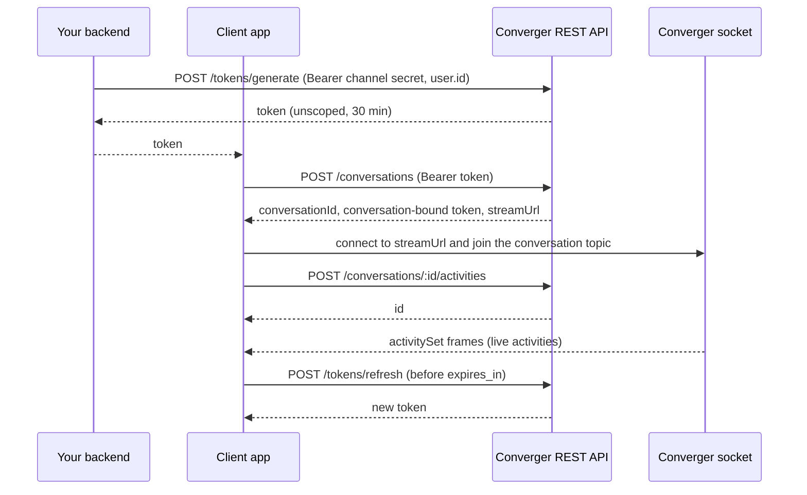

The Converger client API lives under `/api/v1/converger`. End-user clients such as web chat widgets and mobile
apps use it. It is modelled on Bot Framework Direct Line: your backend exchanges a channel secret for a short-lived
token, the client starts a conversation with that token, then posts activities over REST and receives them over the
WebSocket at `streamUrl` (or by polling the activities endpoint with a watermark). Shared conventions (errors, rate
limits, pagination, idempotency, CORS) are in the [overview](overview.md).

Controllers live in [`lib/converger_web/controllers/converger/`](https://github.com/AimTune/converger/tree/main/lib/converger_web/controllers/converger)
(module prefix `ConvergerWeb.ConvergerAPI`). Field names in this API are camelCase (`conversationId`, `channelData`),
unlike the snake_case tenant API.

## Endpoints

| Method | Path | Auth | Purpose |
| --- | --- | --- | --- |
| `POST` | `/api/v1/converger/tokens/generate` | Bearer channel secret | Issue an unscoped or channel-scoped converger token (backend only) |
| `POST` | `/api/v1/converger/tokens/refresh` | Bearer converger token | Exchange a valid token for a fresh one |
| `POST` | `/api/v1/converger/conversations` | Bearer converger token | Start a conversation; returns a conversation-bound token and `streamUrl` |
| `GET` | `/api/v1/converger/conversations/:id` | Bearer converger token | Reconnect: new token and `streamUrl` for an existing conversation |
| `POST` | `/api/v1/converger/conversations/:id/close` | Bearer converger token | Close the conversation |
| `POST` | `/api/v1/converger/conversations/:id/reopen` | Bearer converger token | Reopen the conversation |
| `POST` | `/api/v1/converger/conversations/:conversation_id/activities` | Bearer converger token | Post an activity |
| `GET` | `/api/v1/converger/conversations/:conversation_id/activities` | Bearer converger token | List activities after a watermark |
| `POST` | `/api/v1/converger/conversations/:conversation_id/upload` | Bearer converger token | Upload a file as a new activity (multipart) |
| `GET` | `/api/v1/converger/attachments/:id` | Bearer converger token | Download an uploaded file |

Authentication is described in [client authentication](overview.md#client-authentication-authorization-bearer).
Every token-authenticated route also checks that the token's channel is still `active` (`403` otherwise).

## Flow



### Token scope

| Token | Issued by | Can do |
| --- | --- | --- |
| Unscoped (no `conversation_id` claim) | `tokens/generate`, `tokens/refresh` of an unscoped token | Create conversations. Accepted for any conversation id of the tenant. |
| Channel-scoped (`scope: "channel"`, no `conversation_id`) | `tokens/generate` with `"scope": "channel"`, `tokens/refresh` of a channel-scoped token | Everything an unscoped token can do, plus joining `converger:channel:<channel_id>` on the socket of a `websocket` channel to follow every delivery to it (agent console). See [WebSocket](../websocket.md). |
| Conversation-bound | `POST /conversations`, `GET /conversations/:id`, `tokens/refresh` of a bound token | Only its own conversation: other conversation ids get `403`, attachments of other conversations `404`. |

:::tip
Give end users conversation-bound tokens. An unscoped token is not limited to one conversation, so exchange it for
a conversation-bound one (`POST /conversations`) as early as possible, and do not persist it in the client.
:::

Every token expires after 1800 seconds (`expires_in`). Refresh it with `POST /tokens/refresh` before it expires;
an expired token cannot be refreshed, so the client has to get a new one from your backend.

The examples use:

```bash
export CONVERGER=http://localhost:4000
export CHANNEL_SECRET=...   # backend only
export TOKEN=eyJhbGciOi...  # converger token
export CONV=3f6d1c2e-8a4b-4f1e-9c51-0e6a2b7d9f10
```

## Tokens

### Generate a token

`POST /api/v1/converger/tokens/generate`

Called by **your backend** with the channel secret. Never call it from a browser or app: the secret would leak.

**Rate limit:** `token_generate`, 10 per minute per channel (shared with refresh). See
[rate limiting](overview.md#rate-limiting); raise it per tenant if your traffic needs more.

| Body field | Type | Notes |
| --- | --- | --- |
| `user.id` | string | Optional end-user id, stored as the `user_id` claim and carried through refreshes and conversation tokens. Used for the per-user socket id, so one user can be disconnected individually. |
| `scope` | string | Optional. The only accepted value is `"channel"`: the token gets the `scope: "channel"` claim and may join `converger:channel:<channel_id>` on the client socket (agent console). Conversation tokens minted from it (`POST /conversations`) do not carry the scope. |

```bash
curl -s -X POST "$CONVERGER/api/v1/converger/tokens/generate" \
  -H "authorization: Bearer $CHANNEL_SECRET" \
  -H "content-type: application/json" \
  -d '{"user": {"id": "user-42"}}'
```

`200 OK`:

```json
{ "conversationId": null, "token": "eyJhbGciOiJIUzI1NiIsInR5cCI6IkpXVCJ9...", "expires_in": 1800 }
```

| Status | Body | Cause |
| --- | --- | --- |
| `400` | `{"error": "Token generation requires channel secret, not a token"}` | A converger token was sent instead of the secret |
| `400` | `{"error": "scope must be one of: channel"}` | Unknown `scope` value |
| `401` | `{"error": {"code": "Unauthorized", "message": "Missing or malformed Authorization header"}}` | No `Bearer` header |
| `401` | `{"error": {"code": "Unauthorized", "message": "Invalid or expired token"}}` | Unknown secret, or the channel is inactive |
| `429` | rate limit body | Channel's `token_generate` limit exceeded |

### Refresh a token

`POST /api/v1/converger/tokens/refresh`

Exchanges a still-valid token for a new one with a fresh 1800 s expiry, keeping its `conversation_id` (if any),
`user_id` and `scope`. No body.

```bash
curl -s -X POST "$CONVERGER/api/v1/converger/tokens/refresh" \
  -H "authorization: Bearer $TOKEN"
```

`200 OK`:

```json
{ "conversationId": "3f6d1c2e-8a4b-4f1e-9c51-0e6a2b7d9f10", "token": "eyJhbGciOi...", "expires_in": 1800 }
```

`conversationId` is `null` for an unscoped token. Errors: `401` (invalid or expired token), `403` (channel
inactive), `429` (`token_generate` limit, per channel).

## Conversations

### Start a conversation

`POST /api/v1/converger/conversations`

Creates a conversation on the token's channel, with `metadata: {"source": "converger"}`. The request body is
ignored.

```bash
curl -s -X POST "$CONVERGER/api/v1/converger/conversations" \
  -H "authorization: Bearer $TOKEN"
```

`201 Created`:

```json
{
  "conversationId": "3f6d1c2e-8a4b-4f1e-9c51-0e6a2b7d9f10",
  "token": "eyJhbGciOi...",
  "expires_in": 1800,
  "streamUrl": "ws://localhost:4000/socket/converger/websocket?token=eyJhbGciOi...&conversation_id=3f6d1c2e-8a4b-4f1e-9c51-0e6a2b7d9f10"
}
```

`token` is bound to the new conversation; use it for all further calls. `streamUrl` is the WebSocket URL of the
client socket with the token already in the query string. It is built from the scheme (`wss` for HTTPS requests,
`ws` otherwise), host and port of the request as Phoenix sees it, so behind a reverse proxy that rewrites them you
may need to build the URL yourself. See [WebSocket](../websocket.md) for joining the channel and the frame format.

### Reconnect to a conversation

`GET /api/v1/converger/conversations/:id`

Returns a new conversation-bound token and `streamUrl` for an existing conversation, for example after a page
reload. Pass `watermark` to have it appended to `streamUrl`, so the socket replays what the client missed.

| Query param | Notes |
| --- | --- |
| `watermark` | Optional. The last watermark the client processed. Appended to `streamUrl` verbatim. |

```bash
curl -s "$CONVERGER/api/v1/converger/conversations/$CONV?watermark=c2VxOjQy" \
  -H "authorization: Bearer $TOKEN"
```

`200 OK`:

```json
{
  "conversationId": "3f6d1c2e-8a4b-4f1e-9c51-0e6a2b7d9f10",
  "token": "eyJhbGciOi...",
  "expires_in": 1800,
  "streamUrl": "ws://localhost:4000/socket/converger/websocket?token=eyJhbGciOi...&conversation_id=3f6d1c2e-8a4b-4f1e-9c51-0e6a2b7d9f10&watermark=c2VxOjQy"
}
```

The conversation's status is not checked here: a closed conversation can still be reconnected to and read.

| Status | Body | Cause |
| --- | --- | --- |
| `403` | `{"errors": {"detail": "Forbidden"}}` | Token bound to another conversation |
| `404` | `{"errors": {"detail": "Not Found"}}` | Unknown conversation, or one of another tenant |

### Close and reopen

`POST /api/v1/converger/conversations/:id/close`
`POST /api/v1/converger/conversations/:id/reopen`

Same semantics as the [tenant API](tenant-api.md#close-and-reopen): idempotent, and a real transition appends a
`conversationUpdate` activity from `system` that connected clients receive. A closed conversation rejects new
activities and uploads with `409` until it is reopened
([ADR-0017](../adr/0017-conversation-lifecycle-enforced-under-the-seq-lock.md)).

```bash
curl -s -X POST "$CONVERGER/api/v1/converger/conversations/$CONV/close" \
  -H "authorization: Bearer $TOKEN"
```

`200 OK`:

```json
{ "conversationId": "3f6d1c2e-8a4b-4f1e-9c51-0e6a2b7d9f10", "status": "closed" }
```

Errors: `403` (token bound to another conversation), `404` (unknown or foreign conversation).

## Activities

### Activity shape

[`ConvergerWeb.ConvergerAPI.ActivityJSON`](https://github.com/AimTune/converger/blob/main/lib/converger_web/controllers/converger/activity_json.ex)
derives this shape from the canonical serializer, and the WebSocket `activitySet` frames use the same function, so
REST and socket payloads are identical ([ADR-0004](../adr/0004-single-canonical-activity-serializer.md)):

```json
{
  "id": "a1b2c3d4-e5f6-4a7b-8c9d-0e1f2a3b4c5d",
  "type": "message",
  "from": { "id": "user-42" },
  "text": "Hi, I need help with my order",
  "timestamp": "2026-10-09T12:05:41.004512Z",
  "attachments": [],
  "conversationId": "3f6d1c2e-8a4b-4f1e-9c51-0e6a2b7d9f10",
  "channelData": {}
}
```

| Field | Canonical field |
| --- | --- |
| `from.id` | `sender` |
| `timestamp` | `inserted_at` (server time) |
| `conversationId` | `conversation_id` |
| `channelData` | `metadata` |

`seq` and `idempotency_key` are not included; the position is carried by the watermark instead.

### Post an activity

`POST /api/v1/converger/conversations/:conversation_id/activities`

**Rate limit:** `activity_create`, 100 per second per tenant (shared with the tenant API).

| Header | Notes |
| --- | --- |
| `x-idempotency-key` | Optional. A repeated request with the same key returns the original activity's id and creates nothing. Not allowed by the CORS configuration, see [CORS](overview.md#cors). |

| Body field | Type | Default | Notes |
| --- | --- | --- | --- |
| `type` | string | `message` | `message`, `event`, `typing`, `conversationUpdate`, `endOfConversation` |
| `text` | string | `null` | Up to 65,536 bytes |
| `attachments` | array | `[]` | At most 10 objects, each at most 4,096 bytes as JSON. Use the upload endpoint for files. |
| `channelData` | object | `{}` | Stored as `metadata` (16,384 bytes max). `metadata` is accepted as an alias when `channelData` is absent. |
| `from.id` | string | `"user"` | Stored as the activity's `sender` |

These are the only fields read from the body. The client changeset casts only `type`, `text`, `attachments` and
`metadata`; `tenant_id`, `conversation_id` and the idempotency key come from the token and headers
([ADR-0005](../adr/0005-separate-client-and-system-changesets.md)). `from.id` is a display identity chosen by the
client and is not verified against the token's `user_id`.

```bash
curl -s -X POST "$CONVERGER/api/v1/converger/conversations/$CONV/activities" \
  -H "authorization: Bearer $TOKEN" \
  -H "content-type: application/json" \
  -H "x-idempotency-key: 6c1f0a3e-msg-1" \
  -d '{"type": "message", "from": {"id": "user-42"}, "text": "Hi, I need help with my order", "channelData": {"locale": "en-US"}}'
```

`200 OK` (Direct Line style resource response):

```json
{ "id": "a1b2c3d4-e5f6-4a7b-8c9d-0e1f2a3b4c5d" }
```

The full activity arrives on the socket and in the activities list.

| Status | Body | Cause |
| --- | --- | --- |
| `403` | `{"errors": {"detail": "Forbidden"}}` | Token bound to another conversation |
| `404` | `{"errors": {"detail": "Not Found"}}` | Unknown or foreign conversation |
| `409` | `{"error": "conversation_closed", "detail": "Conversation is closed"}` | Conversation is closed |
| `422` | `{"errors": {"type": ["is invalid"]}}` | Validation failed (type, sizes) |
| `429` | rate limit body | Tenant's `activity_create` limit exceeded |
| `503` | `{"error": "Activity could not be accepted, please retry"}` | Delivery jobs could not be enqueued; nothing stored. Retry with the same idempotency key. |

### List activities

`GET /api/v1/converger/conversations/:conversation_id/activities`

The activities after a watermark, oldest first ([ADR-0006](../adr/0006-per-conversation-seq-and-opaque-watermarks.md)).
Use it to catch up after a reconnect, to fetch what the socket replay did not include, or to poll without a socket.

| Query param | Notes |
| --- | --- |
| `watermark` | The `watermark` of the previous response, or of the last socket `activitySet` frame. Omit to start at the first activity. |
| `limit` | Default `100`, max `1000` |

```bash
curl -s "$CONVERGER/api/v1/converger/conversations/$CONV/activities?watermark=c2VxOjQx&limit=50" \
  -H "authorization: Bearer $TOKEN"
```

`200 OK`:

```json
{
  "activities": [
    {
      "id": "a1b2c3d4-e5f6-4a7b-8c9d-0e1f2a3b4c5d",
      "type": "message",
      "from": { "id": "bot" },
      "text": "Sure, what is your order number?",
      "timestamp": "2026-10-09T12:05:43.118020Z",
      "attachments": [],
      "conversationId": "3f6d1c2e-8a4b-4f1e-9c51-0e6a2b7d9f10",
      "channelData": {}
    }
  ],
  "watermark": "c2VxOjQy",
  "has_more": false
}
```

#### Watermarks

- A watermark is opaque. Today it is URL-safe Base64 without padding of `seq:<n>`, where `n` is the `seq` of the
  last activity in the response (`c2VxOjQy` is `seq:42`). Store it as a string; do not build or parse it.
- To resume, send the watermark back. The response contains activities with a higher `seq` only, so nothing is
  delivered twice and, because `seq` is gap-free and assigned under the conversation lock, nothing is skipped.
- If `has_more` is `true`, call again immediately with the new watermark; otherwise you are caught up.
- An empty page returns the watermark you sent unchanged (`null` if you sent none).
- The socket and REST share the watermark format: on join the socket replays at most `ws_replay_limit` (default 100)
  activities after the watermark in an `activitySet` frame with `has_more`; fetch the rest here starting from that
  frame's watermark.
- Unlike the tenant API, an invalid watermark is not an error here: the list starts at the beginning of the
  conversation. Watermarks issued before `seq` existed (Base64 activity ids) are still accepted.

Errors: `403` (token bound to another conversation), `404` (unknown or foreign conversation).

## Uploads

### Upload a file

`POST /api/v1/converger/conversations/:conversation_id/upload`

Stores a file and creates a `message` activity that references it, in one request. Storage backends (local disk,
S3-compatible, GCS, Azure), CDN and the related environment variables are described in [storage](../storage.md);
the signing design is in [ADR-0007](../adr/0007-attachment-storage-with-hand-written-signing.md).

**Rate limit:** `upload`, 10 per second per tenant.

Send `multipart/form-data` with these parts:

| Part | Required | Notes |
| --- | --- | --- |
| `file` | yes | The file. Its declared content type is ignored. |
| `activity` | no | JSON string (or form map) with optional `type`, `text`, `from.id`, and `channelData` (or `metadata`) for the created activity. Invalid JSON is ignored. |

Validation, in [`Converger.Uploads`](https://github.com/AimTune/converger/blob/main/lib/converger/uploads.ex):

| Check | Default | Configuration |
| --- | --- | --- |
| Conversation is open | | Checked before the file is stored |
| Size | 10 MB (10,485,760 bytes) | `UPLOAD_MAX_BYTES` / `max_file_size`. The multipart body as a whole may be at most this plus 1 MB. |
| Type | Sniffed from the bytes, then checked against the allowlist | `UPLOAD_ALLOWED_TYPES` / `allowed_content_types`; a tenant's `allowed_upload_types` replaces the global list for that tenant |

Default allowlist: `image/png`, `image/jpeg`, `image/gif`, `image/webp`, `application/pdf`, `video/mp4`,
`video/webm`, `video/quicktime`, `audio/mpeg`, `audio/ogg`, `audio/mp4`, `audio/aac`, `audio/wav`, `text/plain`, and
the Office Open XML document, spreadsheet and presentation types. Content that cannot be identified is sniffed as
`application/octet-stream` and rejected. Text is accepted as `text/plain` only when it is valid UTF-8 (an `.html`
file is stored and served as `text/plain`).

```bash
curl -s -X POST "$CONVERGER/api/v1/converger/conversations/$CONV/upload" \
  -H "authorization: Bearer $TOKEN" \
  -F "file=@receipt.png" \
  -F 'activity={"text": "Here is my receipt", "from": {"id": "user-42"}}'
```

`200 OK`:

```json
{
  "id": "e4d3c2b1-a0f9-4e8d-9c7b-6a5f4e3d2c1b",
  "attachments": [
    {
      "id": "9a8b7c6d-5e4f-4a3b-8c2d-1e0f9a8b7c6d",
      "contentType": "image/png",
      "contentUrl": "https://chat.example.com/api/v1/converger/attachments/9a8b7c6d-5e4f-4a3b-8c2d-1e0f9a8b7c6d",
      "size": 48213
    }
  ]
}
```

`id` is the created activity. Its `attachments` contain
`{"contentType", "contentUrl", "name", "size"}` (`name` is the sanitized original filename), and its `text`
defaults to `""`. `contentUrl` is built from the endpoint's configured URL (`PHX_HOST` in production), not from the
request.

| Status | Body | Cause |
| --- | --- | --- |
| `400` | `{"error": "Missing file in upload"}` | No `file` part |
| `403` | `{"errors": {"detail": "Forbidden"}}` | Token bound to another conversation |
| `404` | `{"errors": {"detail": "Not Found"}}` | Unknown or foreign conversation |
| `409` | `{"error": "conversation_closed", "detail": "Conversation is closed"}` | Conversation is closed |
| `413` | `{"error": "File too large (max 10.0MB)"}` | File over `max_file_size` |
| `413` | `{"errors": {"detail": "Request Entity Too Large"}}` | Whole multipart body over `max_file_size` + 1 MB |
| `415` | `{"error": "File type application/octet-stream is not allowed"}` | Sniffed type not in the allowlist |
| `422` | `{"errors": {...}}` | The activity failed validation (for example an unknown `type`); the stored file is deleted |
| `429` | rate limit body | Tenant's `upload` limit exceeded |
| `502` | `{"error": "File could not be stored, please retry"}` | Storage backend error |

## Attachments

### Download an attachment

`GET /api/v1/converger/attachments/:id`

Serves a file uploaded through this API. The route does not require `Accept: application/json`, so clients can ask
for `image/*` and similar. It needs the `Authorization` header like every client route, so a plain `img` tag cannot
load it: fetch it with the header (and, for display, create an object URL from the response).

Access is tenant-scoped. An attachment of another tenant, or of another conversation when the token is
conversation-bound, is reported as `404`, as are unknown and malformed ids.

```bash
curl -s -L -o receipt.png "$CONVERGER/api/v1/converger/attachments/9a8b7c6d-5e4f-4a3b-8c2d-1e0f9a8b7c6d" \
  -H "authorization: Bearer $TOKEN"
```

The response depends on the storage backend:

| Backend | Response |
| --- | --- |
| CDN configured | `302 Found`, `location` is a CDN URL (signed where the CDN type supports it), `cache-control: private, no-store` |
| S3-compatible, GCS, Azure | `302 Found`, `location` is a signed storage URL valid for `signed_url_ttl` (default 300 s, `UPLOAD_SIGNED_URL_TTL`), `cache-control: private, no-store` |
| Local disk | `200 OK`, file streamed from the upload directory |
| Backend without signed URLs or local paths | `200 OK`, bytes fetched from storage |

A `200` response carries these headers:

```http
HTTP/1.1 200 OK
content-type: image/png
content-disposition: inline; filename="receipt.png"; filename*=UTF-8''receipt.png
x-content-type-options: nosniff
content-security-policy: default-src 'none'; sandbox
cache-control: private, max-age=300
etag: "<sha256 of the file>"
```

`content-type` is the type sniffed at upload time (with `charset=utf-8` for `text/*`). `content-disposition` is
`inline` for images, video, audio and PDF, and `attachment` for everything else.

The signed URL itself carries no Converger authentication, so with `curl` use `-L` to follow it. Browsers follow
the redirect automatically; for cross-origin storage, the bucket's own CORS settings apply.

| Status | Body | Cause |
| --- | --- | --- |
| `401` | `{"error": {"code": "Unauthorized", ...}}` | Missing or invalid token |
| `403` | `{"error": {"code": "Forbidden", ...}}` | Token's channel inactive |
| `404` | `{"errors": {"detail": "Not Found"}}` | Unknown, malformed, foreign, or missing from storage |
| `502` | `{"error": "Attachment storage unavailable"}` | Storage backend error |

## Closed conversations

| Operation on a closed conversation | Result |
| --- | --- |
| `POST .../activities` | `409 {"error": "conversation_closed", "detail": "Conversation is closed"}` |
| `POST .../upload` | `409`, same body, before anything is stored |
| Same idempotency key as an activity accepted before the close | `200` with the original id |
| `GET .../activities`, `GET /conversations/:id` | Allowed |
| `POST .../reopen` | Reopens; activities are accepted again |
| WebSocket send | Error reply `conversation_closed` (see [WebSocket](../websocket.md)) |

The close itself appears in the activity stream as a `conversationUpdate` activity from `system` with
`channelData.event` set to `conversation_closed` (reason `manual` or `expired`). Conversations close automatically
after 24 hours without activity by default.

## Related

- [REST API overview](overview.md)
- [Tenant API](tenant-api.md)
- [WebSocket](../websocket.md)
- [Storage](../storage.md)
- [Conversations](../concepts/conversations.md), [activities](../concepts/activities.md)
