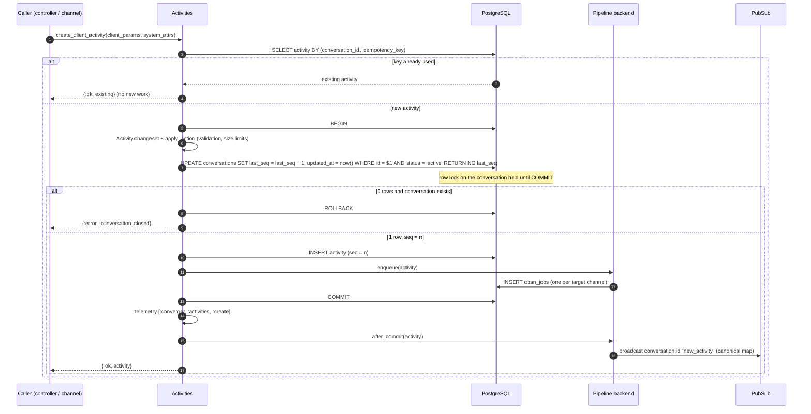
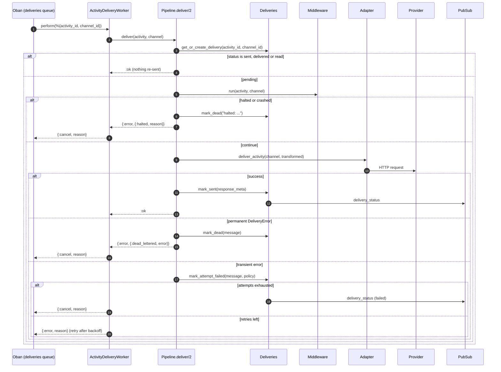

Every message, event or lifecycle change in Converger is an **activity**, and every activity is written through one function: `Converger.Activities.create_activity/2` ([source](https://github.com/AimTune/converger/blob/main/lib/converger/activities.ex)). This page follows one activity from the request that creates it to the delivery record that says it reached the provider, and explains the guarantees at each step.

The short version:

1. The entry point (REST, WebSocket, inbound webhook) splits the input into **client fields** and **system attributes**.
2. One database transaction locks the conversation row, checks that the conversation is open, allocates the next `seq`, inserts the activity and inserts the Oban delivery jobs (transactional outbox).
3. After commit, the canonical activity is broadcast on PubSub.
4. Oban runs `ActivityDeliveryWorker` per target channel: middleware, adapter, delivery record.

## Entry points

All entry points call `Activities.create_client_activity/2`, which keeps only `Activity.client_fields/0` (`type`, `text`, `attachments`, `metadata`, `reply_to_id`) from the untrusted input and merges in server-controlled system attributes (`tenant_id`, `conversation_id`, `sender`, `idempotency_key`). Fields such as `inserted_at` or `seq` in a request body are ignored ([ADR-0005](../adr/0005-separate-client-and-system-changesets.md)).

| Entry point | Module | `sender` | `idempotency_key` |
| --- | --- | --- | --- |
| `POST /api/v1/conversations/:id/activities` (tenant API) | `ConvergerWeb.ActivityController` | `sender` from the body, default `"user"` | `x-idempotency-key` header |
| `POST /api/v1/converger/conversations/:id/activities` (client API) | `ConvergerWeb.ConvergerAPI.ActivityController` | `from.id` from the body, default `"user"` | `x-idempotency-key` header |
| `POST /api/v1/channels/:channel_id/inbound` (provider webhook) | `ConvergerWeb.InboundController` via `Converger.Inbound` | parsed by the adapter (for example the WhatsApp phone number) | the provider message id (for example a WhatsApp `wamid`), if any |
| `postActivity` push on `converger:conversation:<id>` or `converger:channel:<id>`, or a v1 `text` frame pushed as `frame` on a conversation topic (Converger API socket) | `ConvergerWeb.ConvergerChannel`; via `Converger.Inbound` when the token's channel is a `websocket` channel | the token's `user_id` claim, else `from.id` from the payload, else `"user"` | `ws:<sender>:<clientId>` when the payload carries `clientId` (a v1 frame: or a mekik/1 `id` with the clientId syntax) |
| `new_activity` push on `conversation:<id>` (legacy socket, deprecated) | `ConvergerWeb.ConversationChannel` | the token's `sub` claim | `ws:<sender>:<idempotency_key>` when the payload carries `idempotency_key` |
| Close / reopen / expiration | `Converger.Conversations` | `"system"` | none |

Inbound webhooks and client API socket messages both go through [`Converger.Inbound.receive_message/3`](https://github.com/AimTune/converger/blob/main/lib/converger/inbound.ex), which requires the channel's mode to be `inbound` or `duplex` (`{:error, :inbound_not_supported}` otherwise) and checks `Activities.get_activity_by_channel_idempotency_key/2` **before** resolving the conversation, so a provider re-delivery of a message that already created an activity is acknowledged as a duplicate without touching any conversation ([ADR-0015](../adr/0015-per-message-idempotent-inbound-batches.md), [ADR-0016](../adr/0016-participant-based-conversation-resolution.md)).

:::note
The Converger API socket is the single client socket stack ([#23](https://github.com/AimTune/converger/issues/23)). Its `postActivity` event replies `{id, seq, watermark}` on success and `{reason}` on failure (`invalid_activity`, `conversation_closed`, `rate_limited`); see [WebSocket](../websocket.md#6-send-activities-over-the-socket). It also accepts `ack {watermark}`, which marks the deliveries of a `websocket` channel `sent` ([#22](https://github.com/AimTune/converger/issues/22), [ADR-0033](../adr/0033-websocket-channel-adapter-delivery.md)). A v1 `text` frame pushed as the event `frame` is the same send, answered with an `ack` frame (`clientId`, `id`, `seq`, `timestamp`, `duplicate`) or an `error` frame ([#24](https://github.com/AimTune/converger/issues/24), [ADR-0029](../adr/0029-websocket-sends-acked-on-the-phoenix-binding.md)). The legacy socket and its `new_activity` push are deprecated ([migrating from the legacy surfaces](../api/migrating-from-legacy.md)).
:::

## The transaction



Step by step, as implemented in `create_activity/2`:

### 1. Optimistic idempotency check

If both `conversation_id` and `idempotency_key` are present, the activity with that pair is looked up first. If it exists it is returned as `{:ok, activity}` and nothing else happens: no new `seq`, no new jobs, no broadcast. This check runs **outside** the transaction so that the common duplicate case never poisons a transaction with a unique-constraint error.

### 2. Validation

`Activity.changeset/3` validates the type (`message`, `event`, `typing`, `messageReaction`, `messageUpdate`, `messageDelete`, `conversationUpdate`, `endOfConversation`; the internal `deliveryReceipt` only with `internal: true`), the attachments (`Converger.Activities.ActivityAttachment`: `contentType` required) and the size limits (`config :converger, :activity_limits`; defaults: 65,536 bytes of text, 10 attachments, 4,096 bytes per attachment, 16,384 bytes of metadata, measured as JSON). `apply_action(:insert)` runs before any SQL, so an invalid activity never takes the conversation lock.

### 3. Lock, lifecycle check and `seq` allocation in one statement

`next_seq/2` is a single `UPDATE ... RETURNING`:

```sql
UPDATE conversations
SET last_seq = last_seq + 1, updated_at = now()
WHERE id = $1 AND status = 'active'
RETURNING last_seq
```

This one statement does three things ([ADR-0006](../adr/0006-per-conversation-seq-and-opaque-watermarks.md), [ADR-0017](../adr/0017-conversation-lifecycle-enforced-under-the-seq-lock.md)):

- **Serializes writers.** The row lock is held until the transaction commits, so concurrent inserts into one conversation, on any node, are numbered strictly 1, 2, 3, ... A rollback also rolls back the increment, so there are no gaps.
- **Enforces the lifecycle.** If the conversation is closed the `WHERE` matches nothing. The code then checks whether the conversation exists at all: closed returns `{:error, :conversation_closed}` (HTTP `409`, WebSocket reply `conversation_closed`), missing becomes a changeset error on `conversation_id`. Because `close_conversation/2` updates the same row, a concurrent close either commits first (the insert is rejected) or waits for the insert to commit (the activity is kept and the close comes after it).
- **Bumps `updated_at`**, which the expiration worker reads as the conversation's last-activity time.

The `conversationUpdate` activity emitted by close and reopen passes `allow_closed: true`, which drops the `status = 'active'` condition so the "closed" event itself can be written into the closed conversation.

### 4. Insert the activity

The activity is inserted with the allocated `seq`. Two unique indexes protect it: `(conversation_id, seq)` and the partial `(conversation_id, idempotency_key) WHERE idempotency_key IS NOT NULL`. If two requests with the same idempotency key race past step 1, the loser hits the unique index, the transaction rolls back (including its `seq` increment) and `create_activity/2` fetches and returns the winner's activity. Callers see `{:ok, activity}` in both cases.

### 5. Insert the delivery jobs (transactional outbox)

Still inside the transaction, `Converger.Pipeline.enqueue/1` calls the configured backend. With the default `Converger.Pipeline.Oban` backend this:

1. resolves the target channels (`Pipeline.resolve_delivery_channels/1`): the conversation's channel if its adapter has the `:outbound` capability (all five channel types today) and its mode is `outbound` or `duplex`, plus the active, deliverable targets of the routing rules of that channel; minus the participant's own channel when the activity was sent by the participant (no echo back; not applied to a `websocket` channel); and, for lifecycle events, only `webhook` and `websocket` channels;
2. inserts one `ActivityDeliveryWorker` job per channel with args `%{activity_id, channel_id}`.

Because `oban_jobs` lives in the same database, the jobs commit or roll back with the activity ([ADR-0001](../adr/0001-transactional-outbox-with-oban.md)). If any insert fails, `enqueue/1` returns an error, the whole transaction rolls back and the caller gets `{:error, :delivery_enqueue_failed}` (HTTP `503`, "Activity could not be accepted, please retry"). There is never a committed activity without its delivery jobs.

`websocket` channels are deliverable like the other types. Sockets that joined a conversation of its own channel get the after-commit broadcast below; the `websocket` adapter reaches sockets that follow the whole channel or a routed conversation ([Delivery pipeline](delivery-pipeline.md#adapters), [ADR-0033](../adr/0033-websocket-channel-adapter-delivery.md)).

### 6. After commit: broadcast

Only once the transaction has committed does `create_activity/2` emit the `[:converger, :activities, :create]` telemetry event and call `Pipeline.after_commit/1`. For the Oban backend that is just the broadcast:

```elixir
ConvergerWeb.Endpoint.broadcast!(
  "conversation:#{activity.conversation_id}",
  "new_activity",
  Converger.Activities.Serializer.canonical(activity)
)
```

The payload is the single canonical map from `Converger.Activities.Serializer` ([ADR-0004](../adr/0004-single-canonical-activity-serializer.md)): `id`, `type`, `sender`, `text`, `attachments`, `metadata`, `idempotency_key`, `seq`, `reply_to_id`, `edited_at`, `deleted_at`, `conversation_id`, `tenant_id`, `inserted_at`. REST responses, WebSocket frames and webhook payloads are all derived from the same map, so they cannot drift.

Broadcasting after commit means a subscriber never sees an activity that later rolls back. The broadcast is not durable: a client that is not connected (or a node that crashes right after commit) misses it and catches up from the database using `seq` watermarks. See [Real-time](realtime.md).

## Delivery



`Converger.Pipeline.deliver/2` ([source](https://github.com/AimTune/converger/blob/main/lib/converger/pipeline.ex)) is shared by every backend:

1. **Delivery record.** `Deliveries.get_or_create_delivery/2` returns the single `deliveries` row for the activity and channel (unique on `(activity_id, channel_id)`), creating it with `status: "pending"`, `attempts: 0` on the first attempt. If the row is already `sent`, `delivered` or `read`, the attempt returns `:ok` without calling the provider again.
2. **Middleware.** `Pipeline.Middleware.run/2` applies the channel's `transformations` in order. A middleware that returns `{:halt, reason}`, raises or throws halts the chain; the delivery is dead-lettered immediately with `last_error` `"halted: <reason>"` and the job is cancelled ([ADR-0008](../adr/0008-middleware-receives-channel-and-crashes-are-contained.md)).
3. **Adapter.** `Channels.Adapter.deliver_activity/2` dispatches to the adapter for the channel type. `:ok` or `{:ok, response_meta}` marks the delivery `sent` (incrementing `attempts`, storing `sent_at`, merging metadata, and extracting `provider_message_id` from `whatsapp_message_id` / `infobip_message_id` for later receipt correlation). `{:pending, response_meta}` (the `websocket` adapter when no client is connected, or the channel has `require_ack: true`) keeps the delivery `pending`, increments `attempts` and is not retried; `Deliveries.acknowledge/3` marks it `sent` once a client acknowledges or replays it.
4. **Failures.** `{:error, %DeliveryError{retryable?: false}}` dead-letters at once. Any other error counts one failed attempt against the channel's retry policy; the delivery stays `pending` until `attempts` reaches `max_attempts`, then becomes `failed`. Details in [Delivery and retries](../delivery.md).

Every status change of a delivery (`sent`, `failed`, and later provider receipts `delivered` / `read`) is broadcast as `delivery_status` on `conversation:<conversation_id>`.

## Failure semantics

| Failure | Outcome |
| --- | --- |
| Validation error | Nothing is written. REST `422` with field errors; WebSocket reply `invalid_activity` with `errors`. |
| Conversation closed | Nothing is written (the `seq` increment did not happen). REST `409 conversation_closed`; WebSocket reply `conversation_closed`. |
| Job insert fails inside the transaction | The activity insert and the `seq` increment roll back. REST `503`. Retrying is safe with an idempotency key. |
| Node crashes **before** commit | PostgreSQL rolls the transaction back: no activity, no jobs, no `seq` gap. The client got no success response and should retry (with the same idempotency key). |
| Node crashes **after** commit, before the broadcast | The activity and its jobs are committed; deliveries happen as normal. Connected clients miss the live frame and see the activity when they resume from their last watermark. The caller may not have received its response and may retry; with an idempotency key the retry returns the same activity. |
| Client retries without an idempotency key | A second activity with a new `seq` is created. Idempotency is opt-in per request (`x-idempotency-key` on REST, `clientId` on `postActivity`). |
| Concurrent requests with the same idempotency key | Exactly one activity commits; the others roll back and return it. |
| Worker crashes mid-delivery | The job stays `executing` until `Oban.Plugins.Lifeline` rescues it (after 30 minutes) and it runs again. |
| Provider accepted the message but the node crashed before `mark_sent` | The rescued job sends the message again. Delivery to external channels is **at-least-once**; the delivery record (and the provider's own idempotency, where it exists) is the de-duplication point. |
| Delivery retried after it was already marked `sent` | No resend: `deliver/2` short-circuits on `sent`, `delivered` and `read`. |
| `Pipeline.process/1` called again for an activity | No duplicate jobs: `ActivityDeliveryWorker` jobs are unique per `{activity_id, channel_id}` over an infinite period (cancelled and discarded jobs excluded). |

:::warning Non-durable backends
The guarantees in the "after commit" rows hold for the default Oban backend. The Broadway and Inline backends push or deliver **after** commit, so a crash between commit and push loses the delivery. See [Delivery pipeline](delivery-pipeline.md#durability).
:::

### Lifecycle events

`Conversations.close_conversation/2` and `reopen_conversation/2` run a conditional `UPDATE conversations SET status = ... WHERE id = $1 AND status = <from>` and, if a row changed, create a `conversationUpdate` activity with sender `"system"` and metadata `{"event": "conversation_closed" | "conversation_reopened", "status": ..., "reason": ...}`. Both calls are idempotent: a second close returns the conversation unchanged and emits nothing. The status update and the event activity are two separate transactions, so a crash between them leaves the status changed without the event; the failure is logged.

The hourly `ConversationExpirationWorker` closes idle conversations in batches of 500 with the reason `"expired"`, re-checking `status` and `updated_at` in the outer `UPDATE` so that a conversation which received an activity in the meantime is not closed.

## Related

- [Delivery pipeline](delivery-pipeline.md), [Delivery and retries](../delivery.md), [Data model](data-model.md)
- [ADR-0001](../adr/0001-transactional-outbox-with-oban.md), [ADR-0003](../adr/0003-pipeline-is-the-only-delivery-path.md), [ADR-0004](../adr/0004-single-canonical-activity-serializer.md), [ADR-0006](../adr/0006-per-conversation-seq-and-opaque-watermarks.md), [ADR-0017](../adr/0017-conversation-lifecycle-enforced-under-the-seq-lock.md)
