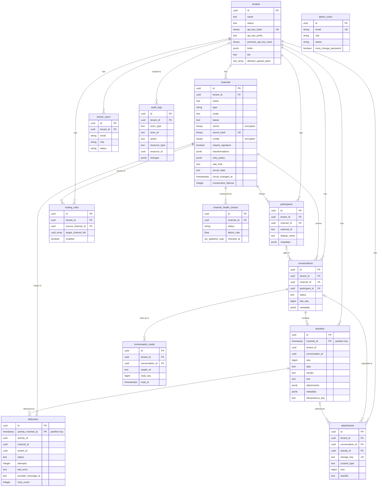

All state lives in one PostgreSQL database, including the Oban job queue. This page describes the schema as it results from the migrations in [`priv/repo/migrations`](https://github.com/AimTune/converger/tree/main/priv/repo/migrations). Primary keys are UUIDs everywhere except `oban_jobs`; most tables use `timestamps(type: :utc_datetime_usec)`. Ecto `:map` columns are `jsonb` in PostgreSQL. The `uuid-ossp` and `pgcrypto` extensions are created by the first schema migration.

## Entity-relationship diagram

`oban_jobs` is not shown: it has no foreign keys to the domain tables. Delivery jobs reference activities and channels only through their JSON `args`.

## Tables

### tenants

The top-level isolation unit. Every domain row carries a `tenant_id` and every API query is scoped by it.

| Column | Type | Notes |
| --- | --- | --- |
| `name`, `status` | text | `status` `"active"` is required for API access. |
| `api_key_hash` | binary, not null, **unique** | SHA-256 of the tenant API key. The plaintext key is never stored. |
| `api_key_prefix` | text | First 4 characters, to recognize a key in the UI. |
| `previous_api_key_hash`, `previous_api_key_expires_at` | binary, timestamp | Grace period for the previous key after a rotation (indexed). |
| `alert_webhook_url` | string | Receives `channel_health_changed` alerts. |
| `limits` | jsonb, not null, default `{}` | Per-tenant rate-limit overrides, e.g. `{"activity_create": {"limit": 200, "scale_ms": 1000}}`. |
| `tier` | text, not null, default `"default"` | Delivery queue tier (`high`, `default`, `bulk`), see [tenant tiers](../delivery.md#tenant-tiers-fair-queueing). |
| `allowed_upload_types` | text[] | Per-tenant MIME allowlist; `NULL` uses the global default. |
| `retention_days` | integer, not null, default `365`, `CHECK > 0` | Activities and deliveries older than this are archived and removed ([Data retention](../operations/retention.md)); at least `RETENTION_MIN_DAYS` (30). |

### channels

A connection to one messaging surface (a webhook, a WhatsApp number, a WebSocket client population).

| Column | Type | Notes |
| --- | --- | --- |
| `type` | string, default `"webhook"` | `echo`, `webhook`, `websocket`, `whatsapp_meta`, `whatsapp_infobip`. |
| `mode` | text, default `"duplex"` | `inbound`, `outbound` or `duplex`. Only `outbound` and `duplex` channels receive deliveries. |
| `status` | text | `"active"` or not. Deactivating disconnects the channel's sockets. |
| `secret` | binary, not null, **encrypted** | Channel secret (Converger API `Bearer` secret, inbound signature key). Cloak `Converger.Encrypted.Binary`. |
| `secret_hash` | binary, not null, **unique** | SHA-256 of the secret, for lookup without decrypting every row. |
| `config` | binary, **encrypted** | Adapter configuration (URLs, provider tokens) as an encrypted JSON map (`Converger.Encrypted.Map`). |
| `require_signature` | boolean, not null | Whether unsigned inbound webhooks are rejected. Default `true` for new channels; channels that existed before the column was added were backfilled with `false`. |
| `transformations` | jsonb, not null, default `[]` | Ordered middleware chain. |
| `retry_policy` | jsonb, not null, default `{}` | Per-channel retry overrides, see [Delivery and retries](../delivery.md). |
| `rate_limit` | text | Outbound rate limit, e.g. `"80/s"`. `NULL` uses the adapter default. |
| `circuit_state` | text, not null, default `"closed"` | Delivery circuit breaker: `closed`, `open`, `half_open`, `paused`. See [circuit breaker](../delivery.md#circuit-breaker). |
| `circuit_changed_at` | utc_datetime_usec | Time of the last breaker transition. |
| `consecutive_failures` | integer, not null, default `0` | Transient delivery failures since the last success. |

Indexes: unique `(tenant_id, name)`, `(mode)`, `(tenant_id, mode, status)`, unique `(secret_hash)`.

### conversations

| Column | Type | Notes |
| --- | --- | --- |
| `tenant_id`, `channel_id` | uuid, not null | Cascade on delete. |
| `participant_id` | uuid, nullable | The external party; `ON DELETE SET NULL`. |
| `status` | text, not null | `"active"` (open) or `"closed"`. |
| `last_seq` | bigint, not null, default `0` | Last allocated activity `seq`. Incremented under the row lock for every activity. |
| `metadata` | jsonb | |
| `updated_at` | timestamp | Bumped on every activity insert; the expiration worker reads it as "last activity". |

Indexes: `(tenant_id)`, `(channel_id)`, `(participant_id, status)` for resolving a participant's open conversation, `(status, updated_at)` for the expiration scan (the **lifecycle index**), and the keyset pagination indexes `(inserted_at, id)` and `(tenant_id, inserted_at, id)`.

### participants

An external party (phone number, chat id, e-mail) on a channel. Inbound messages without a `conversation_id` resolve their conversation through it, and outbound adapters read the recipient from it ([ADR-0016](../adr/0016-participant-based-conversation-resolution.md)).

Columns: `tenant_id`, `channel_id`, `external_id` (not null), `display_name`, `metadata` (jsonb, default `{}`). Indexes: unique `(channel_id, external_id)`, `(tenant_id)`.

### conversation_reads

The read watermark of each WebSocket reader in a conversation: every activity with `seq <= read_seq` has been read by `reader_id` (the connection's participant id: the token's `user_id`, or `anonymous`). Written by `Converger.Receipts.mark_read/3` with an upsert that only ever raises `read_seq`, capped at `conversations.last_seq` ([ADR-0032](../adr/0032-transient-conversation-signals.md)).

Columns: `tenant_id`, `conversation_id` (both cascade on delete), `reader_id` (text, not null), `read_seq` (bigint, not null), `read_at`. Indexes: unique `(conversation_id, reader_id)` (the upsert conflict target), `(tenant_id)`.

### activities

Partitioned by month on `inserted_at` (see [Partitioning and retention](#partitioning-and-retention)); primary key `(id, inserted_at)`.

| Column | Type | Notes |
| --- | --- | --- |
| `tenant_id`, `conversation_id` | uuid, not null | No foreign keys; removed by `PurgeWorker` when the tenant or conversation is deleted. |
| `seq` | bigint, not null | Per-conversation sequence number, strictly increasing and gap-free, assigned by the server ([ADR-0006](../adr/0006-per-conversation-seq-and-opaque-watermarks.md)). |
| `type` | text | `message`, `event`, `typing`, `conversationUpdate`, `endOfConversation` (validated in the changeset). |
| `sender` | text, not null | Set by the server from the authenticated principal or the provider payload. |
| `text` | text | Max 65,536 bytes by default. |
| `attachments` | jsonb, default `[]` | Max 10 entries, 4,096 bytes each (as JSON) by default. |
| `metadata` | jsonb, default `{}` | Max 16,384 bytes (as JSON) by default. |
| `idempotency_key` | text, nullable | From `x-idempotency-key` or the provider message id. |

Indexes and constraints:

| Index | Purpose |
| --- | --- |
| unique `(conversation_id, seq)`, per partition | Ordering, watermark resume and activity keyset pagination (`WHERE conversation_id = $1 AND seq > $2 ORDER BY seq`). A second guard against duplicate `seq` values within a month; across months `seq` is unique by the `last_seq` counter. |
| unique `(conversation_id, idempotency_key) WHERE idempotency_key IS NOT NULL`, per partition | Idempotent creates within a conversation; the race loser rolls back and gets the winner's row. Across months the create path re-checks the key under the conversation lock. |
| `(idempotency_key) WHERE idempotency_key IS NOT NULL` | Lookup of a re-delivered provider message across a channel's conversations before a conversation is resolved ([ADR-0015](../adr/0015-per-message-idempotent-inbound-batches.md)). |
| `(conversation_id, inserted_at)` | Historical ordering (before `seq`). |
| `(tenant_id, id)` | Tenant scoping, per-tenant purge and archive export (also lists a partition's tenants with a loose index scan). |

### deliveries

One row per activity and target channel; the source of truth for delivery state ([Delivery and retries](../delivery.md)). Partitioned by month on `activity_inserted_at`, so a delivery lives in its activity's month; primary key `(id, activity_inserted_at)`.

| Column | Type | Notes |
| --- | --- | --- |
| `activity_id`, `channel_id` | uuid, not null | No foreign keys; removed with the activity, channel or tenant by `PurgeWorker` / `Activities.delete_activity/1`. |
| `tenant_id` | uuid, not null | Copied from the activity on create. |
| `activity_inserted_at` | timestamp, not null | The activity's `inserted_at`, copied on create; the partition key. |
| `status` | text, not null, default `"pending"` | `pending`, `paused` (parked by the circuit breaker or a manual pause), `sent`, `delivered`, `read`, `failed` (dead letter). |
| `attempts` | integer, default `0` | Attempts made; drives the retry policy. |
| `last_error` | text | Last failure message. |
| `sent_at`, `delivered_at`, `read_at` | timestamps | Set on send and on provider receipts. |
| `provider_message_id` | text | Provider id (e.g. a WhatsApp message id) used to correlate receipts. |
| `metadata` | jsonb, default `{}` | Adapter response metadata. |
| `retry_count` | integer, not null, default `0` | Manual replays of the dead letter. |
| `retried_by`, `retried_at` | text, timestamp | Who replayed it last (`"<actor type>:<actor id>"`) and when. |

Indexes: unique `(activity_id, channel_id, activity_inserted_at)` (equivalent to unique `(activity_id, channel_id)`, also serves lookups by activity), `(channel_id)`, `(tenant_id, id)`, `(status)`, partial `(provider_message_id)` and `(channel_id, provider_message_id)` `WHERE provider_message_id IS NOT NULL`, and the keyset indexes `(inserted_at, id)`, `(status, updated_at, id)` and `(channel_id, status, updated_at, id)` (the last two for the dead-letter lists).

### routing_rules

Fan-out from a source channel to additional target channels. Columns: `tenant_id`, `name` (unique per tenant), `source_channel_id` (FK, cascade), `target_channel_ids` (uuid[], not null, default `{}`, no FK, so targets are re-validated at delivery time), `enabled` (default `true`). Timestamps are `utc_datetime` (second precision). Indexes: `(tenant_id)`, `(source_channel_id)`, unique `(tenant_id, name)`.

### attachments

Uploaded files ([storage](../storage.md)). Columns: `tenant_id` (not null), `conversation_id` (cascade), `activity_id` (`ON DELETE SET NULL`), `storage_key` (unique), `content_type`, `size` (bigint), `sha256`, `filename`. Indexes on `tenant_id`, `conversation_id`, `activity_id`.

### audit_logs

Append-only (`updated_at` disabled) trail of administrative changes. Columns: `tenant_id` (nullable, `ON DELETE SET NULL` so the trail outlives the tenant), `actor_type`, `actor_id`, `action`, `resource_type`, `resource_id`, `changes` (jsonb, with secrets redacted, [ADR-0012](../adr/0012-secrets-at-rest-and-audit-redaction.md)). Actions: `create`, `update`, `delete`, `toggle_status`, `toggle_enabled`, `rotate_api_key`, `retry` (dead-letter replay). Resource types: `tenant`, `channel`, `routing_rule`, `admin_user`, `tenant_user`, `delivery`. Indexes: `(tenant_id)`, `(resource_type, resource_id)`, `(actor_type, actor_id)`, `(action)`, `(inserted_at)`, `(inserted_at, id)`. Rows older than 365 days (`AUDIT_LOG_RETENTION_DAYS`, `0` keeps them forever) are pruned daily by `PruneWorker`.

### channel_health_checks

Written by `ChannelHealthWorker` every 5 minutes per active `webhook`, `whatsapp_meta` and `whatsapp_infobip` channel: `status` (`healthy`, `degraded`, `unhealthy`, `unknown`), `total_deliveries`, `failed_deliveries`, `failure_rate`, `checked_at`. Rows older than 7 days (`HEALTH_CHECK_RETENTION_DAYS`) are pruned daily by `PruneWorker`. Indexes: `(channel_id)`, `(channel_id, checked_at)`, `(checked_at)`.

### archive_parts

Manifest of the retention archive ([Data retention](../operations/retention.md)): one row per uploaded JSONL.gz object. Columns: `tenant_id` (no foreign key, the manifest outlives the tenant), `table_name` (`activities` or `deliveries`), `month` (date, first day), `part` (1, 2, ...), `mode` (`detached`: exported from a detached month partition; `deleted`: exported and deleted from a live partition), `object_key` (unique), `row_count`, `byte_size`, `sha256`, `last_id` (export cursor), `verified_at`. Unique `(table_name, tenant_id, month, part)`.

### admin_users and tenant_users

Operator accounts for `/admin` and tenant accounts for `/portal`. Both store a bcrypt `password_hash`, `name`, `role` and `status`. `admin_users.email` is unique; `admin_users.must_change_password` flags an account that must set a new password (cleared when it does, via `/admin/password`). `tenant_users` is unique on `(tenant_id, email)` and also has `(tenant_id)` and `(inserted_at, id)` indexes.

### oban_jobs

Oban's own table, created by `Oban.Migration.up(version: 12)` and upgraded to schema version 14 (required by Oban 2.24). Delivery jobs (`Converger.Workers.ActivityDeliveryWorker`, queue `deliveries`, args `{"activity_id", "channel_id"}`) are inserted in the same transaction as their activity, which is why the queue must live in the application database ([ADR-0001](../adr/0001-transactional-outbox-with-oban.md)). Completed, cancelled and discarded jobs are pruned after 24 hours (`Oban.Plugins.Pruner`); the durable delivery history is the `deliveries` table.

## Encrypted and hashed columns

| Column | Protection | Mechanism |
| --- | --- | --- |
| `channels.secret` | encrypted | Cloak, `Converger.Vault`, AES-256-GCM with a 12-byte IV, key from `CLOAK_KEY` |
| `channels.config` | encrypted | same, JSON-encoded map |
| `channels.secret_hash` | SHA-256 digest | lookup by presented secret |
| `tenants.api_key_hash`, `tenants.previous_api_key_hash` | SHA-256 digest | authentication hashes the presented `x-api-key` |
| `admin_users.password_hash`, `tenant_users.password_hash` | bcrypt | `bcrypt_elixir` |

Each ciphertext is tagged with a fingerprint of the key that produced it, so keys can be rotated: put the old key in `CLOAK_RETIRED_KEYS`, deploy with the new `CLOAK_KEY`, then run `Converger.Release.reencrypt_secrets/0`. The migration that introduced encryption encrypts existing rows in place without needing the vault process. See [security](../security.md) and [ADR-0012](../adr/0012-secrets-at-rest-and-audit-redaction.md).

## Pagination indexes

Every list query is bounded ([ADR-0018](../adr/0018-keyset-pagination.md)):

- **Activities** page by `seq` within a conversation, served by the unique `(conversation_id, seq)` index.
- **Conversations, deliveries, audit logs, tenant users** use keyset pagination on `(inserted_at, id)`, served by the composite indexes added in `20261009180000_add_keyset_pagination_indexes.exs` (built `CONCURRENTLY`, so large tables stay writable during the migration).
- **Dead letters** page on `(updated_at, id)` filtered by `status = 'failed'` (served by the `status` index).

## Partitioning and retention

`activities` and `deliveries` are range partitioned by month ([ADR-0034](../adr/0034-monthly-partitioning-and-per-tenant-retention.md), [#30](https://github.com/AimTune/converger/issues/30)):

| Table | Partition key | Primary key | Partitions |
| --- | --- | --- | --- |
| `activities` | `inserted_at` | `(id, inserted_at)` | `activities_pYYYY_MM` |
| `deliveries` | `activity_inserted_at` | `(id, activity_inserted_at)` | `deliveries_pYYYY_MM` |

- Unique indexes that do not contain the partition key exist **per partition**: `(conversation_id, seq)` and `(conversation_id, idempotency_key)`. Across partitions, `seq` is unique because it comes from the `conversations.last_seq` counter under the row lock, and the create path re-checks the idempotency key in every partition after taking that lock.
- `deliveries (activity_id, channel_id, activity_inserted_at)` is a real unique index on the parent: an activity has one `inserted_at`, so it is equivalent to the old `(activity_id, channel_id)`.
- **No foreign keys** from or to the partitioned tables (the diagram above shows logical relationships). Deleting a tenant, channel or conversation enqueues `Converger.Workers.PurgeWorker`, which deletes the matching activities and deliveries in batches; `attachments.activity_id` is no longer a foreign key either.
- Partitions are created three months ahead (migration, boot, daily job). Expired months are archived to object storage and dropped by the monthly retention job; see [Data retention, partitions and archive](../operations/retention.md).

## Related

- [Activity flow](activity-flow.md), [Delivery and retries](../delivery.md)
- [Migrations](../operations/migrations.md) and [deployment](../deployment.md)
