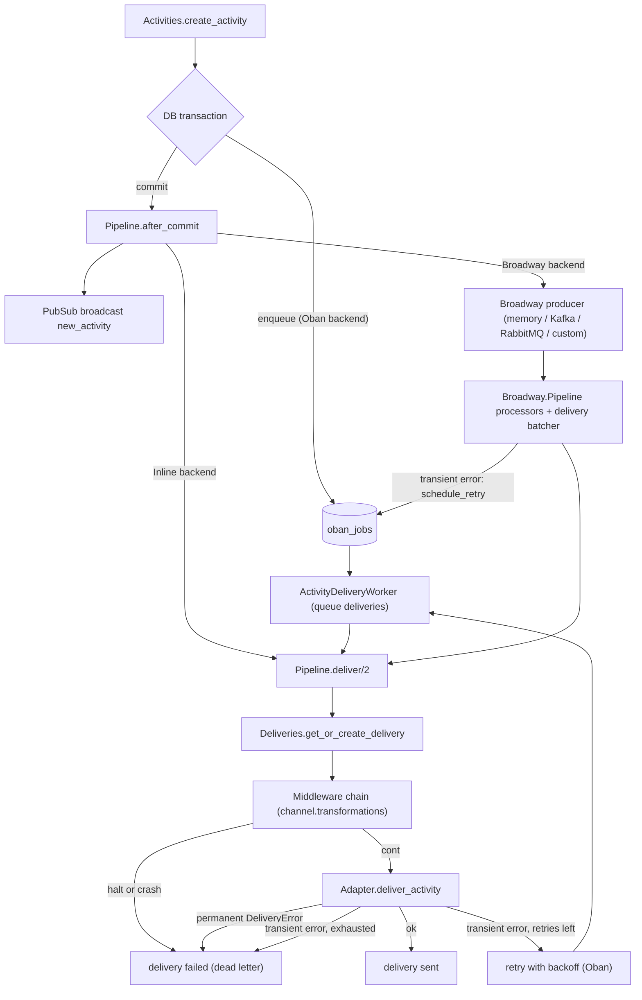

The delivery pipeline takes a committed activity and gets it to every external channel that should receive it. It is the **only** delivery path: REST, WebSocket and inbound activities all go through it, so middleware, delivery tracking, retries and routing-rule fan-out apply uniformly ([ADR-0003](../adr/0003-pipeline-is-the-only-delivery-path.md)).

The entry module is [`Converger.Pipeline`](https://github.com/AimTune/converger/blob/main/lib/converger/pipeline.ex). It defines a behaviour with three callbacks and delegates to the configured backend:

| Callback | When it runs | Purpose |
| --- | --- | --- |
| `enqueue(activity)` | **inside** the transaction that inserts the activity | Durable hand-off. Returning `{:error, reason}` (or raising) rolls the activity back. |
| `after_commit(activity)` | after the transaction committed | PubSub broadcast and any non-transactional work. |
| `child_specs()` | application start | Processes the backend needs supervised (Broadway only). |

## Backends

| Backend | Delivery hand-off | Durable | Intended for |
| --- | --- | --- | --- |
| `Converger.Pipeline.Oban` (default) | Oban jobs inserted in the activity transaction | yes | production |
| `Converger.Pipeline.Broadway` | message pushed to a Broadway producer after commit | no | high-throughput setups that already run Kafka or RabbitMQ, with the caveats below |
| `Converger.Pipeline.Inline` | adapter called synchronously after commit | no | tests and local development |

All three broadcast the canonical activity on `conversation:<id>` after commit and use the same `Pipeline.deliver/2` for the actual delivery, so middleware, delivery records, `DeliveryError` handling and retry policies behave the same.



### Oban (default)

[`Converger.Pipeline.Oban`](https://github.com/AimTune/converger/blob/main/lib/converger/pipeline/oban.ex) resolves the target channels and inserts one `Converger.Workers.ActivityDeliveryWorker` job per channel inside the activity transaction, a transactional outbox ([ADR-0001](../adr/0001-transactional-outbox-with-oban.md)). `after_commit/1` only broadcasts.

The worker ([source](https://github.com/AimTune/converger/blob/main/lib/converger/workers/activity_delivery_worker.ex)):

| Option | Value | Why |
| --- | --- | --- |
| `queue` | per tenant tier | `deliveries_high` (10 per node), `deliveries` (20, also the default) or `deliveries_bulk` (5), chosen from `tenants.tier` at enqueue (`Converger.Pipeline.Oban.queue_for_tier/1`). |
| `priority` | `1` | |
| `max_attempts` | `100` | Only a safety cap. The channel's retry policy decides when to stop, by cancelling the job. |
| `unique` | `[fields: [:worker, :args], keys: [:activity_id, :channel_id], period: :infinity]` | One live job per activity and channel, ever. Cancelled and discarded jobs are not counted, so a dead delivery can be re-enqueued explicitly. |
| `backoff/1` | channel policy or `Retry-After` | See [Delivery and retries](../delivery.md). |

`perform/1` returns `:ok` on success, `{:error, reason}` for a retryable failure (Oban schedules the next attempt) and `{:cancel, reason}` when the delivery was dead-lettered or halted by middleware.

### Broadway

[`Converger.Pipeline.Broadway`](https://github.com/AimTune/converger/blob/main/lib/converger/pipeline/broadway.ex) starts a Broadway pipeline ([`Converger.Pipeline.Broadway.Pipeline`](https://github.com/AimTune/converger/blob/main/lib/converger/pipeline/broadway/pipeline.ex)) under the application supervisor. Its `enqueue/1` does nothing (a broker is outside the database transaction); `after_commit/1` broadcasts, resolves the target channels and pushes one message per channel:

```json
{ "activity_id": "<uuid>", "channel_id": "<uuid>", "channel_type": "webhook" }
```

Processors load the activity and channel and route the message to the `:delivery` batcher, which calls `Pipeline.deliver/2` per message. Processor errors and malformed messages (anything that is not a map with `activity_id` and `channel_id`, or a JSON string decoding to one) are failed and logged by `handle_failed/2`.

**Broadway for throughput, Oban for retries** ([ADR-0002](../adr/0002-broadway-for-throughput-oban-for-retries.md)). Broadway is not used for retries. When a delivery fails transiently, the batcher calls `Pipeline.schedule_retry/3`, which inserts an `ActivityDeliveryWorker` job scheduled after the policy backoff (or the provider's `Retry-After`) and **acks** the Broadway message, since Oban now owns that delivery. From then on retries and dead-lettering are identical to the Oban backend. Only if the hand-off insert itself fails is the Broadway message marked failed. Dead-lettered and halted deliveries are failed in Broadway as well (and recorded as `failed` in `deliveries`).

#### Producers

Selected with `broadway: [producer: ...]`:

| Producer | Broadway producer module | Push module | Extra dependency |
| --- | --- | --- | --- |
| `:memory` (default) | `Converger.Pipeline.Broadway.MemoryProducer` (GenStage, in-process queue) | built in | none |
| `:kafka` | `BroadwayKafka.Producer` with `hosts` (default `[localhost: 9092]`), `group_id` (default `"converger_pipeline"`), `topics` (default `["converger.activities"]`) | `Converger.Pipeline.Broadway.KafkaPush` (`:brod.produce_sync/5`, keyed by `activity_id`, to `topic`, default `"converger.activities"`, client `client_id`, default `:converger_kafka_client`) | `{:broadway_kafka, "~> 0.4"}` and `:brod` |
| `:rabbitmq` | `BroadwayRabbitMQ.Producer` with `queue` (default `"converger.activities"`) and `connection` (default `[host: "localhost"]`) | `Converger.Pipeline.Broadway.RabbitmqPush` (publishes JSON to the default exchange with the queue as routing key) | `{:broadway_rabbitmq, "~> 0.8"}` and `{:amqp, "~> 3.3"}` |
| `:custom` | `custom: [broadway_producer: {Module, opts}]` | `custom: [push_module: Module]`, implementing `Converger.Pipeline.Broadway.PushBehaviour` (`push(message, config)`) | your own |

For Kafka and RabbitMQ you can replace the producer with `broadway_producer: {Mod, opts}` and the push side with `kafka_push_module:` / `rabbitmq_push_module:` under `broadway:`.

:::warning
The Kafka and RabbitMQ client libraries are **not** in `mix.exs`. Using those producers requires adding the dependencies and building your own release. The RabbitMQ push module also opens and closes an AMQP connection per message, which is not suitable for high volume as shipped.
:::

Tuning keys under `broadway:` and their defaults:

| Key | Default | Meaning |
| --- | --- | --- |
| `processor_concurrency` | `10` | Broadway processors |
| `delivery_concurrency` | `5` | delivery batcher processes |
| `delivery_batch_size` | `10` | messages per batch |
| `delivery_batch_timeout` | `1000` | ms before a partial batch is flushed |
| `allow_memory_producer_in_prod` | `false` | see below |

### Inline

[`Converger.Pipeline.Inline`](https://github.com/AimTune/converger/blob/main/lib/converger/pipeline/inline.ex) delivers synchronously in the calling process right after commit (so the HTTP request or socket push waits for the provider). Failures are logged and not retried. It is the backend of the test environment (`config/test.exs`).

## Durability

Only the Oban backend guarantees that every committed activity has its delivery jobs.

- **Broadway** pushes after commit. A crash between commit and push loses the delivery, and the activity is not re-pushed. A broker (Kafka, RabbitMQ) protects the message only once it has been pushed.
- The **memory producer** keeps queued messages in process memory and its `ack/3` is a no-op, so a restart loses everything queued. It refuses to start when `config :converger, env: :prod` unless `allow_memory_producer_in_prod: true` is set (an `ArgumentError` at boot).
- **Inline** has no queue at all: a crash during the request loses the delivery, and a transient provider error is not retried.

`Pipeline.process/1` can re-run an already persisted activity through the pipeline (`enqueue/1` in its own transaction, then `after_commit/1`). With the Oban backend this is safe to call repeatedly because of the unique jobs; note that it also re-broadcasts the activity.

## Selecting a backend

The backend is the `:pipeline` application env, set in [config/config.exs](https://github.com/AimTune/converger/blob/main/config/config.exs) (`pipeline: [backend: Converger.Pipeline.Oban]`) and overridden in [config/test.exs](https://github.com/AimTune/converger/blob/main/config/test.exs) (`Converger.Pipeline.Inline`). There is **no environment variable** for it: `config/runtime.exs` does not read one. To change it, set it in your config files (or add it to your own `runtime.exs`) and build a release:

```elixir
# Default: durable, transactional outbox
config :converger, :pipeline,
  backend: Converger.Pipeline.Oban

# Broadway with Kafka (add broadway_kafka and brod to mix.exs first)
config :converger, :pipeline,
  backend: Converger.Pipeline.Broadway,
  broadway: [
    producer: :kafka,
    kafka: [
      hosts: [localhost: 9092],
      group_id: "converger_pipeline",
      topics: ["converger.activities"],
      topic: "converger.activities",
      client_id: :converger_kafka_client
    ],
    processor_concurrency: 10,
    delivery_concurrency: 5,
    delivery_batch_size: 10,
    delivery_batch_timeout: 1000
  ]

# Broadway with RabbitMQ (add broadway_rabbitmq and amqp to mix.exs first)
config :converger, :pipeline,
  backend: Converger.Pipeline.Broadway,
  broadway: [
    producer: :rabbitmq,
    rabbitmq: [queue: "converger.activities", connection: [host: "localhost"]]
  ]
```

Because `Converger.Pipeline` reads the backend on every call, and `child_specs/0` at boot, all nodes of a cluster must run the same backend.

## Target channel resolution

`Pipeline.resolve_delivery_channels/1` decides which channels receive an activity:

1. The conversation's own channel, if it is deliverable and its mode is `outbound` or `duplex`. A channel is deliverable when its adapter has the `:outbound` capability (`Converger.Channels.Adapter.capability?/2`); all five types have it today. `inbound`-only channels never receive deliveries. The primary channel's `status` is not checked at this step, unlike routing targets.
2. The target channels of the tenant's **enabled** routing rules whose source is that channel (`RoutingRules.resolve_target_channels/2`), keeping only channels that exist, are `active`, are deliverable and have an `outbound` or `duplex` mode.
3. Duplicates are removed.
4. The participant's own channel is removed when the activity's `sender` equals the participant's `external_id`, so an inbound WhatsApp message is not sent back to the person who wrote it. This does not apply when that channel is a `websocket` channel: it serves many sockets (the participant's other tabs, an agent console), and the sending socket drops the frame by `seq`.
5. Lifecycle events (`conversationUpdate` from `"system"`) are only delivered to `webhook` and `websocket` channels; messaging adapters would otherwise send an empty message into a closed conversation.

See [routing rules](../concepts/routing-rules.md).

## Middleware

Each channel has an ordered `transformations` list (JSONB). `Converger.Pipeline.Middleware.run/2` applies it before the adapter. Built-in types:

| Type | Module |
| --- | --- |
| `add_prefix` | `Converger.Pipeline.Middleware.AddPrefix` |
| `add_suffix` | `Converger.Pipeline.Middleware.AddSuffix` |
| `text_replace` | `Converger.Pipeline.Middleware.TextReplace` |
| `truncate_text` | `Converger.Pipeline.Middleware.TruncateText` |
| `set_metadata` | `Converger.Pipeline.Middleware.SetMetadata` |
| `content_filter` | `Converger.Pipeline.Middleware.ContentFilter` |

Additional types can be registered (or built-ins overridden) with `config :converger, :extra_middleware, %{"my_type" => MyApp.MyMiddleware}`. A middleware implements `call(activity, channel, opts)`, returning `{:cont, activity}` or `{:halt, reason}`, and `validate_opts(opts)`, which runs when the channel is saved. Unknown types are rejected at save time and skipped at run time.

A halt dead-letters the delivery immediately. A middleware that raises or throws is treated as a halt (`"middleware crashed: <type>: <message>"`) and emits `[:converger, :middleware, :exception]`, so a buggy transformation cannot make a job retry forever ([ADR-0008](../adr/0008-middleware-receives-channel-and-crashes-are-contained.md)). Middleware transforms only the copy sent to that channel; the stored activity is unchanged. See [middleware](../concepts/middleware.md).

## Adapters

After middleware, `Converger.Channels.Adapter.deliver_activity/2` dispatches by channel type:

| Type | Adapter | Delivered by the pipeline |
| --- | --- | --- |
| `echo` | `Converger.Channels.Adapters.Echo` | yes |
| `webhook` | `Converger.Channels.Adapters.Webhook` | yes |
| `whatsapp_meta` | `Converger.Channels.Adapters.WhatsAppMeta` | yes |
| `whatsapp_infobip` | `Converger.Channels.Adapters.WhatsAppInfobip` | yes |
| `websocket` | `Converger.Channels.Adapters.WebSocket` | yes |

The `websocket` adapter broadcasts the activity (after the channel's middleware) on the PubSub topics `channel:<channel_id>` and `channel:<channel_id>:conversation:<conversation_id>`, which the channel's agent-console and routed sockets follow, and counts the connected clients (`ConvergerWeb.Sockets.count_connections/2`). It returns `{:ok, %{connected_clients: n}}` when at least one client is connected, and `{:pending, %{connected_clients: n}}` when none is, or when the channel's config has `require_ack: true` ([ADR-0033](../adr/0033-websocket-channel-adapter-delivery.md), [WebSocket channel](../channels/websocket.md)).

An adapter returns `:ok`, `{:ok, response_meta}`, `{:pending, response_meta}` or `{:error, reason}`. `{:pending, _}` means handed off without a confirmed receipt: the delivery stays `pending` with `attempts` incremented (`Deliveries.mark_handed_off/2`), is not retried, and is marked `sent` by `Deliveries.acknowledge/3` when a client acknowledges it or it is replayed to a client. For `{:error, reason}`, `reason` may be a `%Converger.Channels.DeliveryError{}` that says whether the failure is retryable and carries a provider `Retry-After`. Adapters can also supply retry policy defaults through the optional `retry_policy/0` callback (the webhook adapter sets `timeout_ms: 10_000`) and declare what they can do through the optional `capabilities/0` callback (default `[:inbound, :outbound]`). See [Delivery and retries](../delivery.md) and [writing an adapter](../channels/writing-an-adapter.md).

## Related

- [Activity flow](activity-flow.md)
- [Delivery and retries](../delivery.md)
- [ADR-0001](../adr/0001-transactional-outbox-with-oban.md), [ADR-0002](../adr/0002-broadway-for-throughput-oban-for-retries.md), [ADR-0003](../adr/0003-pipeline-is-the-only-delivery-path.md), [ADR-0008](../adr/0008-middleware-receives-channel-and-crashes-are-contained.md), [ADR-0019](../adr/0019-per-channel-retry-policy-delivery-error-and-lifeline.md), [ADR-0033](../adr/0033-websocket-channel-adapter-delivery.md)
