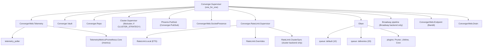
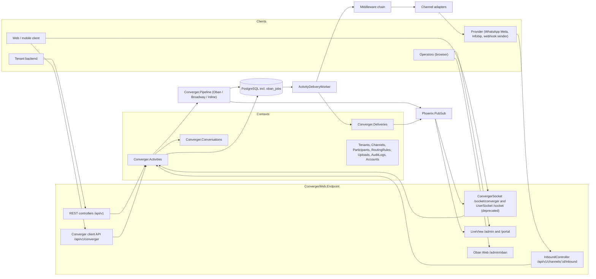

Converger is a single Elixir/OTP application (`:converger`) built on Phoenix 1.8, PostgreSQL and Oban. One release contains the HTTP API, the WebSocket endpoints, the admin and tenant LiveView UIs, the delivery pipeline and the background workers. Nodes are stateless apart from in-memory caches, so you scale out by running more identical nodes against the same database; nodes find each other through `DNS_CLUSTER_QUERY` and share Phoenix PubSub.

This page is the map. The pages below go into detail:

| Page | What it covers |
| --- | --- |
| [Activity flow](activity-flow.md) | The write path: from a REST call, socket push or inbound webhook to a committed activity, its outbox jobs and the PubSub broadcast. |
| [Delivery pipeline](delivery-pipeline.md) | The pluggable pipeline backends (Oban, Broadway, Inline), how to select one, middleware, adapters. |
| [Real-time](realtime.md) | Sockets, channels, PubSub topics, socket identity, presence and forced disconnects. |
| [Data model](data-model.md) | Tables, columns, indexes, constraints and encrypted columns. |
| [Delivery and retries](../delivery.md) | Retry policies, permanent vs. transient errors, dead letters, Lifeline. |

## Supervision tree

The application callback is [`Converger.Application`](https://github.com/AimTune/converger/blob/main/lib/converger/application.ex). Before starting any child it attaches the OpenTelemetry instrumentations (`OpentelemetryPhoenix.setup(adapter: :bandit)`, `OpentelemetryEcto.setup([:converger, :repo])`, `OpentelemetryOban.setup()`). It then starts the following children under `Converger.Supervisor` with the `:one_for_one` strategy, in this order:

| # | Child | Role |
| --- | --- | --- |
| 1 | `ConvergerWeb.Telemetry` | Supervisor for `:telemetry_poller` (10 s period) and the `TelemetryMetricsPrometheus.Core` registry served at `GET /metrics` on the main port (plus the unauthenticated listener on `PROMETHEUS_PORT` only when that variable is set). |
| 2 | `Converger.Vault` | Cloak vault (AES-256-GCM) that encrypts channel secrets and configs at rest. Must be up before anything reads a channel. |
| 3 | `Converger.Repo` | Ecto repository (PostgreSQL via Postgrex). |
| 4 | `Cluster.Supervisor` (`Converger.ClusterSupervisor`) | libcluster node discovery built by `Converger.Cluster` from `CLUSTER_STRATEGY`; not started when the strategy is `none`. See [Clustering](../operations/clustering.md). |
| 5 | `Phoenix.PubSub` (`Converger.PubSub`) | Cluster-wide pub/sub used by the endpoint, channels, LiveViews, presence and the rate limiter. |
| 6 | `ConvergerWeb.SocketPresence` | `Phoenix.Presence` tracker of joined client sockets per channel (used for channel-wide disconnects). |
| 7 | `Converger.RateLimit.Supervisor` | Hammer ETS counters, the per-tenant override cache and, with the `:cluster` backend, the PubSub counter replication. |
| 8 | `Oban` | Job processing, configured from `config :converger, Oban`. |
| 9 | `Converger.Pipeline.child_specs()` | Children of the configured pipeline backend. Empty for Oban and Inline; the Broadway pipeline for the Broadway backend. |
| 10 | `ConvergerWeb.Endpoint` | Bandit HTTP server, sockets and the router. Started after everything it depends on, so it only accepts traffic once they are running. Client sockets are limited by `ConvergerWeb.SocketGuard`. |
| 11 | `ConvergerWeb.Drain` | Shutdown gate. Stopped first, it turns `/health/ready` to 503 (`draining`, one of the readiness checks of `Converger.Health`) and refuses new sockets for `drain_delay_ms` before the endpoint drains its sockets in batches. See [WebSocket limits and draining](../operations/websocket-limits.md). |



## Components



### Web layer

| Component | Module(s) | Notes |
| --- | --- | --- |
| HTTP endpoint | [`ConvergerWeb.Endpoint`](https://github.com/AimTune/converger/blob/main/lib/converger_web/endpoint.ex) | Bandit adapter. Plug order: `TrustedProxies` (resolves `conn.remote_ip` from `TRUSTED_PROXIES`), `ForceSSL` (HTTPS redirect and HSTS, runtime-configured), `Plug.Static`, request id, telemetry, `CORSPlug` (origins read per request from `CORS_ORIGINS`), parsers (with a body reader that caches the raw body for signature checks), session, router. |
| Tenant REST API | `ConvergerWeb.ConversationController`, `ActivityController`, `RoutingRuleController`, `TokenController` | `/api/v1`, authenticated with `x-api-key` (tenant API key) or `x-channel-token` (deprecated, see [migrating from the legacy surfaces](../api/migrating-from-legacy.md)). |
| Converger client API | `ConvergerWeb.ConvergerAPI.*` | `/api/v1/converger`, Direct Line-inspired, authenticated with `Authorization: Bearer` (channel secret for `tokens/generate`, otherwise a Converger token). |
| Inbound webhooks | `ConvergerWeb.InboundController` | `GET/POST /api/v1/channels/:channel_id/inbound` (provider verification and messages) and `POST /api/v1/channels/:channel_id/status` (delivery and read receipts). |
| Sockets | `ConvergerWeb.UserSocket`, `ConvergerWeb.ConvergerSocket` | Phoenix channel sockets at `/socket/converger` (the client socket stack; clients also send activities on it with `postActivity`) and `/socket` (legacy, deprecated); see [Real-time](realtime.md) and [WebSocket](../websocket.md). |
| Admin UI | `ConvergerWeb.Admin.*Live` | `/admin`, behind the admin IP allowlist (`ADMIN_IP_WHITELIST`) and an admin session. |
| Tenant portal | `ConvergerWeb.Portal.*Live` | `/portal`, tenant user session, no IP allowlist. |
| Oban Web | `oban_dashboard("/oban")` | `/admin/oban`, same guards as the admin UI plus role mapping in `ConvergerWeb.ObanResolver`. |
| Metrics | `ConvergerWeb.Telemetry` | Prometheus scrape endpoint on its own port, not routed through the endpoint. |

### Contexts

The domain lives in plain context modules under `lib/converger/`. Controllers, channels and LiveViews call them; they never touch `Repo` directly for writes.

| Context | Responsibility |
| --- | --- |
| `Converger.Activities` | Creating activities (the only write path, see [Activity flow](activity-flow.md)), per-conversation `seq` allocation, idempotency, paginated reads. |
| `Converger.Conversations` | Conversations, lifecycle (`active` / `closed`), close/reopen, inactivity expiration, keyset pagination. |
| `Converger.Deliveries` | One delivery record per activity and target channel; status progression, attempt counting, dead letters, provider receipts. |
| `Converger.Channels` | Channels, adapters, inbound signature verification, the webhook SSRF guard, health checks. Deactivating or deleting a channel disconnects its sockets. |
| `Converger.Participants` | External parties (phone number, chat id) per channel, used to resolve the conversation of inbound messages. |
| `Converger.RoutingRules` | Fan-out from a source channel to extra target channels. |
| `Converger.Tenants`, `Converger.Accounts` | Tenants (hashed API keys, limits) and admin / tenant users. |
| `Converger.Uploads` | Attachments on local disk, S3-compatible, GCS or Azure storage, optional CDN signing. See [storage](../storage.md). |
| `Converger.AuditLogs` | Audit trail of administrative changes, with secret redaction. |

### Delivery pipeline

[`Converger.Pipeline`](https://github.com/AimTune/converger/blob/main/lib/converger/pipeline.ex) is the only path by which an activity reaches an external channel ([ADR-0003](../adr/0003-pipeline-is-the-only-delivery-path.md)). It has two phases: `enqueue/1` runs inside the activity's transaction and `after_commit/1` runs after it. The backend is selected with `config :converger, :pipeline, backend: ...`:

- `Converger.Pipeline.Oban` (default): delivery jobs are inserted in the activity transaction, a transactional outbox ([ADR-0001](../adr/0001-transactional-outbox-with-oban.md)).
- `Converger.Pipeline.Broadway`: pushes to a Broadway producer (memory, Kafka, RabbitMQ or custom) after commit; transient failures are handed to Oban ([ADR-0002](../adr/0002-broadway-for-throughput-oban-for-retries.md)).
- `Converger.Pipeline.Inline`: synchronous, for tests and development.

Each delivery runs the channel's middleware chain ([ADR-0008](../adr/0008-middleware-receives-channel-and-crashes-are-contained.md)) and then the channel's adapter. See [Delivery pipeline](delivery-pipeline.md).

### Oban

Oban stores its jobs in the same PostgreSQL database (`oban_jobs`, schema version 14). Configuration from [config/config.exs](https://github.com/AimTune/converger/blob/main/config/config.exs):

```elixir
config :converger, Oban,
  repo: Converger.Repo,
  plugins: [
    {Oban.Plugins.Pruner, max_age: 3600 * 24},
    {Oban.Plugins.Lifeline, rescue_after: :timer.minutes(30)},
    {Oban.Plugins.Cron,
     crontab: [
       {"0 * * * *", Converger.Workers.ConversationExpirationWorker},
       {"*/5 * * * *", Converger.Workers.ChannelHealthWorker}
     ]}
  ],
  queues: [default: 10, deliveries_high: 10, deliveries: 20, deliveries_bulk: 5]
```

| Worker | Queue | Schedule | Purpose |
| --- | --- | --- | --- |
| `Converger.Workers.ActivityDeliveryWorker` | `deliveries` | per activity and target channel | Runs one delivery attempt; unique per `{activity_id, channel_id}`. |
| `Converger.Workers.ConversationExpirationWorker` | `default` | hourly (`0 * * * *`) | Closes conversations idle longer than `:conversation_inactivity_hours` (default 24). |
| `Converger.Workers.ChannelHealthWorker` | `default` | every 5 minutes | Computes channel health from delivery failure rates, broadcasts changes, sends tenant alert webhooks. |

In the test environment Oban runs with `testing: :inline` and the pipeline backend is `Converger.Pipeline.Inline` ([config/test.exs](https://github.com/AimTune/converger/blob/main/config/test.exs)).

### PubSub

`Converger.PubSub` (Phoenix PubSub, PG2 adapter, cluster-wide once nodes are connected) carries:

| Topic | Published by | Consumed by |
| --- | --- | --- |
| `conversation:<conversation_id>` | `Converger.Pipeline.broadcast/1` (`new_activity`), `Converger.Deliveries` (`delivery_status`) | `ConversationChannel` clients, `ConvergerChannel` processes, admin conversation LiveView |
| `channel_health` | `Converger.Channels.Health` (`health_changed`) | admin dashboard and channel LiveViews |
| `sockets:channel:<channel_id>` | `ConvergerWeb.SocketPresence` | `ConvergerWeb.Sockets` (disconnect, count) |
| `<socket id>` (for example `converger_socket:<tenant_id>:user:<user_id>`) | `ConvergerWeb.Sockets` (`disconnect`) | Phoenix socket transports |
| `converger:rate_limit` | `Converger.RateLimit.ClusterSync` | the same, on other nodes |
| `converger:rate_limit_overrides` | `Converger.RateLimit.Overrides` | the same, on other nodes (cache invalidation) |

PubSub is fire-and-forget. Nothing that must not be lost is sent only over PubSub: activities are committed first, and clients that miss a broadcast catch up from the database with `seq` watermarks ([ADR-0006](../adr/0006-per-conversation-seq-and-opaque-watermarks.md)).

### Repo and Vault

`Converger.Repo` is a standard Ecto repo. Migrations take a session-level Postgres advisory lock (`migration_lock: :pg_advisory_lock`) so that concurrent `Converger.Release.migrate/0` runs from several replicas apply each migration exactly once (see [deployment](../deployment.md)).

`Converger.Vault` is a Cloak vault with AES-GCM ciphers. The current key comes from `CLOAK_KEY` and older keys from `CLOAK_RETIRED_KEYS`; every ciphertext carries a tag derived from its key's fingerprint, so any configured key can decrypt it. It encrypts `channels.secret` and `channels.config` ([ADR-0012](../adr/0012-secrets-at-rest-and-audit-redaction.md)). See [security](../security.md).

### Rate limiting

`Converger.RateLimit` uses Hammer 7 with per-node ETS counters. With `RATE_LIMIT_BACKEND=cluster` (the default when clustering is enabled with `CLUSTER_STRATEGY`) counter increments are replicated to other nodes over PubSub every `RATE_LIMIT_SYNC_INTERVAL_MS` (100 ms by default). Tenants can carry per-bucket overrides in `tenants.limits` ([ADR-0013](../adr/0013-cluster-wide-rate-limiting-with-hammer-and-pubsub.md)).

### Telemetry and tracing

- **Metrics**: `ConvergerWeb.Telemetry` defines Phoenix, Ecto, VM and Oban metrics plus `converger.activities.create.count` and `converger.rate_limit.exceeded.count`, exported in Prometheus format.
- **Telemetry events** emitted by Converger itself: `[:converger, :activities, :create]`, `[:converger, :deliveries, :dead_lettered]`, `[:converger, :deliveries, :retried]`, `[:converger, :middleware, :exception]`, `[:converger, :rate_limit, :exceeded]`, `[:converger, :deprecated, :use]`.
- **Tracing**: OpenTelemetry spans for Phoenix, Ecto and Oban. Export is disabled (`traces_exporter: :none`) unless `OTEL_EXPORTER_OTLP_ENDPOINT` or `OTEL_EXPORTER_OTLP_TRACES_ENDPOINT` is set ([ADR-0010](../adr/0010-runtime-cors-and-opentelemetry-configuration.md)).
- **Logs**: in production, `LoggerJSON` on the default handler, with redaction of keys such as `api_key`, `secret`, `token` and `authorization`.

## Architecture decision records

The decisions behind this design are recorded as ADRs. The ones most relevant to the architecture:

- [ADR-0001: Transactional outbox with Oban](../adr/0001-transactional-outbox-with-oban.md)
- [ADR-0002: Broadway for throughput, Oban for retries](../adr/0002-broadway-for-throughput-oban-for-retries.md)
- [ADR-0003: The pipeline is the only delivery path](../adr/0003-pipeline-is-the-only-delivery-path.md)
- [ADR-0004: Single canonical activity serializer](../adr/0004-single-canonical-activity-serializer.md)
- [ADR-0006: Per-conversation seq and opaque watermarks](../adr/0006-per-conversation-seq-and-opaque-watermarks.md)
- [ADR-0008: Middleware receives the channel; crashes are contained](../adr/0008-middleware-receives-channel-and-crashes-are-contained.md)
- [ADR-0013: Cluster-wide rate limiting](../adr/0013-cluster-wide-rate-limiting-with-hammer-and-pubsub.md)
- [ADR-0017: Conversation lifecycle enforced under the seq lock](../adr/0017-conversation-lifecycle-enforced-under-the-seq-lock.md)
- [ADR-0018: Keyset pagination](../adr/0018-keyset-pagination.md)
- [ADR-0019: Per-channel retry policy, DeliveryError and Lifeline](../adr/0019-per-channel-retry-policy-delivery-error-and-lifeline.md)
- [ADR-0020: Per-subject socket ids and presence](../adr/0020-per-subject-socket-ids-and-presence.md)
- [ADR-0024: Converger Protocol v1 as a superset of mekik/1](../adr/0024-converger-protocol-v1-as-superset-of-mekik-1.md)

The full list is in the [ADR index](../adr/index.md).
