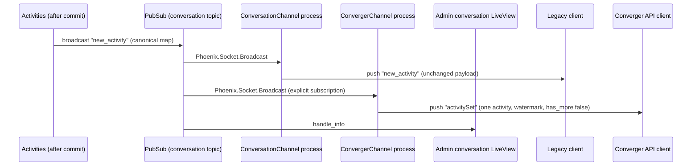
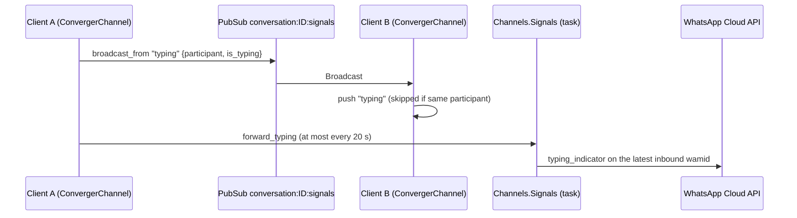

Converger is WebSocket-first: a client that holds a socket open sees every activity of its conversation as soon as it commits. Real-time fan-out is built on Phoenix Channels and Phoenix PubSub. This page explains the server side; the client-facing contract (frames, payloads, examples) is on the [WebSocket](../websocket.md) page.

Two socket stacks exist today, for historical reasons. The Converger client API stack is the single implementation of the client protocol; the legacy stack is **deprecated** ([#23](https://github.com/AimTune/converger/issues/23), [ADR-0026](../adr/0026-one-client-socket-stack-and-shape-checked-legacy-tokens.md)) and kept unchanged until it is removed:

| | Legacy stack (deprecated) | Converger client API stack |
| --- | --- | --- |
| Socket path | `/socket` | `/socket/converger` |
| Socket module | [`ConvergerWeb.UserSocket`](https://github.com/AimTune/converger/blob/main/lib/converger_web/channels/user_socket.ex) | [`ConvergerWeb.ConvergerSocket`](https://github.com/AimTune/converger/blob/main/lib/converger_web/channels/converger_socket.ex) |
| Channel topic | `conversation:<conversation_id>` | `converger:conversation:<conversation_id>` |
| Channel module | [`ConvergerWeb.ConversationChannel`](https://github.com/AimTune/converger/blob/main/lib/converger_web/channels/conversation_channel.ex) | [`ConvergerWeb.ConvergerChannel`](https://github.com/AimTune/converger/blob/main/lib/converger_web/channels/converger_channel.ex) |
| Token | `Converger.Auth.Token` (from `POST /api/v1/tokens`) | `Converger.Auth.ConvergerToken` (from `POST /api/v1/converger/tokens/generate` or `/conversations`) |
| Activity frame | `new_activity` (canonical map) | `activitySet` (`{activities, watermark, has_more}`) |
| Resume | `last_activity_id` in the join payload | opaque `watermark` in the join payload |
| Client sends | `new_activity` push | `postActivity` push, or REST; `typing` and `read` events |
| Delivery status | `delivery_status` pushed | `deliveryStatus` frames, plus read receipts |
| Typing, presence | no (typing is a persisted activity) | `typing` and `presence` frames |

Both are Phoenix sockets with `websocket: true` and `longpoll: false`, using the standard Phoenix V2 JSON serializer. A third socket, `/live`, serves LiveView for the admin and tenant UIs.

:::info Planned
Converger Protocol v1 ([spec](../protocol/v1.md)) is implemented on the Converger client API socket ([#22](https://github.com/AimTune/converger/issues/22)); the legacy stack is removed after its deprecation window (protocol v1, section 13.3). Also planned: a raw WebSocket endpoint without Phoenix framing ([#26](https://github.com/AimTune/converger/issues/26)), and client message ids with server acks ([#24](https://github.com/AimTune/converger/issues/24)).
:::

## How an activity reaches a socket

- `Converger.Pipeline.broadcast/1` publishes `"new_activity"` on `conversation:<conversation_id>` with the canonical activity map ([ADR-0004](../adr/0004-single-canonical-activity-serializer.md)) **after** the activity's transaction committed ([Activity flow](activity-flow.md)).
- A `ConversationChannel` process is joined to exactly that topic, so Phoenix forwards the broadcast to the client as-is (no `intercept`).
- A `ConvergerChannel` process is joined to `converger:conversation:<id>` and additionally calls `ConvergerWeb.Endpoint.subscribe("conversation:<id>")` in `join/3`. Its `handle_info/2` turns each `new_activity` broadcast into an `activitySet` frame with one activity (formatted by `ConvergerWeb.ConvergerAPI.ActivityJSON.activity_data/1`, the same function the REST API uses) and the watermark of that activity's `seq`. `delivery_status` broadcasts become `deliveryStatus` frames (see [Receipts, typing and presence](#receipts-typing-and-presence)).

PubSub is cluster-wide, so a client connected to node B receives activities created on node A.

## PubSub topics

| Topic | Event | Payload | Publisher |
| --- | --- | --- | --- |
| `conversation:<conversation_id>` | `new_activity` | canonical activity: `id`, `type`, `sender`, `text`, `attachments`, `metadata`, `idempotency_key`, `seq`, `conversation_id`, `tenant_id`, `inserted_at` | `Converger.Pipeline.broadcast/1` |
| `conversation:<conversation_id>` | `delivery_status` | `delivery_id`, `activity_id`, `channel_id`, `status`, `sent_at`, `delivered_at`, `read_at`, `seq`, `sender`, `attempts`, `last_error`, `updated_at` | `Converger.Deliveries` on `sent`, dead letter (`failed`) and provider receipts |
| `conversation:<conversation_id>:signals` | `typing` | `participant` (`id`, `role`), `is_typing` | `ConvergerChannel` (`broadcast_from`, so not to the sender's own process) |
| `conversation:<conversation_id>:signals` | `read` | `up_to_seq`, `by` (participant), `at` | `ConvergerChannel`, when a `read` frame moved the stored watermark |
| `conversation:<conversation_id>:presence` | presence diffs | participant id with meta `role`, `online_at` | `ConvergerWeb.ConversationPresence` |
| `channel_health` | `health_changed` | `channel_id`, `channel_name`, `tenant_id`, `previous_status`, `status`, `failure_rate`, `total_deliveries`, `failed_deliveries`, `checked_at` | `Converger.Channels.Health` (from `ChannelHealthWorker`) |
| `sockets:channel:<channel_id>` | presence diffs | socket id with meta `tenant_id`, `conversation_id` | `ConvergerWeb.SocketPresence` |
| `converger_socket:<tenant_id>:user:<user_id>`, `converger_socket:<tenant_id>:conversation:<conversation_id>`, `user_socket:<tenant_id>:` | `disconnect` | `{}` | `ConvergerWeb.Sockets` |

Conversation lifecycle changes are not a separate event: closing or reopening a conversation creates a `conversationUpdate` activity (sender `"system"`, metadata `event`, `status`, `reason`), which flows through `new_activity` / `activitySet` like any other activity.

## Authentication

Both sockets authenticate once, in `connect/3`, from the `token` connect parameter. Both token types are HS256 JWTs signed by `Converger.Auth.Signer` with the endpoint's `secret_key_base` (`SECRET_KEY_BASE`), so rotating that secret invalidates all outstanding tokens. There is no per-message authentication; authorization to a conversation is checked on channel join.

### Legacy socket (`/socket`)

`UserSocket.connect/3` verifies the token with `Converger.Auth.Token.verify_conversation_token/1` (a channel token or a Converger API token is refused), logs a deprecation warning (`ConvergerWeb.Deprecation`) and stores the claims. Tokens come from `POST /api/v1/tokens` (body `conversation_id`, `user_id`; header `x-channel-token`) and carry `conversation_id`, `tenant_id`, `sub` (the user id) and a 1 hour expiry.

`ConversationChannel.join/3` for `conversation:<id>`:

1. rejects with `{"reason": "unauthorized"}` unless the token's `conversation_id` equals `<id>`;
2. rejects with `{"reason": "channel_inactive"}` if the conversation's channel is not active in the token's tenant;
3. otherwise joins and, in `handle_info({:after_join, ...})`, tracks the socket in presence and replays missed activities if `last_activity_id` was given.

### Converger API socket (`/socket/converger`)

`ConvergerSocket.connect/3` verifies the token with `Converger.Auth.ConvergerToken.verify_token/1` (which also requires `"type": "converger"`) **and** checks that the token's channel is active (`Channels.get_active_channel/2`). A token for a deactivated channel cannot connect even before it expires.

Converger tokens carry `type`, `channel_id`, `tenant_id`, `sub` (`converger_<channel_id>`), an expiry (1800 s by default), and optionally `conversation_id` and `user_id`. `ConvergerChannel.join/3` for `converger:conversation:<id>` authorizes only when the token has a `conversation_id` claim equal to `<id>`. A channel-level token (no `conversation_id`) cannot join: it must create or resume a conversation first (`POST`/`GET /api/v1/converger/conversations`), which returns a conversation token ([#114](https://github.com/AimTune/converger/pull/114)). Channel-wide agent sockets come with an explicit `scope` claim ([#64](https://github.com/AimTune/converger/issues/64)).

Any other topic is rejected with `{"reason": "invalid_topic"}`; a failed authorization with `{"reason": "unauthorized"}`.

`ConvergerChannel.handle_in("postActivity", ...)` sends over the socket: it rate-limits with the tenant's `activity_create` bucket, maps the Direct Line-style payload to client fields (`channelData` becomes `metadata`) and calls `Activities.create_client_activity/2`, so the activity takes the same pipeline path as a REST send ([ADR-0003](../adr/0003-pipeline-is-the-only-delivery-path.md)). The sender is the token's `user_id`, else the payload's `from.id`, else `"user"`; an optional `clientId` becomes the idempotency key `ws:<sender>:<clientId>`. The reply is `{id, seq, watermark}`; the activity then arrives as an `activitySet` like any other. See [WebSocket](../websocket.md#6-send-activities-over-the-socket).

## Socket identity

Phoenix lets a socket declare an `id/1`; broadcasting `"disconnect"` to that id closes every socket with it, on every node. Converger derives the id per **subject**, never per channel ([ADR-0020](../adr/0020-per-subject-socket-ids-and-presence.md)), in [`ConvergerWeb.Sockets`](https://github.com/AimTune/converger/blob/main/lib/converger_web/sockets.ex):

| Socket | Id | Derived from |
| --- | --- | --- |
| `ConvergerSocket` with `user_id` claim | `converger_socket:<tenant_id>:user:<user_id>` | `user.id` passed to `tokens/generate` |
| `ConvergerSocket` with `conversation_id` but no `user_id` | `converger_socket:<tenant_id>:conversation:<conversation_id>` | conversation token |
| `ConvergerSocket` with neither | `nil` (anonymous socket) | channel-level token |
| `UserSocket` | `user_socket:<tenant_id>:` | legacy token |

Ids are tenant-scoped, so the same user id in two tenants is two different subjects. Before [#81](https://github.com/AimTune/converger/pull/81) the Converger socket id was per channel, so disconnecting one user dropped every client of that channel.

`ConvergerWeb.Sockets` exposes:

| Function | Effect |
| --- | --- |
| `disconnect_user(tenant_id, user_id)` | Disconnects that user's sockets on both endpoints. |
| `disconnect_conversation(tenant_id, conversation_id)` | Disconnects Converger sockets identified by that conversation. |
| `disconnect_channel(channel_id)` | Disconnects every tracked socket that joined a conversation of the channel. |
| `count(channel_id)` | Number of distinct tracked sockets on the channel. |

## Presence and channel-wide disconnects

Because socket ids are per subject, "every socket of a channel" cannot be addressed by one id. Instead, after a successful join both channels call `ConvergerWeb.Sockets.track/3`, which tracks the channel process in [`ConvergerWeb.SocketPresence`](https://github.com/AimTune/converger/blob/main/lib/converger_web/socket_presence.ex) (a `Phoenix.Presence` on `Converger.PubSub`) under the topic `sockets:channel:<channel_id>`, keyed by the socket id, with meta `tenant_id` and `conversation_id`. Presence is CRDT-replicated, so the list is cluster-wide, and an entry disappears automatically when the channel process exits.

`disconnect_channel/1` lists the socket ids on that topic and broadcasts `"disconnect"` to each. `Converger.Channels.update_channel/3` calls it whenever a channel ends up in a non-`active` status, and `delete_channel/2` calls it after deleting. Combined with the active-channel checks in `ConvergerSocket.connect/3` and `ConversationChannel.join/3`, a deactivated channel's clients are dropped and cannot reconnect while it stays inactive.

:::note
Sockets without an id (a `ConvergerSocket` connected with a channel-level token that has neither `user_id` nor `conversation_id`) are not tracked, so `disconnect_channel/1` cannot reach them. Issue tokens with `user.id` (or per conversation) for clients that must be force-disconnectable. `SocketPresence` is server-side bookkeeping only; the presence pushed to clients is the separate per-conversation `ConversationPresence` below.
:::

## Receipts, typing and presence

`ConvergerChannel` pushes three transient frames besides `activitySet` (client contract: [WebSocket](../websocket.md#5a-receipts-typing-and-presence); spec: [Protocol v1](../protocol/v1.md), section 8; decision: [ADR-0027](../adr/0027-transient-conversation-signals.md)). The legacy channel pushes none of them. Each connection has a **participant** derived from its conversation token (`ConvergerChannel.participant/1`): `role: "user"` with the token's `user_id` as id, or `"anonymous"` without one.

- **deliveryStatus.** `Converger.Deliveries` already broadcast `delivery_status` on `conversation:<id>` for every status change (`mark_sent`, dead letter, provider receipts through `apply_status_update/2`). Each `ConvergerChannel` turns it into a `deliveryStatus` frame (`ConvergerWeb.ConvergerFrames`), skipping it for identified end users who did not send the activity. Stored `pending` maps to v1 `queued`.
- **read.** A `read {watermark}` push calls `Converger.Receipts.mark_read/3`, which upserts `conversation_reads (conversation_id, reader_id) -> read_seq` with `ON CONFLICT ... DO UPDATE ... WHERE read_seq < new`, so the position is monotonic without a lock and capped at `conversations.last_seq`. Only when it moved does the channel broadcast `read` on the signals topic (every other participant's connections push a `deliveryStatus` read receipt) and call `Converger.Channels.Signals.forward_read/3`.
- **typing.** A `typing` push is rate-limited in the channel process (same state within 2 s is dropped), broadcast with `broadcast_from` on the signals topic, and `isTyping: true` is forwarded to external channels at most every 20 s per connection. `terminate/2` broadcasts `isTyping: false` when a typing connection closes.
- **presence.** When the channel's config `presence` allows it (`"identified"` by default, `"all"`, `"off"`), the channel process is tracked in `ConvergerWeb.ConversationPresence` under `conversation:<id>:presence`, keyed by participant id, and subscribes to that topic. After join it pushes the current participants; on each `presence_diff` it pushes the new connection count of every participant in the diff (`offline` at 0). Phoenix Presence is CRDT-replicated, so this works across nodes.
- **External channels.** `Converger.Channels.Signals` resolves the same target channels as a delivery (`Pipeline.resolve_delivery_channels/1`), keeps the ones whose adapter implements `send_typing/2` / `send_read_receipt/2` and that have a participant in the conversation, and passes the participant's latest inbound provider message id (an activity's `idempotency_key`). It runs in a task under `Converger.TaskSupervisor` (`config :converger, :channel_signals_async`, `true` by default), so a slow provider never blocks a channel process. Failures are logged and not retried. See [Writing an adapter](../channels/writing-an-adapter.md).

## Replay and resume

Live frames are not durable: a client that was disconnected misses them. Both channels replay from the database on join; the replay is capped at `ws_replay_limit` activities (`config :converger, :pagination`, default `100`, env `PAGINATION_WS_REPLAY_LIMIT`).

| Channel | Join payload | Replay | When more are pending |
| --- | --- | --- | --- |
| `ConversationChannel` | `{"last_activity_id": "<uuid>"}` | `new_activity` frames for activities with `seq` greater than that activity's `seq` (from the start of the conversation if the id is unknown) | a `replay_truncated` frame `{has_more: true, last_activity_id}`; rejoin with that id |
| `ConvergerChannel` | `{"watermark": "<opaque>"}` | one `activitySet` with the activities after the watermark and the new watermark | `has_more: true` in that frame; page the rest over `GET /api/v1/converger/conversations/:id/activities?watermark=` |

Without `last_activity_id` / `watermark` neither channel replays; the client starts live. An invalid watermark is treated like no watermark.

Watermarks encode the per-conversation `seq` (`Converger.ConvergerAPI.Watermark`: URL-safe Base64 of `seq:<n>`), so resuming needs no lookup and is exact ([ADR-0006](../adr/0006-per-conversation-seq-and-opaque-watermarks.md)). Legacy watermarks (Base64 activity ids) are still accepted.

`ConvergerChannel` subscribes to the PubSub topic in `join/3` and queries the replay afterwards, so a live frame can arrive before or overlap with the replay frame. Clients must de-duplicate by activity `id`.

## Related

- [WebSocket](../websocket.md) for the client contract
- [Activity flow](activity-flow.md)
- [ADR-0004](../adr/0004-single-canonical-activity-serializer.md), [ADR-0006](../adr/0006-per-conversation-seq-and-opaque-watermarks.md), [ADR-0020](../adr/0020-per-subject-socket-ids-and-presence.md), [ADR-0024](../adr/0024-converger-protocol-v1-as-superset-of-mekik-1.md)
