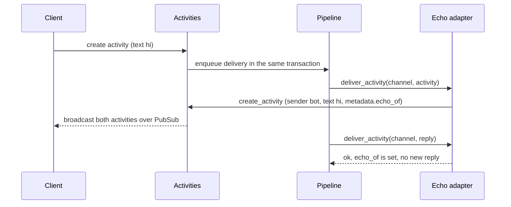

The `echo` channel type ([`lib/converger/channels/adapters/echo.ex`](https://github.com/AimTune/converger/blob/main/lib/converger/channels/adapters/echo.ex)) is a loopback bot. Every activity delivered to an echo channel produces a reply in the same conversation, sent by `bot`, with the same text. It has no external dependency, so it is the quickest way to:

- check that a client (REST, WebSocket, the JS SDK) sends and receives activities;
- watch the delivery pipeline, retries and delivery rows work without a real provider;
- test middleware chains (`transformations`): the reply carries the text **after** middleware ran;
- demo routing rules, since the reply is an ordinary activity that is broadcast and fanned out like any other.

## Configuration

| Setting | Value |
| --- | --- |
| `type` | `echo` |
| `mode` | `outbound` only (other modes fail validation with `echo channels only support modes: outbound`) |
| `config` | none; `validate_config/1` accepts any map |
| `require_signature` | irrelevant, the channel has no inbound webhook |

Note that the channel's default mode is `duplex`, so set `mode: "outbound"` explicitly when you create an echo channel.

## Behaviour

Echo is delivered through the pipeline like any outbound adapter ([ADR-0003](../adr/0003-pipeline-is-the-only-delivery-path.md)): the original activity gets a delivery row for the echo channel, middleware runs first, and `deliver_activity/2` is called by the delivery worker.



`deliver_activity/2`:

1. If the activity has `metadata["echo_of"]`, it is itself an echo reply: return `:ok` without creating anything. This prevents an endless loop.
2. Otherwise create a new activity with:

   ```json
   {
     "tenant_id": "<original tenant_id>",
     "conversation_id": "<original conversation_id>",
     "text": "<original text, after middleware>",
     "sender": "bot",
     "metadata": { "echo_of": "<original activity id>" },
     "idempotency_key": "echo:<original activity id>"
   }
   ```

3. Map the result:

| Result of `create_activity` | Adapter returns | Effect on the delivery |
| --- | --- | --- |
| `{:ok, reply}` | `:ok` | `sent` |
| `{:error, :conversation_closed}` (conversation closed since the original was accepted) | `:ok` | `sent`; there is nothing to reply into |
| any other `{:error, reason}` | `{:error, {:echo_failed, reason}}` | retried according to the channel's retry policy |

Because the reply's idempotency key is derived from the original activity id, a retried delivery (for example after a crash between creating the reply and marking the delivery `sent`) finds the existing reply instead of creating a second one.

Only `text` is copied. Attachments, `type` and other metadata of the original are not.

## Inbound

`parse_inbound/2` always returns `{:error, "echo channel does not support inbound webhooks"}`. A `POST /api/v1/channels/<id>/inbound` to an echo channel is rejected: with `401` when it is unsigned and the channel requires signatures (the default), otherwise with `400` and `{"error": "echo channel does not support inbound webhooks"}`. Activities enter an echo conversation through the tenant API, the client API or a WebSocket.

## Example

With an echo channel and a conversation on it, using the tenant API:

```bash
curl -sS "https://converger.example.com/api/v1/conversations/$CONVERSATION_ID/activities" \
  -H "x-api-key: $TENANT_API_KEY" \
  -H 'content-type: application/json' \
  -d '{"sender":"user-1","text":"echo via rest"}'
```

Listing the conversation's activities afterwards shows two activities: the original from `user-1` and a reply from `bot` with `text: "echo via rest"` and `metadata.echo_of` set to the original id. The original's delivery for the echo channel has status `sent`. With the default Oban pipeline the reply appears once the delivery job has run; with the inline backend (used in tests) it is there immediately.

The test `echo channel replies through the pipeline` in [`test/converger_web/controllers/activity_controller_test.exs`](https://github.com/AimTune/converger/blob/main/test/converger_web/controllers/activity_controller_test.exs) exercises exactly this, and [`test/converger/pipeline/middleware_integration_test.exs`](https://github.com/AimTune/converger/blob/main/test/converger/pipeline/middleware_integration_test.exs) uses echo channels to test middleware.

## Related

- [Channels and adapters](overview.md)
- [Writing an adapter](writing-an-adapter.md): echo is the smallest complete adapter and a good starting point.
