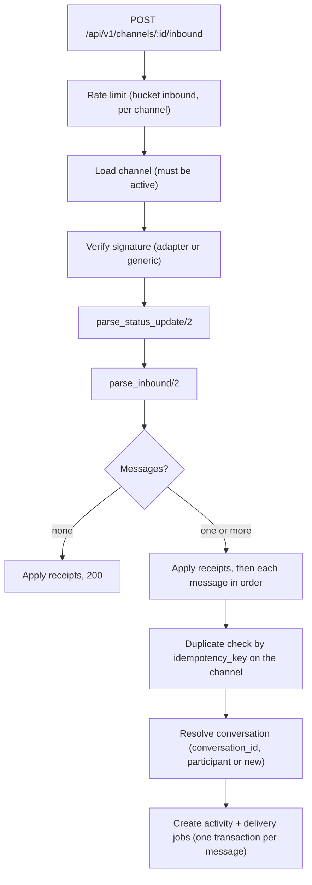

A **channel** is a tenant-owned connection to one external system: a WhatsApp number, an HTTP endpoint, a set of WebSocket clients. Every channel has a `type`, and every type is implemented by an **adapter**: a module that implements the `Converger.Channels.Adapter` behaviour. The adapter knows how to validate the channel config, how to deliver an activity to the provider, how to turn a provider webhook into activities and how to read delivery receipts.

This page covers the behaviour, the built-in channel types and what each one supports, the shared inbound endpoints and their signature scheme, and channel health checks. Each adapter has its own page:

- [WhatsApp (Meta Cloud API and Infobip)](whatsapp.md)
- [Echo](echo.md)
- [WebSocket](websocket.md)
- Generic HTTP webhook: see [Outbound webhooks](../webhooks.md)
- [Writing an adapter](writing-an-adapter.md)

## Channel types and modes

The channel schema ([`lib/converger/channels/channel.ex`](https://github.com/AimTune/converger/blob/main/lib/converger/channels/channel.ex)) accepts these values:

| Field | Values | Default |
| --- | --- | --- |
| `type` | `echo`, `webhook`, `websocket`, `whatsapp_meta`, `whatsapp_infobip` | `webhook` |
| `mode` | `inbound`, `outbound`, `duplex` | `duplex` |
| `status` | `active` or another value such as `inactive`. Only `active` channels accept inbound requests and socket joins, are routing-rule targets and get health checks. | `active` |
| `require_signature` | `true` / `false` | `true` |
| `config` | adapter-specific map, encrypted at rest | `{}` |
| `secret` | generated (32 random bytes, unpadded base64) when not given; encrypted at rest | generated |
| `retry_policy` | per-channel overrides, see [ADR-0019](../adr/0019-per-channel-retry-policy-delivery-error-and-lifeline.md) | `{}` |
| `transformations` | middleware chain run before delivery | `[]` |

The mode decides the direction of traffic:

- `inbound`: the channel accepts `POST /api/v1/channels/:id/inbound`. Activities in its conversations are not delivered back through the adapter.
- `outbound`: the pipeline delivers activities to the channel. Inbound messages are refused (`400 Channel does not accept inbound messages`); delivery receipts are still accepted.
- `duplex`: both.

The changeset rejects a mode the adapter does not support (`<type> channels only support modes: ...`). `echo` and `websocket` are `outbound` only; the others support all three modes.

Channels are created and edited in the admin panel (`/admin/channels`) and the tenant portal (`/portal/channels`). The config form fields per type are listed on each adapter page.

## The adapter behaviour

The behaviour lives in [`lib/converger/channels/adapter.ex`](https://github.com/AimTune/converger/blob/main/lib/converger/channels/adapter.ex). The module is also the dispatcher: `Adapter.adapter_for/1` maps a type string to its module, and the `Adapter.*` functions with the same names call the adapter (and handle missing optional callbacks).

| Callback | Required | Returns | Purpose |
| --- | --- | --- | --- |
| `supported_modes/0` | yes | `[String.t()]` | Modes the type accepts, checked by the channel changeset. |
| `validate_config/1` | yes | `:ok` or `{:error, message}` | Validates `channel.config` on create and update. The message becomes a `config` error on the changeset. |
| `deliver_activity/2` | yes | `:ok`, `{:ok, map}` or `{:error, term}` | Delivers one activity to the provider. Called by the pipeline only. |
| `parse_inbound/2` | yes | `{:ok, [message]}`, `{:ok, message}` or `{:error, term}` | Turns an inbound webhook body into zero or more messages. |
| `parse_status_update/2` | no | `{:ok, [update]}`, `:ignore` or `{:error, term}` | Extracts delivery and read receipts. Missing callback means `:ignore`. |
| `verify_inbound_signature/3` | no | `:ok`, `:legacy`, `:missing` or `{:error, reason}` | Provider-native signature check. Missing callback means the generic `x-converger-signature` scheme. |
| `retry_policy/0` | no | `map` | Adapter defaults merged over the global retry policy and under the channel's `retry_policy`. |

### `deliver_activity/2`

- `:ok`: the delivery is marked `sent`.
- `{:ok, map}`: marked `sent`; the map is merged into the delivery's `metadata`. If it contains `whatsapp_message_id` or `infobip_message_id`, that value is stored as the delivery's `provider_message_id`, which is how later receipts find the delivery (see `Converger.Deliveries.mark_sent/2`).
- `{:error, %Converger.Channels.DeliveryError{retryable?: false}}`: the delivery is dead-lettered after this attempt (`status: "failed"`), no retry.
- `{:error, %DeliveryError{retry_after_ms: ms}}`: retried, and the next attempt waits `ms` instead of the policy backoff.
- any other `{:error, term}`: retryable; the next attempt follows the channel's retry policy until `max_attempts` is reached.

`DeliveryError` ([`lib/converger/channels/delivery_error.ex`](https://github.com/AimTune/converger/blob/main/lib/converger/channels/delivery_error.ex)) has the fields `reason`, `status`, `retry_after_ms` and `retryable?` (default `true`). Its helpers classify failures the same way for every adapter:

| Helper | Result |
| --- | --- |
| `DeliveryError.from_http(status, headers, body, label)` | Retryable for `408`, `425`, `429` and any `5xx`; permanent for every other status. `retry_after_ms` is parsed from a `Retry-After` header (delta-seconds or IMF-fixdate HTTP date). |
| `DeliveryError.from_transport(reason, label)` | Always retryable (timeout, connection refused, DNS failure). |
| `DeliveryError.permanent(reason)` | `retryable?: false`. Use it for misconfiguration and errors no retry can fix. |
| `DeliveryError.message(error)` | The string written to the delivery's `last_error`. |

The design is recorded in [ADR-0019](../adr/0019-per-channel-retry-policy-delivery-error-and-lifeline.md).

### `parse_inbound/2`

Providers batch several messages into one webhook call, so the callback returns a **list** (a single map is accepted and wrapped). The list may be empty, for example for a payload that only carries receipts. Each message is a map with string keys:

| Key | Required | Meaning |
| --- | --- | --- |
| `sender` | yes | Sender identifier stored on the activity (`activity.sender`). |
| `text`, `type`, `attachments`, `metadata` | no | Activity client fields. `type` defaults to `message`. |
| `idempotency_key` | no | A stable provider message id (a WhatsApp `wamid`, an Infobip `messageId`). A re-delivered webhook carrying the same id never creates a second activity. |
| `participant` | no | `%{"external_id" => ..., "display_name" => ...}`. When present (and the request has no `conversation_id`), the message joins the participant's active conversation on the channel. See [ADR-0016](../adr/0016-participant-based-conversation-resolution.md). |

Only client fields are taken from the parsed message when the activity is created (`Activities.create_client_activity/2`); `sender` and `idempotency_key` are passed as server-controlled attributes by the controller.

### `parse_status_update/2`

Each update is a map with:

| Key | Required | Meaning |
| --- | --- | --- |
| `provider_message_id` | yes (or `delivery_id`) | The id the provider returned when the message was sent. |
| `delivery_id` | alternative | A Converger delivery id (used by the generic webhook). |
| `status` | yes | `sent`, `delivered`, `read` or `failed`. |
| `timestamp` | no | ISO 8601 or Unix seconds from the provider. |
| `recipient_id` | no | Provider recipient identifier. |
| `error` | no | Error text for `failed`; stored in `last_error`. |

Status progression is monotonic (`pending` < `sent` < `delivered` < `read`): a `delivered` arriving after `read` is ignored, and `failed` is applied unless the delivery is already `read`. Updates for unknown message ids are skipped and not counted in `receipts_processed`.

## Capability matrix

| Type | Modes | Outbound delivery | Inbound webhook | Status receipts | Inbound signature | Batches |
| --- | --- | --- | --- | --- | --- | --- |
| `webhook` | inbound, outbound, duplex | Canonical activity JSON to the configured URL, signed with `x-converger-signature` | One message per request | Yes: `delivery_id` or `provider_message_id` plus `status` | Generic `x-converger-signature` | No (one message per request) |
| `whatsapp_meta` | inbound, outbound, duplex | Text messages through the Graph API | Yes (Cloud API webhook) | Yes (`statuses`) | Meta `X-Hub-Signature-256` keyed with `app_secret` | Yes: every `entry` / `changes` / `messages` / `statuses` item |
| `whatsapp_infobip` | inbound, outbound, duplex | Text messages through the Infobip API | Yes (`results`) | Yes (delivery reports in `results`) | Generic `x-converger-signature` (no Infobip-native check) | Yes: every item of `results` |
| `echo` | outbound | Creates a reply activity from `bot` in the same conversation | No | No | Not applicable | Not applicable |
| `websocket` | outbound | No-op; clients receive activities through the PubSub broadcast | No (clients send over the socket) | No | Not applicable | Not applicable |

Notes:

- The pipeline only calls adapters for `echo`, `webhook`, `whatsapp_meta` and `whatsapp_infobip` (`@delivery_types` in [`lib/converger/pipeline.ex`](https://github.com/AimTune/converger/blob/main/lib/converger/pipeline.ex)). `websocket` channels get no delivery rows.
- Conversation lifecycle events (close, reopen) are delivered only to `webhook` channels.
- An inbound message from the conversation's participant is never delivered back to that participant's own channel.
- Outbound WhatsApp media, templates and interactive messages are planned ([#37](https://github.com/AimTune/converger/issues/37)). Adapter capabilities declared by the adapter itself are planned in adapter behaviour v2 ([#36](https://github.com/AimTune/converger/issues/36)).

## Inbound endpoints

Defined in [`lib/converger_web/router.ex`](https://github.com/AimTune/converger/blob/main/lib/converger_web/router.ex) under the `/api/v1` scope (JSON pipeline), handled by [`ConvergerWeb.InboundController`](https://github.com/AimTune/converger/blob/main/lib/converger_web/controllers/inbound_controller.ex):

| Method and path | Action | Purpose |
| --- | --- | --- |
| `GET /api/v1/channels/:channel_id/inbound` | `verify` | Webhook verification handshake. For `whatsapp_meta` it checks `hub.verify_token` against the channel's `verify_token` and echoes `hub.challenge`; any other type answers `200 ok`. |
| `POST /api/v1/channels/:channel_id/inbound` | `create` | Messages and receipts. WhatsApp sends both to the same URL. |
| `POST /api/v1/channels/:channel_id/status` | `status` | Receipts only (delivery and read receipts). |

There is no bearer token or API key on these routes. A request is authenticated by the **channel id in the path** plus the **signature** described below. The id is a UUID; treat the full URL as a credential anyway.

Processing order for `POST .../inbound`:



### Batch semantics

A batch is not all-or-nothing. Each message is committed in its own transaction, and because each one carries its provider message id as idempotency key, the provider can always re-deliver the whole batch safely:

- created and duplicate messages count as handled;
- a message that is permanently invalid (for example text over the size limit) is logged and skipped;
- a transient failure (for example delivery jobs could not be enqueued) stops processing and returns an error, so the provider re-delivers; messages committed before the failure are recognized as duplicates and the rest are created, in order.

Receipts in the same request are applied best-effort before the messages. See [ADR-0015](../adr/0015-per-message-idempotent-inbound-batches.md).

The duplicate check looks up the key across **all conversations of the channel** (`Activities.get_activity_by_channel_idempotency_key/2`) before a conversation is resolved, because provider message ids are unique per channel. The database also enforces a unique `(conversation_id, idempotency_key)` index.

### Responses

Successful requests return:

```json
{
  "status": "accepted",
  "activity_id": "0b4c3f8e-6f53-4f4e-9d0c-1f0a3a5e2b71",
  "activity_ids": ["0b4c3f8e-6f53-4f4e-9d0c-1f0a3a5e2b71"],
  "duplicates": 0,
  "rejected": 0,
  "receipts_processed": 0
}
```

A receipts-only request returns `{"status": "accepted", "receipts_processed": 2}`.

:::note
`POST .../status` expects at least one receipt the adapter recognizes. A body without one (the adapter returns `:ignore`) is not mapped to a client error by the fallback controller today and ends in a server error, so senders should only post receipts there. `POST .../inbound` accepts receipt-only payloads and, for WhatsApp, well-formed payloads that carry neither messages nor receipts.
:::

| Status | When |
| --- | --- |
| `201` | Generic channel (`webhook`), at least one activity created. |
| `200` | Duplicates only, receipts only, or any handled request on `whatsapp_meta` / `whatsapp_infobip`. WhatsApp channels always get `200` once the request was handled, even when every message was rejected permanently, because the provider would otherwise retry for days. |
| `400` | Channel inactive (`{"error": "Channel is inactive"}`), channel mode `outbound` with messages (`{"error": "Channel does not accept inbound messages"}`), or the adapter could not parse the body (`{"error": "unable to parse WhatsApp Meta webhook payload"}` and similar). |
| `401` | Signature missing (on a `require_signature` channel), legacy, invalid, malformed or outside the time window. |
| `404` | Unknown channel id, or an unknown `conversation_id` for the channel's tenant. |
| `409` | The explicit `conversation_id` refers to a closed conversation. |
| `422` | Generic channel and every message was invalid (changeset errors), or the message has neither text nor attachments. |
| `429` | Rate limit exceeded, with a `Retry-After` header. Default: 500 requests per second per channel (`inbound` bucket), overridable per tenant. |
| `503` | The activity could not be accepted because its delivery jobs could not be enqueued. Retry; idempotency keys make that safe. |

### Conversation resolution

For each message, the conversation is chosen in this order:

1. an explicit `conversation_id` in the request body, scoped to the channel's tenant;
2. the participant's active conversation on the channel (or a new one for the participant), when the parsed message carries `participant.external_id`;
3. otherwise a new conversation with `metadata.source = "inbound_webhook"`.

Participant resolution is described in [ADR-0016](../adr/0016-participant-based-conversation-resolution.md). The channel config key `conversation_idle_timeout_seconds` (or the app config `:inbound_conversation_idle_timeout_seconds`) starts a new conversation after a period of inactivity; by default there is no idle timeout.

## Inbound signatures

Signature checks run over the **exact raw bytes** of the request body. `ConvergerWeb.CacheBodyReader` (configured as the endpoint's `body_reader`) caches the body in `conn.assigns.raw_body` for every `/api/v1/channels/*` path, so both `/inbound` and `/status` verify what was sent, not a re-encoded JSON.

### The generic scheme

Implemented in [`lib/converger/channels/inbound_signature.ex`](https://github.com/AimTune/converger/blob/main/lib/converger/channels/inbound_signature.ex) and used by every adapter that does not implement `verify_inbound_signature/3` (today: `webhook` and `whatsapp_infobip`). The header is:

```http
x-converger-signature: t=<unix seconds>,v1=<hex HMAC-SHA256 of "<t>.<raw body>">
```

- The HMAC key is the channel `secret` string as-is (it is not base64-decoded).
- `v1` is lowercase hex.
- `t` must be within the tolerance window of the server clock: 300 seconds by default, set with `config :converger, :inbound_signature_tolerance_seconds`. This limits replay of captured requests.
- Several `v1=` values are allowed (`t=...,v1=<new>,v1=<old>`) so a sender can sign with two secrets during rotation; any match is accepted.
- The legacy format `sha256=<hex HMAC-SHA256 of the raw body>` has no timestamp and no replay protection. It is accepted only on channels with `require_signature: false`, with a deprecation warning in the log.

Outbound webhooks are signed with the same scheme; the verification snippets and a test vector are in [Outbound webhooks](../webhooks.md).

### Per-channel enforcement

| Verification result | `require_signature: true` (default) | `require_signature: false` |
| --- | --- | --- |
| Valid current signature | accepted | accepted |
| Valid legacy `sha256=` signature | `401` | accepted, deprecation warning |
| No signature | `401` | accepted, deprecation warning |
| Signature present but invalid, malformed or stale | `401` | `401` |

A signature that is present but wrong is always rejected, even when signatures are optional. `require_signature: false` exists for channels created before signatures were enforced; unsigned requests will be rejected in a future release. The decision is recorded in [ADR-0009](../adr/0009-inbound-signature-scheme-and-per-channel-enforcement.md).

`whatsapp_meta` channels use Meta's own `X-Hub-Signature-256` instead (see [WhatsApp](whatsapp.md#inbound-signature-x-hub-signature-256)); for them the generic header is not accepted in its place.

### Signing a request with bash and openssl

```bash
CHANNEL_ID='3f6c1b9e-2d4a-4c55-9f0e-7b8a1c2d3e4f'
SECRET='<channel secret>'
BODY='{"sender":"user-42","text":"hello","idempotency_key":"evt-1001","external_id":"user-42","display_name":"Ada"}'

T=$(date +%s)
SIG=$(printf '%s' "$T.$BODY" | openssl dgst -sha256 -hmac "$SECRET" | sed 's/^.*= //')

curl -sS "https://converger.example.com/api/v1/channels/$CHANNEL_ID/inbound" \
  -H 'content-type: application/json' \
  -H "x-converger-signature: t=$T,v1=$SIG" \
  --data-raw "$BODY"
```

Send exactly the bytes you signed: `--data-raw` with the same `$BODY` string. Pretty-printing or re-encoding the JSON after signing breaks the signature.

### Signing a request in Elixir

```elixir
defmodule MyApp.ConvergerInbound do
  def post(channel_id, secret, params) do
    body = Jason.encode!(params)
    t = System.system_time(:second)

    v1 =
      :crypto.mac(:hmac, :sha256, secret, "#{t}.#{body}")
      |> Base.encode16(case: :lower)

    Req.post!("https://converger.example.com/api/v1/channels/#{channel_id}/inbound",
      body: body,
      headers: [
        {"content-type", "application/json"},
        {"x-converger-signature", "t=#{t},v1=#{v1}"}
      ]
    )
  end
end
```

Inside the Converger code base (tests, tools), `Converger.Channels.InboundSignature.sign(secret, raw_body)` builds the same header value.

## Channel health

Converger computes a health status for every active `webhook`, `whatsapp_meta` and `whatsapp_infobip` channel from its delivery failure rate.

- [`Converger.Channels.Health`](https://github.com/AimTune/converger/blob/main/lib/converger/channels/health.ex) counts the channel's deliveries created in the last 60 minutes and the ones with status `failed`.
- [`Converger.Channels.HealthCheck`](https://github.com/AimTune/converger/blob/main/lib/converger/channels/health_check.ex) is the stored result (table `channel_health_checks`): `status`, `total_deliveries`, `failed_deliveries`, `failure_rate` (0.0 to 1.0, rounded to 4 decimals) and `checked_at`.
- [`Converger.Workers.ChannelHealthWorker`](https://github.com/AimTune/converger/blob/main/lib/converger/workers/channel_health_worker.ex) is an Oban cron job (`*/5 * * * *` in `config/config.exs`, queue `default`).

| Status | Failure rate in the window |
| --- | --- |
| `healthy` | below 10% |
| `degraded` | 10% or more, below 50% |
| `unhealthy` | 50% or more |
| `unknown` | no deliveries in the window |

Each run inserts one health check per channel. When a channel's status differs from its previous check, the worker:

1. broadcasts `health_changed` on the PubSub topic `channel_health` (used by the admin dashboard);
2. if the tenant has an `alert_webhook_url`, posts this JSON to it (fire-and-forget, 10 second timeout, through `Converger.HTTP`):

```json
{
  "event": "channel_health_changed",
  "channel_id": "3f6c1b9e-2d4a-4c55-9f0e-7b8a1c2d3e4f",
  "channel_name": "Support WhatsApp",
  "tenant_id": "8a0d2c71-5b8e-4f0c-a1d3-6e9f7b2c4d10",
  "previous_status": "healthy",
  "new_status": "degraded",
  "failure_rate": 0.1875,
  "total_deliveries": 32,
  "failed_deliveries": 6,
  "checked_at": "2026-10-09T12:05:00.123456Z"
}
```

The first check of a channel never alerts (there is no previous status). Health checks older than 7 days are pruned at the end of every run.

## Related

- [Outbound webhooks](../webhooks.md): the `webhook` adapter's config, headers, signature verification and SSRF guard.
- [ADR-0009](../adr/0009-inbound-signature-scheme-and-per-channel-enforcement.md): inbound signature scheme and per-channel enforcement.
- [ADR-0014](../adr/0014-webhook-ssrf-guard-and-outbound-signing.md): webhook SSRF guard and outbound signing.
- [ADR-0015](../adr/0015-per-message-idempotent-inbound-batches.md): per-message idempotent inbound batches.
- [ADR-0016](../adr/0016-participant-based-conversation-resolution.md): participant-based conversation resolution.
- [ADR-0019](../adr/0019-per-channel-retry-policy-delivery-error-and-lifeline.md): per-channel retry policy and `DeliveryError`.
