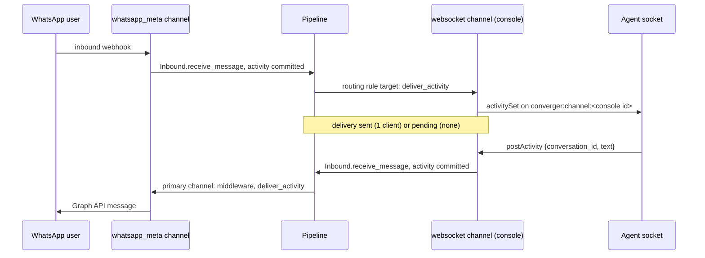

The `websocket` channel type is the home of clients connected over WebSockets: a web chat widget, an agent console, a test client. It is a regular channel adapter ([`lib/converger/channels/adapters/websocket.ex`](https://github.com/AimTune/converger/blob/main/lib/converger/channels/adapters/websocket.ex)): the pipeline delivers to it through the channel's middleware and records a delivery for every activity, it can be the target of a routing rule, and messages its clients send go through the same inbound path as webhooks. The design is recorded in [ADR-0033](../adr/0033-websocket-channel-adapter-delivery.md).

For the client side (sockets, topics, frames, tokens, replay), see the [WebSocket API](../websocket.md).

## Configuration

| Field | Value |
| --- | --- |
| `type` | `websocket` |
| `mode` | `inbound`, `outbound` or `duplex` (default). `outbound` or `duplex` to receive deliveries; `inbound` or `duplex` to accept messages from its sockets. |
| `config.require_ack` | `true` or `false` (default). With `true`, a delivery stays `pending` until a client acknowledges it, even when clients are connected. |
| `config.presence` | `identified` (default), `all` or `off`: presence frames for the client API sockets of this channel ([WebSocket API](../websocket.md#presence), [ADR-0032](../adr/0032-transient-conversation-signals.md)). Read from the token's channel, so it works on every channel type. |

Existing `websocket` channels, which could only be `outbound` before, were changed to `duplex` by migration `20261010200000_make_websocket_channels_duplex`.

## Adapter callbacks

| Callback | Behaviour |
| --- | --- |
| `supported_modes/0` | `["inbound", "outbound", "duplex"]`. |
| `capabilities/0` | `[:inbound, :outbound]`: the pipeline delivers to it. |
| `validate_config/1` | `presence` is not validated; `require_ack` must be `true`, `false` (or the strings `"true"`, `"false"`) or empty. |
| `deliver_activity/2` | Broadcasts the activity and returns `{:ok, %{connected_clients: n}}` or `{:pending, %{connected_clients: n}}`, see below. |
| `parse_inbound/2` | `{:error, ...}`: clients send over the socket, not through `/inbound`. |

## Delivery

`deliver_activity/2` receives the activity after the channel's middleware and broadcasts its canonical JSON ([ADR-0004](../adr/0004-single-canonical-activity-serializer.md)) on two PubSub topics:

| PubSub topic | Who listens |
| --- | --- |
| `channel:<channel id>` | Sockets that follow the whole channel (`converger:channel:<channel id>`, an agent console). |
| `channel:<channel id>:conversation:<conversation id>` | Sockets of the channel joined to that conversation when the conversation belongs to another channel (routed). |

It then counts the connected clients with `ConvergerWeb.Sockets.count_connections/2`: joined channel processes of this channel that follow the conversation or the whole channel, across nodes (Phoenix Presence, [ADR-0020](../adr/0020-per-subject-socket-ids-and-presence.md)).

| Situation | Adapter result | Delivery |
| --- | --- | --- |
| At least one client, `require_ack` off | `{:ok, %{connected_clients: n}}` | `sent`, `metadata.connected_clients = n` |
| No client connected | `{:pending, %{connected_clients: 0}}` | stays `pending`, `attempts` incremented, not retried |
| `require_ack: true` | `{:pending, %{connected_clients: n}}` | stays `pending` until a client sends `ack` |

A pending delivery is not a failure and never dead-letters. It is marked `sent` by `Converger.Deliveries.acknowledge/3` when a client of the channel:

- sends `ack {watermark}` covering the activity, or
- joins the conversation with a watermark and gets the activity in the replay (only when `require_ack` is off).

Activities are persisted, so offline buffering is the replay from the client's watermark ([ADR-0006](../adr/0006-per-conversation-seq-and-opaque-watermarks.md)); there is no separate queue.

### What the pipeline delivers to a websocket channel

A `websocket` channel is delivered to like any channel in mode `outbound` or `duplex` ([Delivery pipeline](../architecture/delivery-pipeline.md)), with two differences:

- **Lifecycle events** (`conversationUpdate` on close and reopen) are delivered to `websocket` channels, as to webhooks. Messaging adapters such as WhatsApp still skip them.
- **No echo exclusion.** An inbound message from the conversation's participant is not delivered back to the participant's own channel, except when that channel is a `websocket` channel: other sockets of the channel (the participant's other tabs, an agent console on the same channel) need it, and the sending socket drops its own frame by `seq`.

## Receiving messages from sockets

A client of a `websocket` channel sends with the `postActivity` event on `/socket/converger` ([WebSocket API](../websocket.md#6-send-activities-over-the-socket)). The message goes through `Converger.Inbound.receive_message/3`, the function inbound webhooks use as well, so:

- the channel must be `inbound` or `duplex`, otherwise the reply is `inbound_not_supported`;
- the activity is created with `Activities.create_client_activity/2` and goes through the pipeline: middleware of every target channel, routing rules, deliveries and retries ([ADR-0003](../adr/0003-pipeline-is-the-only-delivery-path.md));
- the sender is the token's `user_id` when it has one (else the payload's `from.id`, else `"user"`);
- an optional `clientId` is stored as `ws:<sender>:<clientId>`, so a re-send returns the stored activity instead of creating a second one.

A Converger token of another channel type (`echo`, `webhook`, ...) is a client of the conversation, like the REST API: its `postActivity` creates the activity directly, without the mode check.

## Bridging another channel to an agent console

A routing rule from a channel to a `websocket` channel makes that channel's conversations visible to the `websocket` channel's sockets. For example, WhatsApp to an agent console:

1. Create the console channel: type `websocket`, mode `duplex`.
2. Create a routing rule with the WhatsApp channel as source and the console as target.
3. Issue a channel-scoped token for the console: `POST /api/v1/converger/tokens/generate` with the console's secret and `{"scope": "channel", "user": {"id": "agent-7"}}`.
4. The console joins `converger:channel:<console id>` and receives an `activitySet` with `conversation_id` for every WhatsApp message.
5. The agent replies with `postActivity` and the `conversation_id`. The reply is an activity of the WhatsApp conversation: the pipeline delivers it to WhatsApp, with the WhatsApp channel's middleware, and to the console's sockets.

The same channel-scoped token can also join `converger:conversation:<id>` for one routed conversation (an unscoped token cannot join; an end user gets a conversation token). Such a routed socket receives the console's deliveries, after the console's middleware; a socket of the conversation's own channel receives every activity as committed.

## Related

- [WebSocket API](../websocket.md)
- [Channels and adapters](overview.md)
- [Routing rules](../concepts/routing-rules.md)
- [Deliveries](../concepts/deliveries.md)
- [ADR-0033](../adr/0033-websocket-channel-adapter-delivery.md): the websocket channel adapter and pending receipts.
- [ADR-0020](../adr/0020-per-subject-socket-ids-and-presence.md): per-subject socket ids and presence.
