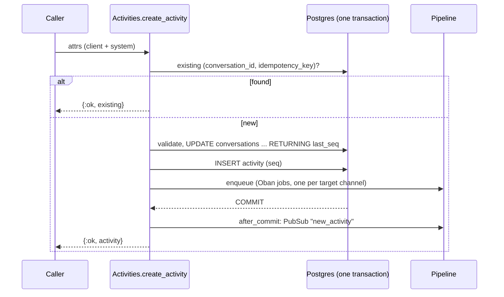

An activity is one message or event in a [conversation](conversations.md): a user's text, a bot reply, an upload, a typing notice, a lifecycle event. Activities are immutable once written. They are ordered by a server-assigned, gap-free sequence number `seq`, and every outward representation (REST, WebSocket, webhooks) is built from one canonical serializer.

Source: [`lib/converger/activities/activity.ex`](https://github.com/AimTune/converger/blob/main/lib/converger/activities/activity.ex), [`lib/converger/activities.ex`](https://github.com/AimTune/converger/blob/main/lib/converger/activities.ex), [`lib/converger/activities/serializer.ex`](https://github.com/AimTune/converger/blob/main/lib/converger/activities/serializer.ex).

## Schema

Table `activities`:

| Field | Type | Set by | Notes |
| --- | --- | --- | --- |
| `id` | uuid | server | Primary key. |
| `tenant_id` | uuid | server | From the credentials. |
| `conversation_id` | uuid | server | From the URL or token. |
| `seq` | bigint | server | Per-conversation sequence number: 1, 2, 3, ... `(conversation_id, seq)` is unique. |
| `type` | text | client | Default `"message"`. Must be a known type. |
| `sender` | text | server | Required. Who sent it (see [Sender](#sender)). |
| `text` | text | client | Optional. At most 65,536 bytes. |
| `attachments` | array of maps | client | Default `[]`. At most 10, each at most 4,096 bytes as JSON. |
| `metadata` | map | client | Default `{}`. At most 16,384 bytes as JSON. Exposed as `channelData` in the client API. |
| `idempotency_key` | text | server | From the `x-idempotency-key` header or the provider message id. `(conversation_id, idempotency_key)` is unique where not null. |
| `inserted_at`, `updated_at` | utc_datetime_usec | server | The server timestamp always wins. Clients cannot set it. |

### Types

`Activity.types/0`:

| Type | Typical use |
| --- | --- |
| `message` | A chat message (text and/or attachments). The default. |
| `event` | An application event. Put the payload in `metadata`. |
| `typing` | A typing indicator. |
| `conversationUpdate` | A conversation lifecycle change. The server emits these with sender `"system"` on close and reopen ([conversations](conversations.md#lifecycle)). |
| `endOfConversation` | The sender signals the end of the conversation. The server attaches no behavior to this type: it does not close the conversation, so use the close endpoint for that. |

Any other `type` is rejected with `422`. A richer activity model (reactions, edits, threading, rich message vocabulary) is Planned ([#28](https://github.com/AimTune/converger/issues/28), [#68](https://github.com/AimTune/converger/issues/68)).

### Size limits

| Limit | Default | Measured as |
| --- | --- | --- |
| `max_text_bytes` | `65_536` | bytes of `text` |
| `max_attachments` | `10` | number of entries |
| `max_attachment_bytes` | `4_096` | JSON size of each attachment descriptor (not of the file itself, which is uploaded separately) |
| `max_metadata_bytes` | `16_384` | JSON size of `metadata` |

Override them with `config :converger, :activity_limits, max_text_bytes: ..., ...`.

### Attachments

`attachments` holds descriptors, not file contents. Files are uploaded with `POST /api/v1/converger/conversations/:id/upload` (multipart), which stores the file, creates an `attachments` row and an activity whose attachment looks like this:

```json
{
  "contentType": "image/png",
  "contentUrl": "http://localhost:4000/api/v1/converger/attachments/7f1c...",
  "name": "screenshot.png",
  "size": 48213
}
```

`contentUrl` is served through an authenticated endpoint, or redirected to a signed storage/CDN URL. See [storage](../storage.md) and [ADR-0007](../adr/0007-attachment-storage-with-hand-written-signing.md).

## Client versus system fields

Activities are created from untrusted input (REST bodies, WebSocket payloads, parsed inbound webhooks), so the schema has two changesets ([ADR-0005](../adr/0005-separate-client-and-system-changesets.md), issue [#5](https://github.com/AimTune/converger/issues/5)):

| Changeset | Casts | Used for |
| --- | --- | --- |
| `client_changeset/2` | `type`, `text`, `attachments`, `metadata` (`Activity.client_fields/0`) | Everything a client may set. Validates type and sizes. |
| `system_changeset/2` | `tenant_id`, `conversation_id`, `sender`, `idempotency_key` | Server-controlled fields. Never fed raw client input. |
| `changeset/2` | both | Trusted internal callers. |

`Activities.create_client_activity(client_params, system_attrs)` takes **only** the client keys from `client_params`, then merges `system_attrs` built by the controller or socket. Fields such as `inserted_at`, `seq`, `id`, `tenant_id` or `idempotency_key` in a request body are ignored. `seq` is never cast at all. It is added after validation.

### Sender

| Entry point | `sender` |
| --- | --- |
| `POST /api/v1/conversations/:id/activities` (tenant API key) | The body's `"sender"` when it is a non-empty string, else `"user"`. |
| `POST /api/v1/converger/conversations/:id/activities` (client API) | `from.id` from the body, else `"user"`. |
| `new_activity` on `/socket` (`ConversationChannel`) | The token's `sub` claim. Never taken from the payload. |
| Inbound webhook | The adapter's parsed `"sender"` (for example the WhatsApp phone number). |
| Lifecycle events | `"system"` |
| Echo adapter replies | `"bot"` |

## Idempotency

| Source | Key |
| --- | --- |
| REST (both APIs) | `x-idempotency-key` request header |
| Inbound webhooks | the provider message id from the adapter (for example a WhatsApp `wamid`) |
| Echo replies | `"echo:" <> original_activity_id` |

`create_activity/2` first looks for an existing activity with the same `(conversation_id, idempotency_key)` and returns it unchanged if found. A concurrent insert that loses the race on the unique index is also resolved to the existing activity. A retried request therefore returns `201`/`200` with the **original** activity, even if its body differs. For inbound webhooks, the key is additionally checked across every conversation of the channel before conversation resolution, so a redelivered provider message is recognized even when it would resolve to a new conversation ([ADR-0015](../adr/0015-per-message-idempotent-inbound-batches.md)). Activities without a key are not deduplicated. Client message ids with server acks over WebSocket are Planned ([#24](https://github.com/AimTune/converger/issues/24)).

## Sequence numbers (`seq`)

`seq` gives every conversation a strict, gap-free order that does not depend on node clocks (issue [#6](https://github.com/AimTune/converger/issues/6), [ADR-0006](../adr/0006-per-conversation-seq-and-opaque-watermarks.md)). It is allocated inside the activity's insert transaction:

```sql
UPDATE conversations
SET last_seq = last_seq + 1, updated_at = now()
WHERE id = $1 AND status = 'active'
RETURNING last_seq
```

- The `UPDATE` takes the conversation's row lock and holds it until commit, so concurrent inserts into one conversation, on any node, are numbered 1, 2, 3, ... in commit order.
- A rollback also rolls back the increment, so there are no gaps.
- The same statement enforces the [lifecycle](conversations.md#rejection-of-activities-on-closed-conversations): on a closed conversation, no row matches and the insert fails with `conversation_closed`.
- It bumps `updated_at`, which the expiry worker treats as the last-activity time.

Lists are ordered by `seq` ascending. Migration [`20261008150000_add_seq_to_activities`](https://github.com/AimTune/converger/blob/main/priv/repo/migrations/20261008150000_add_seq_to_activities.exs) added `conversations.last_seq` and `activities.seq`, backfilled existing rows in `(inserted_at, id)` order, and added the unique index. It needs a maintenance window ([deployment](../deployment.md#migrations-that-need-a-maintenance-window)).

### Watermarks

Clients resume with an opaque **watermark**, the position of the last activity they received. It is `Base.url_encode64("seq:" <> seq, padding: false)`, so `seq` 2 encodes as `c2VxOjI`. Clients must treat it as opaque. Decoding needs no database lookup. Watermarks from before `seq` (Base64 activity ids) are still accepted for one release.

| Endpoint | Watermark | Response |
| --- | --- | --- |
| `GET /api/v1/conversations/:id/activities?watermark=&limit=` | invalid: `400 {"error": "Invalid watermark"}` | `{"data": [...], "meta": {"watermark", "has_more", "limit"}}` |
| `GET /api/v1/converger/conversations/:id/activities?watermark=&limit=` | invalid: starts from the beginning | `{"activities": [...], "watermark", "has_more"}` |
| WebSocket join (`watermark` param) | replays at most `ws_replay_limit` (100) activities. The rest come over REST. | frames |

Page size defaults to 100 and is capped at 1000 (`PAGINATION_ACTIVITY_DEFAULT_LIMIT`, `PAGINATION_ACTIVITY_MAX_LIMIT`).

## Creating an activity: what happens



If enqueueing the delivery jobs fails, the transaction rolls back and the caller gets `{:error, :delivery_enqueue_failed}` (REST `503`). Retrying with the same idempotency key is safe ([ADR-0001](../adr/0001-transactional-outbox-with-oban.md)). Each successful create emits `[:converger, :activities, :create]` telemetry with the `tenant_id`.

## Canonical JSON shape

`Converger.Activities.Serializer.canonical/1` is the single representation of an activity ([ADR-0004](../adr/0004-single-canonical-activity-serializer.md)). The PubSub `new_activity` broadcast, the `/api/v1` REST responses, outbound webhook bodies (with an added `timestamp`) and, by mapping, the client API are all built from it:

```json
{
  "id": "0e7d4c1a-8b2f-4f6e-a1c3-7d9e2b4f6a80",
  "type": "message",
  "sender": "user-1",
  "text": "Hello, Converger",
  "attachments": [],
  "metadata": {},
  "idempotency_key": "hello-1",
  "seq": 1,
  "conversation_id": "5b0c8f2e-3c1d-4a8e-9f3a-1d2e3f4a5b6c",
  "tenant_id": "3f2a1b0c-9d8e-4f7a-b6c5-d4e3f2a1b0c9",
  "inserted_at": "2026-10-09T10:15:02.481230Z"
}
```

`attachments` and `metadata` are never `null` (empty list and empty map instead).

The client API (`/api/v1/converger` REST and the `/socket/converger` frames) uses a Direct Line style shape derived from the same map by `ConvergerWeb.ConvergerAPI.ActivityJSON.activity_data/1`:

| Client API field | Canonical field |
| --- | --- |
| `id` | `id` |
| `type` | `type` |
| `from.id` | `sender` |
| `text` | `text` |
| `timestamp` | `inserted_at` |
| `attachments` | `attachments` |
| `conversationId` | `conversation_id` |
| `channelData` | `metadata` |

```json
{
  "id": "0e7d4c1a-8b2f-4f6e-a1c3-7d9e2b4f6a80",
  "type": "message",
  "from": { "id": "user-1" },
  "text": "Hello, Converger",
  "timestamp": "2026-10-09T10:15:02.481230Z",
  "attachments": [],
  "conversationId": "5b0c8f2e-3c1d-4a8e-9f3a-1d2e3f4a5b6c",
  "channelData": {}
}
```

`seq`, `idempotency_key` and `tenant_id` are not part of the client API shape. The client's position is carried by the watermark instead. The frame format of the planned Converger Protocol v1 is defined separately (spec in progress, [#21](https://github.com/AimTune/converger/issues/21), [#63](https://github.com/AimTune/converger/issues/63)).
