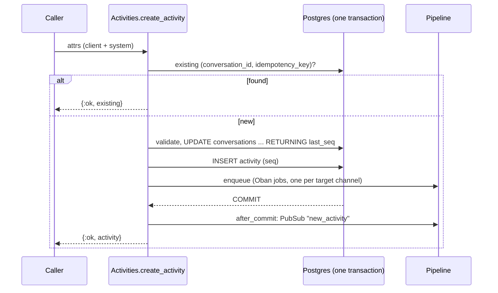

An activity is one message or event in a [conversation](conversations.md): a user's text, a bot reply, an upload, a reaction, an edit, a typing notice, a lifecycle event. Activities are append-only: an edit or delete is a new activity that refers to the original ([edits and deletes](#edits-and-deletes)). They are ordered by a server-assigned, gap-free sequence number `seq`, and every outward representation (REST, WebSocket, webhooks) is built from one canonical serializer.

Source: [`lib/converger/activities/activity.ex`](https://github.com/AimTune/converger/blob/main/lib/converger/activities/activity.ex), [`lib/converger/activities.ex`](https://github.com/AimTune/converger/blob/main/lib/converger/activities.ex), [`lib/converger/activities/serializer.ex`](https://github.com/AimTune/converger/blob/main/lib/converger/activities/serializer.ex).

## Schema

Table `activities`:

| Field | Type | Set by | Notes |
| --- | --- | --- | --- |
| `id` | uuid | server | Primary key. |
| `tenant_id` | uuid | server | From the credentials. |
| `conversation_id` | uuid | server | From the URL or token. |
| `seq` | bigint | server | Per-conversation sequence number: 1, 2, 3, ... `(conversation_id, seq)` is unique. |
| `type` | text | client | Default `"message"`. Must be a known [type](#types); anything else is rejected with `422`. |
| `sender` | text | server | Required. Who sent it (see [Sender](#sender)). |
| `text` | text | client | Optional. At most 65,536 bytes. |
| `attachments` | array of maps | client | Default `[]`. At most 10, each at most 4,096 bytes as JSON. |
| `metadata` | map | client | Default `{}`. At most 16,384 bytes as JSON. Exposed as `channelData` in the client API. |
| `idempotency_key` | text | server | From the `x-idempotency-key` header or the provider message id. `(conversation_id, idempotency_key)` is unique where not null. |
| `reply_to_id` | uuid | client | Optional. The activity this one refers to, in the same conversation ([references](#references-replies-reactions-edits-and-deletes)). No foreign key (`activities` is partitioned, [ADR-0034](../adr/0034-monthly-partitioning-and-per-tenant-retention.md)); the reference can dangle once retention drops the original's month. |
| `edited_at`, `deleted_at` | utc_datetime_usec | server | Stamped on a message when a `messageUpdate` or `messageDelete` for it is accepted. Never cast from input. |
| `inserted_at`, `updated_at` | utc_datetime_usec | server | The server timestamp always wins. Clients cannot set it. |

### Types

Converger's own activity vocabulary, kept stable (`Activity.types/0`, decided in [ADR-0036](../adr/0036-rich-activity-model.md)):

| Type | Typical use |
| --- | --- |
| `message` | A chat message (text and/or attachments). The default. With `reply_to_id` it is a threaded reply. |
| `event` | An application event. Put the payload in `metadata`. |
| `typing` | A stored typing indicator, kept for existing clients that post it over REST. Live typing is the transient `typing` signal, which is never stored ([ADR-0032](../adr/0032-transient-conversation-signals.md)); external channels get it through `send_typing/2`. `typing` activities are never delivered to messaging adapters. |
| `messageReaction` | A reaction to a message. `text` is the emoji (or a short reaction name, at most 64 bytes); empty means the sender removed their reaction. `reply_to_id` (required) is the message. |
| `messageUpdate` | An edit. `text` and/or `attachments` are the new content; `reply_to_id` (required) is the edited message. |
| `messageDelete` | A delete. `reply_to_id` (required) is the deleted message. |
| `conversationUpdate` | A conversation lifecycle change. The server emits these with sender `"system"` on close and reopen ([conversations](conversations.md#lifecycle)). |
| `endOfConversation` | The sender signals the end of the conversation. The server attaches no behavior to this type: it does not close the conversation, so use the close endpoint for that. |
| `deliveryReceipt` | Internal. Only the server may create it (`create_activity(attrs, internal: true)`); clients get `422`. Never delivered to channels. Reserved: nothing emits it today, since delivery and read receipts are transient `deliveryStatus` signals plus stored read watermarks ([ADR-0032](../adr/0032-transient-conversation-signals.md)). |

Any other `type` is rejected with `422`. The rich message vocabulary (buttons, cards, carousels as typed payloads) is Planned ([#68](https://github.com/AimTune/converger/issues/68)); until then cards travel as `application/vnd.converger.card.*` attachments.

### Size limits

| Limit | Default | Measured as |
| --- | --- | --- |
| `max_text_bytes` | `65_536` | bytes of `text` |
| `max_attachments` | `10` | number of entries |
| `max_attachment_bytes` | `4_096` | JSON size of each attachment descriptor (not of the file itself, which is uploaded separately) |
| `max_metadata_bytes` | `16_384` | JSON size of `metadata` |

Override them with `config :converger, :activity_limits, max_text_bytes: ..., ...`.

### Attachments

`attachments` holds descriptors, not file contents. Files are uploaded with `POST /api/v1/converger/conversations/:id/upload` (multipart), which stores the file, creates an `attachments` row and an activity whose attachment looks like this:

```json
{
  "contentType": "image/png",
  "contentUrl": "http://localhost:4000/api/v1/converger/attachments/7f1c...",
  "name": "screenshot.png",
  "size": 48213
}
```

`contentUrl` is served through an authenticated endpoint, or redirected to a signed storage/CDN URL. See [storage](../storage.md) and [ADR-0007](../adr/0007-attachment-storage-with-hand-written-signing.md).

Every attachment written through any entry point is validated and normalised by the embedded schema `Converger.Activities.ActivityAttachment`:

| Field | Type | Rule |
| --- | --- | --- |
| `contentType` | string | **Required.** A MIME type (`image/png`, `image/*`) or a well-known Converger type, at most 255 characters. |
| `contentUrl` | string | Optional. An absolute `http`/`https` URL or a server path such as `/api/v1/converger/attachments/ID`. `javascript:`, `data:` and other schemes are rejected. At most 2,048 characters. |
| `name` | string | Optional. File name, at most 1,024 characters. |
| `size` | integer | Optional. Bytes, `>= 0`. |
| `thumbnailUrl` | string | Optional. Same rules as `contentUrl`. |
| `content` | object or array | Optional. Inline payload for structured attachments. |
| `channelData` | object | Optional. Provider passthrough (for example a WhatsApp `providerMediaId`). |

Other keys are dropped; nil values are omitted. An attachment without `contentType` is rejected with `422` (`{"errors": {"attachments": ["attachment 0: contentType can't be blank"]}}`).

Well-known content types:

| `contentType` | `content` |
| --- | --- |
| `application/vnd.converger.card.*` (for example `application/vnd.converger.card.hero`) | Required, an object: the card. Renderers that do not know the card type show the activity `text`. |
| `application/vnd.converger.location` | `{latitude, longitude, name?, address?, url?}` |
| `application/vnd.converger.contacts` | `[{name, phones}]` |

Validation applies to new writes only. Attachments stored before it (possibly without `contentType`, or with provider keys at the top level) are returned exactly as stored. The JSON Schema is published with the protocol as `$defs/attachment` of [`priv/protocol/v1/activity.schema.json`](https://github.com/AimTune/converger/blob/main/priv/protocol/v1/activity.schema.json).

## References: replies, reactions, edits and deletes

`reply_to_id` names another activity **of the same conversation**; a reference to an unknown activity, or to one in another conversation, is rejected with `422` (`{"errors": {"reply_to_id": ["does not exist in this conversation"]}}`). The check runs in the insert transaction, after the `seq` is allocated under the conversation row lock, and a rejected activity rolls its `seq` back. There is no database foreign key (`activities` is partitioned by month, [ADR-0034](../adr/0034-monthly-partitioning-and-per-tenant-retention.md)), so once retention drops the month holding an original, later activities may still name it in `reply_to_id`: clients must treat an unknown `replyToId` as "original unavailable".

| Type | `reply_to_id` | Target | Who may send it |
| --- | --- | --- | --- |
| `message` | optional: a threaded reply | any activity | anyone |
| `messageReaction` | required | a `message` | anyone |
| `messageUpdate` | required | a `message` that is not deleted | the original's sender only |
| `messageDelete` | required | a `message` that is not deleted | the original's sender only |

### Edits and deletes

An edit or delete is a new activity with its own `seq`, so every client sees it in order, also on replay. Accepting a `messageUpdate` stamps `edited_at` on the original; accepting a `messageDelete` stamps `deleted_at`. Both happen in the same transaction as the insert. The original's `text` and `attachments` are **not** rewritten: clients (SDKs) apply the update or hide the deleted message. A deleted message cannot be edited or deleted again. Removing the stored content of a deleted message (redaction, retention) is not part of this; see Planned retention ([#30](https://github.com/AimTune/converger/issues/30)).

### Inbound references

Adapters name the provider message a reply or reaction refers to (a WhatsApp `context.id` or `reaction.message_id`). The inbound controller resolves it to an activity of the same conversation with `Activities.get_activity_by_provider_message_id/2`: an inbound message by its idempotency key, or an outbound message by the provider message id of its delivery. A reaction, edit or delete whose target cannot be resolved (sent before Converger saw the conversation) is stored as an `event` with its metadata, never dropped. A reply whose target cannot be resolved is a plain `message`; the provider id stays in `metadata.reply_to`.

### Delivery to channels

Adapters declare the types they deliver natively ([capabilities](../channels/writing-an-adapter.md#capabilities-and-downgrade)). For other types the channel config key `unsupported_activities` decides: `downgrade` (default) sends a `message` with a text rendering, `skip` sends nothing.

| Type | Downgraded text |
| --- | --- |
| `messageReaction` | `"<sender> reacted with <emoji>"`; a removed reaction is skipped |
| `messageUpdate` | `"(edited) <text>"` |
| `messageDelete` | `"<sender> deleted a message"` |
| `event`, `endOfConversation`, `conversationUpdate` | the activity `text`; skipped when it has none |
| `typing` | skipped |

`deliveryReceipt` is never delivered to channels. WebSocket clients receive every type through the broadcast.

## Client versus system fields

Activities are created from untrusted input (REST bodies, WebSocket payloads, parsed inbound webhooks), so the schema has two changesets ([ADR-0005](../adr/0005-separate-client-and-system-changesets.md), issue [#5](https://github.com/AimTune/converger/issues/5)):

| Changeset | Casts | Used for |
| --- | --- | --- |
| `client_changeset/3` | `type`, `text`, `attachments`, `metadata`, `reply_to_id` (`Activity.client_fields/0`) | Everything a client may set. Validates type (client types only, unless `internal: true`), sizes, attachments and per-type rules. |
| `system_changeset/2` | `tenant_id`, `conversation_id`, `sender`, `idempotency_key` | Server-controlled fields. Never fed raw client input. |
| `changeset/3` | both | Trusted internal callers. |

`Activities.create_client_activity(client_params, system_attrs)` takes **only** the client keys from `client_params`, then merges `system_attrs` built by the controller or socket. Fields such as `inserted_at`, `seq`, `id`, `tenant_id` or `idempotency_key` in a request body are ignored. `seq` is never cast at all. It is added after validation.

### Sender

| Entry point | `sender` |
| --- | --- |
| `POST /api/v1/conversations/:id/activities` (tenant API key) | The body's `"sender"` when it is a non-empty string, else `"user"`. |
| `POST /api/v1/converger/conversations/:id/activities` (client API) | `from.id` from the body, else `"user"`. |
| `postActivity` on `/socket/converger` (`ConvergerChannel`) | The token's `user_id` claim, else `from.id` from the payload, else `"user"`. |
| `new_activity` on `/socket` (`ConversationChannel`, deprecated) | The token's `sub` claim. Never taken from the payload. |
| Inbound webhook | The adapter's parsed `"sender"` (for example the WhatsApp phone number). |
| Lifecycle events | `"system"` |
| Echo adapter replies | `"bot"` |

## Idempotency

| Source | Key |
| --- | --- |
| REST (both APIs) | `x-idempotency-key` request header |
| WebSocket `postActivity` | `clientId` in the payload (1 to 128 characters of `A-Z a-z 0-9 . _ : ~ -`), stored as `ws:<sender>:<clientId>` |
| WebSocket `new_activity` (legacy socket, deprecated) | `idempotency_key` in the payload, stored as `ws:<sender>:<idempotency_key>` |
| Inbound webhooks | the provider message id from the adapter (for example a WhatsApp `wamid`) |
| Echo replies | `"echo:" <> original_activity_id` |

`create_activity/2` first looks for an existing activity with the same `(conversation_id, idempotency_key)` and returns it unchanged if found. A concurrent insert that loses the race on the unique index is also resolved to the existing activity. A retried request therefore returns `201`/`200` with the **original** activity, even if its body differs. For inbound webhooks, the key is additionally checked across every conversation of the channel before conversation resolution, so a redelivered provider message is recognized even when it would resolve to a new conversation ([ADR-0015](../adr/0015-per-message-idempotent-inbound-batches.md)). Activities without a key are not deduplicated. A `postActivity` re-sent with the same `clientId` returns the stored activity in its `ok` reply (`id`, `seq`, `watermark`) and creates nothing; see [WebSocket](../websocket.md#6-send-activities-over-the-socket).

## Sequence numbers (`seq`)

`seq` gives every conversation a strict, gap-free order that does not depend on node clocks (issue [#6](https://github.com/AimTune/converger/issues/6), [ADR-0006](../adr/0006-per-conversation-seq-and-opaque-watermarks.md)). It is allocated inside the activity's insert transaction:

```sql
UPDATE conversations
SET last_seq = last_seq + 1, updated_at = now()
WHERE id = $1 AND status = 'active'
RETURNING last_seq
```

- The `UPDATE` takes the conversation's row lock and holds it until commit, so concurrent inserts into one conversation, on any node, are numbered 1, 2, 3, ... in commit order.
- A rollback also rolls back the increment, so there are no gaps.
- The same statement enforces the [lifecycle](conversations.md#rejection-of-activities-on-closed-conversations): on a closed conversation, no row matches and the insert fails with `conversation_closed`.
- It bumps `updated_at`, which the expiry worker treats as the last-activity time.

Lists are ordered by `seq` ascending. Migration [`20261008150000_add_seq_to_activities`](https://github.com/AimTune/converger/blob/main/priv/repo/migrations/20261008150000_add_seq_to_activities.exs) added `conversations.last_seq` and `activities.seq`, backfilled existing rows in `(inserted_at, id)` order, and added the unique index. It needs a maintenance window ([deployment](../deployment.md#migrations-that-need-a-maintenance-window)).

### Watermarks

Clients resume with an opaque **watermark**, the position of the last activity they received. It is `Base.url_encode64("seq:" <> seq, padding: false)`, so `seq` 2 encodes as `c2VxOjI`. Clients must treat it as opaque. Decoding needs no database lookup. Watermarks from before `seq` (Base64 activity ids) are still accepted for one release.

| Endpoint | Watermark | Response |
| --- | --- | --- |
| `GET /api/v1/conversations/:id/activities?watermark=&limit=` | invalid: `400 {"error": "Invalid watermark"}` | `{"data": [...], "meta": {"watermark", "has_more", "limit"}}` |
| `GET /api/v1/converger/conversations/:id/activities?watermark=&limit=` | invalid: starts from the beginning | `{"activities": [...], "watermark", "has_more"}` |
| WebSocket join (`watermark` param) | replays at most `ws_replay_limit` (100) activities. The rest come over REST. | frames |

Page size defaults to 100 and is capped at 1000 (`PAGINATION_ACTIVITY_DEFAULT_LIMIT`, `PAGINATION_ACTIVITY_MAX_LIMIT`).

## Creating an activity: what happens



If enqueueing the delivery jobs fails, the transaction rolls back and the caller gets `{:error, :delivery_enqueue_failed}` (REST `503`). Retrying with the same idempotency key is safe ([ADR-0001](../adr/0001-transactional-outbox-with-oban.md)). Each successful create emits `[:converger, :activities, :create]` telemetry with the `tenant_id`.

## Canonical JSON shape

`Converger.Activities.Serializer.canonical/1` is the single representation of an activity ([ADR-0004](../adr/0004-single-canonical-activity-serializer.md)). The PubSub `new_activity` broadcast, the `/api/v1` REST responses, outbound webhook bodies (with an added `timestamp`) and, by mapping, the client API are all built from it:

```json
{
  "id": "0e7d4c1a-8b2f-4f6e-a1c3-7d9e2b4f6a80",
  "type": "message",
  "sender": "user-1",
  "text": "Hello, Converger",
  "attachments": [],
  "metadata": {},
  "idempotency_key": "hello-1",
  "seq": 1,
  "reply_to_id": null,
  "edited_at": null,
  "deleted_at": null,
  "conversation_id": "5b0c8f2e-3c1d-4a8e-9f3a-1d2e3f4a5b6c",
  "tenant_id": "3f2a1b0c-9d8e-4f7a-b6c5-d4e3f2a1b0c9",
  "inserted_at": "2026-10-09T10:15:02.481230Z"
}
```

`attachments` and `metadata` are never `null` (empty list and empty map instead).

The client API (`/api/v1/converger` REST and the `/socket/converger` frames) uses a Direct Line style shape derived from the same map by `ConvergerWeb.ConvergerAPI.ActivityJSON.activity_data/1`:

| Client API field | Canonical field |
| --- | --- |
| `id` | `id` |
| `type` | `type` |
| `from.id` | `sender` |
| `text` | `text` |
| `timestamp` | `inserted_at` |
| `attachments` | `attachments` |
| `conversationId` | `conversation_id` |
| `channelData` | `metadata` |
| `replyToId` | `reply_to_id` |
| `editedAt` | `edited_at` |
| `deletedAt` | `deleted_at` |

```json
{
  "id": "0e7d4c1a-8b2f-4f6e-a1c3-7d9e2b4f6a80",
  "type": "message",
  "from": { "id": "user-1" },
  "text": "Hello, Converger",
  "timestamp": "2026-10-09T10:15:02.481230Z",
  "attachments": [],
  "conversationId": "5b0c8f2e-3c1d-4a8e-9f3a-1d2e3f4a5b6c",
  "channelData": {},
  "replyToId": null,
  "editedAt": null,
  "deletedAt": null
}
```

`seq`, `idempotency_key` and `tenant_id` are not part of the client API shape. The client's position is carried by the watermark instead. The frame format of the planned Converger Protocol v1 is defined separately (spec in progress, [#21](https://github.com/AimTune/converger/issues/21), [#63](https://github.com/AimTune/converger/issues/63)).
