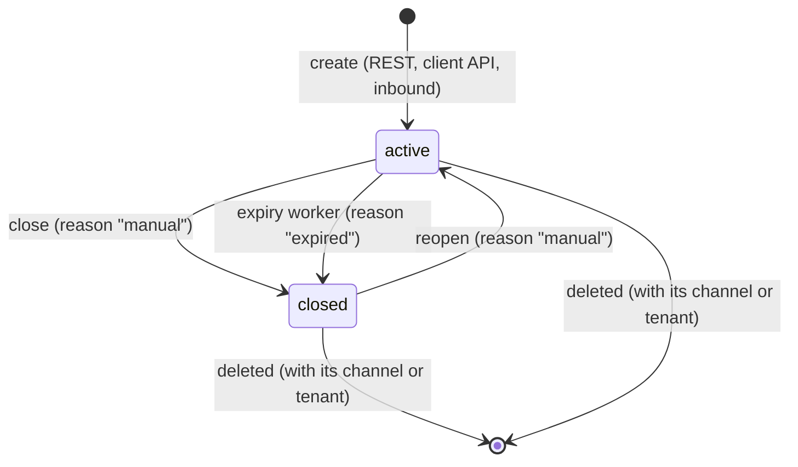

A conversation is an ordered thread of [activities](activities.md) on one [channel](channels.md), optionally tied to an external [participant](participants.md). It owns the per-conversation sequence counter (`last_seq`) and a lifecycle status that decides whether new activities are accepted.

Source: [`lib/converger/conversations/conversation.ex`](https://github.com/AimTune/converger/blob/main/lib/converger/conversations/conversation.ex), [`lib/converger/conversations.ex`](https://github.com/AimTune/converger/blob/main/lib/converger/conversations.ex).

## Schema

Table `conversations`:

| Field | Type | Default | Notes |
| --- | --- | --- | --- |
| `id` | uuid | | Primary key. |
| `tenant_id` | uuid | | Owner. |
| `channel_id` | uuid | | The channel the conversation lives on. Its activities are delivered to this channel (when it can send) and to its routing rule targets. |
| `participant_id` | uuid, nullable | | The external party, set by inbound participant resolution. Never cast from client input. Cleared if the participant is deleted. |
| `status` | text | `"active"` | `active` or `closed`, validated by the changeset. |
| `last_seq` | bigint | `0` | Highest activity `seq` handed out. Server-managed. |
| `metadata` | map | `{}` | Free-form. Converger sets `{"source": "converger"}` for client-API conversations and `{"source": "inbound_webhook"}` for conversations created by inbound messages. |
| `inserted_at`, `updated_at` | utc_datetime_usec | | `updated_at` is bumped on every activity insert and status change, so it is the last-activity time. |

Indexes: `(tenant_id)`, `(channel_id)`, `(participant_id, status)`, `(status, updated_at)` for expiry, and the keyset pagination indexes ([ADR-0018](../adr/0018-keyset-pagination.md)).

The REST representation (`ConvergerWeb.ConversationJSON`) is:

```json
{
  "data": {
    "id": "5b0c8f2e-3c1d-4a8e-9f3a-1d2e3f4a5b6c",
    "status": "active",
    "metadata": { "source": "inbound_webhook" },
    "channel_id": "8d1e2f3a-...",
    "tenant_id": "3f2a1b0c-...",
    "participant_id": "c4d5e6f7-...",
    "participant": { "id": "c4d5e6f7-...", "external_id": "905551112233", "display_name": "Ayse" },
    "inserted_at": "2026-10-09T10:00:00.000000Z",
    "updated_at": "2026-10-09T10:15:02.733914Z"
  }
}
```

`participant` is `null` when the conversation has none, or when it was not preloaded (the close and reopen responses do not preload it).

## Lifecycle

A conversation has exactly two statuses. There is no separate "expired" status: expiry closes the conversation with reason `"expired"`.



| Status | Meaning | Accepts activities |
| --- | --- | --- |
| `active` | Open. `Conversations.open_status/0`. | yes |
| `closed` | Closed manually or by inactivity. `Conversations.closed_status/0`. | no (except the server's own lifecycle event) |

### Close and reopen

| Operation | Tenant API (`x-api-key`) | Client API (bearer token) |
| --- | --- | --- |
| Close | `POST /api/v1/conversations/:id/close` | `POST /api/v1/converger/conversations/:id/close` |
| Reopen | `POST /api/v1/conversations/:id/reopen` | `POST /api/v1/converger/conversations/:id/reopen` |

The tenant API returns the conversation (`{"data": {...}}`). The client API returns `{"conversationId": "...", "status": "closed"}`. The tenant portal (`/portal/conversations/:id`) has Close and Reopen buttons too.

`close_conversation/2` and `reopen_conversation/2` run one conditional `UPDATE ... WHERE id = $1 AND status = <from>`:

- **Idempotent.** Closing a closed conversation (or reopening an open one) changes nothing, emits nothing, and returns the conversation as it is.
- **Serialized with activity inserts.** The update takes the conversation's row lock, the same lock that allocates `seq`. An activity either commits before the close, or is rejected after it. Nothing slips in between ([ADR-0017](../adr/0017-conversation-lifecycle-enforced-under-the-seq-lock.md)).
- **Announced in-band.** A successful transition emits a `conversationUpdate` activity with sender `"system"`:

```json
{
  "type": "conversationUpdate",
  "sender": "system",
  "text": null,
  "metadata": {
    "event": "conversation_closed",
    "status": "closed",
    "reason": "manual"
  }
}
```

`event` is `conversation_closed` or `conversation_reopened`. `reason` is `"manual"` by default (the `:reason` option), and `"expired"` for expiry. The close event is created with `allow_closed: true`, so it is always the **last** activity of a closed conversation. It is broadcast to WebSocket clients like any activity. Of the external channels, only `webhook` channels receive lifecycle events. Messaging adapters (WhatsApp, echo) skip them, so they never send an empty message.

### Expiry

`Converger.Workers.ConversationExpirationWorker` runs hourly (Oban cron `0 * * * *`) and calls `Conversations.expire_inactive_conversations/1`. It closes every `active` conversation whose `updated_at` is older than the inactivity window, and emits a `conversationUpdate` with reason `"expired"` for each one.

| Setting | Default | Description |
| --- | --- | --- |
| `config :converger, :conversation_inactivity_hours` | `24` | Inactivity window in hours. |
| job arg `"inactivity_hours"` | | Overrides the window for one job run, for example a manually inserted job. |

The worker closes conversations in batches of 500 using the `(status, updated_at)` index. The outer `UPDATE` re-checks `status` and `updated_at` under the row lock, so a conversation that received an activity after the batch was selected is not closed. Migration [`20261009170000_add_conversation_lifecycle_index`](https://github.com/AimTune/converger/blob/main/priv/repo/migrations/20261009170000_add_conversation_lifecycle_index.exs) moved `updated_at` forward to the latest activity for existing rows, so the first run after deploy did not close conversations that were still in use.

### Rejection of activities on closed conversations

The status check happens in the statement that allocates `seq`:

```sql
UPDATE conversations SET last_seq = last_seq + 1, updated_at = now()
WHERE id = $1 AND status = 'active'
RETURNING last_seq
```

When no row is updated and the conversation exists, `Activities.create_activity/2` returns `{:error, :conversation_closed}` and the whole transaction rolls back. Clients see:

| Path | Result |
| --- | --- |
| REST (`/api/v1`, `/api/v1/converger`) | `409 {"error": "conversation_closed", "detail": "Conversation is closed"}` |
| WebSocket `postActivity` push (Converger API socket) | error reply with reason `conversation_closed` |
| WebSocket `new_activity` push (legacy socket, deprecated) | error reply with reason `conversation_closed` |
| Echo adapter replying into a conversation closed meanwhile | the reply is dropped, and the delivery counts as successful |
| Inbound webhook | never reaches a closed conversation through participant resolution (see below). A request with an explicit `conversation_id` of a closed conversation stops with `409`. |

Use `Conversations.open?/1` or `ensure_open/1` to check the status before expensive work such as uploads.

## Creating conversations

| Path | Credentials | Channel |
| --- | --- | --- |
| `POST /api/v1/conversations` (deprecated) | `x-channel-token` (channel token, shown in the admin channel table, valid 1 h; deprecated, see [migrating from the legacy surfaces](../api/migrating-from-legacy.md)) | The token's channel. It must be active. The body may carry `metadata`. |
| `POST /api/v1/converger/conversations` | bearer Converger token | The token's channel. Returns a conversation-scoped token and `streamUrl`. |
| Inbound webhook | channel signature | Resolved automatically (see below). |

## How inbound messages find their conversation

Providers such as WhatsApp never send a Converger conversation id. `ConvergerWeb.InboundController` resolves the conversation for each inbound message in this order (issue [#16](https://github.com/AimTune/converger/issues/16), [ADR-0016](../adr/0016-participant-based-conversation-resolution.md)):

1. **Explicit id.** If the request carries `conversation_id`, that conversation is used (scoped to the channel's tenant, `404` if unknown).
2. **Participant.** If the adapter parsed a participant (`"participant": {"external_id": ..., "display_name": ...}`), `Participants.resolve_conversation/2` upserts the participant `(channel_id, external_id)` and reuses its most recent `active` conversation on the channel, unless that conversation has been idle longer than the channel's idle timeout. Otherwise it creates a new conversation for the participant.
3. **Neither.** A new conversation without a participant is created.

Closed (manually or by expiry) conversations are never reused for inbound messages: the next message from that participant starts a new conversation. The participant upsert locks the participant row until the transaction commits, so concurrent messages from one participant end up in one conversation. See [participants](participants.md).

Before resolution, a message whose provider id (`idempotency_key`) already exists in any conversation of the channel is treated as a duplicate and skipped ([ADR-0015](../adr/0015-per-message-idempotent-inbound-batches.md)).

## Listing

`GET /api/v1/conversations` (tenant API key only) returns the tenant's conversations, newest first, keyset-paginated on `(inserted_at, id)`, with the participant preloaded.

| Query param | Description |
| --- | --- |
| `limit` | Page size. Default 50, maximum 500 (`PAGINATION_DEFAULT_LIMIT`, `PAGINATION_MAX_LIMIT`). |
| `cursor` | `meta.next_cursor` from the previous page. An invalid cursor returns `400 {"error": "Invalid cursor"}`. |
| `status` | `active` or `closed`. |
| `channel_id` | UUID (`400` if malformed). |
| `external_id` | The participant's provider id, for example a phone number. |

The response is `{"data": [...], "meta": {"next_cursor": "...", "has_more": true, "limit": 50}}`.
