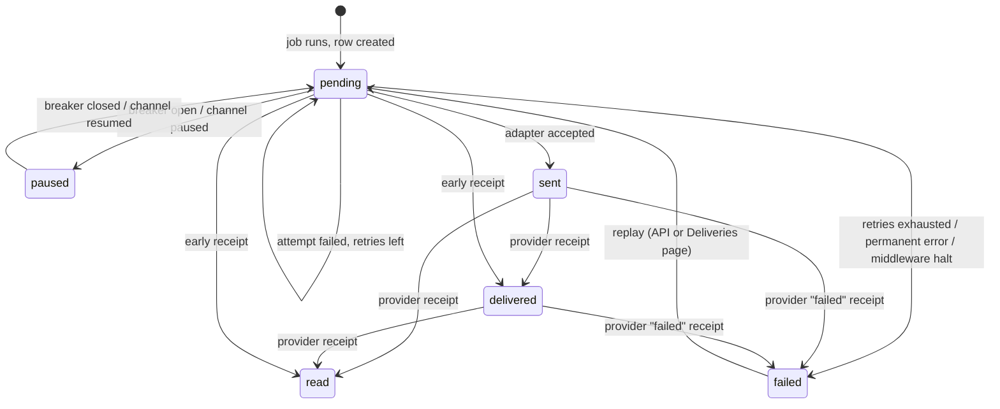

A delivery is the record of one [activity](activities.md) being sent to one [channel](channels.md) through its adapter. There is at most one delivery per `(activity, channel)` pair. It tracks the outcome (`pending`, `paused`, `sent`, `delivered`, `read`, `failed`), the number of attempts, the last error, and the provider's message id, so that later delivery and read receipts can be matched to it.

This page describes the record. The [delivery pipeline](../delivery.md) page covers the job mechanics (Oban, backends, Lifeline) in depth.

Source: [`lib/converger/deliveries/delivery.ex`](https://github.com/AimTune/converger/blob/main/lib/converger/deliveries/delivery.ex), [`lib/converger/deliveries.ex`](https://github.com/AimTune/converger/blob/main/lib/converger/deliveries.ex), [`lib/converger/pipeline.ex`](https://github.com/AimTune/converger/blob/main/lib/converger/pipeline.ex), [`lib/converger/workers/activity_delivery_worker.ex`](https://github.com/AimTune/converger/blob/main/lib/converger/workers/activity_delivery_worker.ex).

## Schema

Table `deliveries`:

| Field | Type | Default | Notes |
| --- | --- | --- | --- |
| `id` | uuid | | Primary key. Webhook requests send it as `x-converger-delivery-id`, which stays stable across retries. |
| `activity_id` | uuid | | The activity. Unique together with `channel_id`. |
| `channel_id` | uuid | | The target channel. |
| `status` | text | `"pending"` | `pending`, `paused`, `sent`, `delivered`, `read`, `failed`. `paused` means parked by an open [circuit breaker](../delivery.md#circuit-breaker) or a manual pause. |
| `attempts` | integer | `0` | Attempts made, successful or not. Drives the retry policy. |
| `last_error` | text | | Message of the last failure, or the provider's error for a `failed` receipt. |
| `sent_at` | utc_datetime_usec | | When the adapter accepted the message (or the provider's `sent` receipt time). |
| `delivered_at` | utc_datetime_usec | | Provider delivery receipt. |
| `read_at` | utc_datetime_usec | | Provider read receipt. |
| `provider_message_id` | text | | For example the WhatsApp `wamid` or the Infobip message id. Used to correlate receipts. |
| `metadata` | map | `{}` | Adapter response metadata, merged on success. |
| `retry_count` | integer | `0` | How many times the delivery was replayed from the dead-letter queue. |
| `retried_by` | text | | Who replayed it last, as `"<actor type>:<actor id>"` (for example `"tenant_api:<tenant id>"` or `"admin:ops@example.com"`). |
| `retried_at` | utc_datetime_usec | | When it was last replayed. |
| `inserted_at`, `updated_at` | utc_datetime_usec | | |

Indexes: `(activity_id)`, `(channel_id)`, `(status)`, unique `(activity_id, channel_id)`, and partial indexes on `(provider_message_id)` and `(channel_id, provider_message_id)` where `provider_message_id IS NOT NULL`, plus `(inserted_at, id)`, `(status, updated_at, id)` and `(channel_id, status, updated_at, id)` for the keyset-paginated lists.

Replay tracking (`retry_count`, `retried_by`, `retried_at`) was added by migration [`20261010032000_add_replay_tracking_to_deliveries`](https://github.com/AimTune/converger/blob/main/priv/repo/migrations/20261010032000_add_replay_tracking_to_deliveries.exs), and the dead-letter indexes by [`20261010032100_add_dead_letter_indexes_to_deliveries`](https://github.com/AimTune/converger/blob/main/priv/repo/migrations/20261010032100_add_dead_letter_indexes_to_deliveries.exs) (built `CONCURRENTLY`).

Receipt tracking was added by migration [`20260227200000_add_receipt_tracking_to_deliveries`](https://github.com/AimTune/converger/blob/main/priv/repo/migrations/20260227200000_add_receipt_tracking_to_deliveries.exs). It added `sent_at`, `read_at` and `provider_message_id`, renamed the old success status `delivered` to `sent` (adapter success only means the message left Converger, while `delivered` is now reserved for the provider's receipt), copied `delivered_at` to `sent_at`, and backfilled `provider_message_id` from `metadata.whatsapp_message_id` or `metadata.infobip_message_id`.

## Which deliveries exist

When an activity is created, `Converger.Pipeline.resolve_delivery_channels/1` picks the targets, and the Oban backend inserts one `ActivityDeliveryWorker` job per target **in the activity's transaction** ([ADR-0001](../adr/0001-transactional-outbox-with-oban.md)). The delivery row itself is created by the job on its first run (`get_or_create_delivery/2`). Targets are:

- the conversation's own channel, if its type is delivered through an adapter (`echo`, `webhook`, `whatsapp_meta`, `whatsapp_infobip`) and its mode is `outbound` or `duplex`;
- plus the targets of enabled [routing rules](routing-rules.md) whose source is that channel, if they are active, deliverable and `outbound`/`duplex`;
- minus the participant's own channel when the activity was sent by that participant (no echo back to the author);
- minus every non-`webhook` channel for `conversationUpdate` lifecycle events.

`websocket` channels never get delivery records. Their clients receive the PubSub broadcast. Per-socket delivery with acks is Planned ([#22](https://github.com/AimTune/converger/issues/22), [#24](https://github.com/AimTune/converger/issues/24)).

## Status lifecycle



Status ranks are `pending` 0, `paused` 0, `sent` 1, `delivered` 2, `read` 3, and `failed` -1. Receipts only move a delivery **forward** (`Deliveries.advance_status/2`):

- a receipt with a higher rank than the current status is applied, and a stale one (for example `delivered` after `read`) is ignored;
- `failed` is applied from any status except `read`;
- a `failed` delivery is never advanced by later receipts.

Every status change is broadcast on the conversation's PubSub topic as `delivery_status`:

```json
{
  "delivery_id": "1c2d3e4f-...",
  "activity_id": "0e7d4c1a-...",
  "channel_id": "8d1e2f3a-...",
  "status": "read",
  "sent_at": "2026-10-09T10:15:03.010000Z",
  "delivered_at": "2026-10-09T10:15:04.000000Z",
  "read_at": "2026-10-09T10:16:10.000000Z"
}
```

The admin conversation view uses it to update delivery badges live. Converger API WebSocket clients receive every change as a `deliveryStatus` frame (end users with a `user_id` only for activities they sent); see [WebSocket](../websocket.md#5a-receipts-typing-and-presence).

## Attempts and retries

`Pipeline.deliver/2` runs once per job execution:

1. Load or create the delivery. If it is already `sent`, `delivered` or `read`, return `:ok` without re-sending (idempotent).
2. Run the target channel's [middleware](middleware.md) chain. A halt (including a middleware crash) dead-letters the delivery immediately with `last_error: "halted: <reason>"`.
3. Call the adapter's `deliver_activity/2`:

| Adapter result | Effect on the delivery | Job |
| --- | --- | --- |
| `:ok` / `{:ok, meta}` | `sent`, `sent_at` set, `attempts + 1`, `meta` merged into `metadata`, `provider_message_id` taken from `whatsapp_message_id` / `infobip_message_id` | done |
| `{:error, %DeliveryError{retryable?: false}}` (for example HTTP 400 or 404, missing recipient) | `failed` (dead letter) | cancelled |
| any other `{:error, reason}`, retries left | stays `pending`, `attempts + 1`, `last_error` set | retried after backoff |
| any other `{:error, reason}`, retries exhausted | `failed` | cancelled |

HTTP statuses 408, 425, 429 and 5xx, as well as transport errors (timeouts, connection refused, DNS), are retryable. Other 4xx statuses are permanent.

The **delivery's** `attempts` counter and the channel's [retry policy](channels.md#retry-policy) decide when to stop, not Oban's attempt counter:

- defaults: `max_attempts: 5`, exponential backoff `base_ms * 3^attempt` (30 s, 90 s, 270 s, 810 s), capped at `max_ms` (1 h);
- a provider `Retry-After` header (for example on 429) replaces the backoff for the next attempt;
- the Oban job is unique per `{activity_id, channel_id}` with an infinite period, so re-processing an activity never creates a second live job. `max_attempts: 100` on the worker is only a safety cap;
- `Oban.Plugins.Lifeline` rescues jobs left `executing` by a crashed node after 30 minutes, and the delivery is attempted again.

See [ADR-0019](../adr/0019-per-channel-retry-policy-delivery-error-and-lifeline.md), and [ADR-0002](../adr/0002-broadway-for-throughput-oban-for-retries.md) for how the Broadway backend hands retries to Oban.

## Receipts

Providers report what happened after Converger handed a message over. Adapters that implement `parse_status_update/2` (the WhatsApp adapters, and the generic webhook) turn provider payloads into updates:

```json
{ "provider_message_id": "wamid.HBgM...", "status": "delivered", "timestamp": "1760004904" }
```

Receipts arrive on either of two endpoints:

- `POST /api/v1/channels/:channel_id/status`, which carries receipts only;
- `POST /api/v1/channels/:channel_id/inbound`. WhatsApp sends messages and statuses to the same URL. Statuses are applied first, then the messages.

Both go through the channel's [signature check](channels.md#signature-enforcement) and the per-channel `inbound` rate limit. `Deliveries.apply_status_update/2` finds the delivery by `provider_message_id` **scoped to that channel**, or by `delivery_id` when the update carries one. The timestamp may be ISO 8601 or Unix seconds, and defaults to now. Unknown ids are counted as not processed. The response reports how many receipts were applied:

```json
{ "status": "accepted", "receipts_processed": 1 }
```

## Dead letters

A delivery is dead-lettered (`status: "failed"`) when its retries run out, when the adapter reports a permanent error, or when middleware halts or crashes. On dead-lettering, Converger:

- keeps the row with `attempts` and `last_error`;
- emits `[:converger, :deliveries, :dead_lettered]` telemetry (measurement `attempts`, metadata `delivery_id`, `activity_id`, `channel_id`, `error`) and logs a warning;
- broadcasts `delivery_status`;
- cancels the Oban job.

`Deliveries.list_dead_letters/2` and `paginate_dead_letters/2` list failed deliveries, most recently failed first (keyset on `(updated_at, id)`). Failures also lower the channel's [health](channels.md#health-checks) status and can trigger the tenant's alert webhook.

Dead letters can be inspected and replayed on the **Deliveries** page of the admin panel and the tenant portal, and through the [tenant API](../api/tenant-api.md#deliveries). A replay moves the delivery back to `pending`, resets `attempts`, records `retry_count`, `retried_by` and `retried_at`, writes an audit log entry and enqueues a new job. See [Replaying dead letters](../delivery.md#replaying-dead-letters) for the rules.
