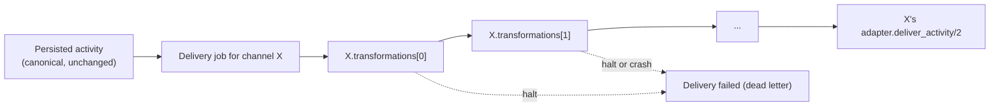

Middleware is a chain of small transformation steps attached to a channel. It runs once for every [delivery](deliveries.md) **to** that channel, after the activity has been persisted and just before the adapter sends it. Each step can modify the activity (text, metadata, ...) or halt the delivery. A typical chain adds a prefix for a support line, truncates text for an SMS-like target, or blocks messages that contain certain words.

Source: [`lib/converger/pipeline/middleware.ex`](https://github.com/AimTune/converger/blob/main/lib/converger/pipeline/middleware.ex) and [`lib/converger/pipeline/middleware/`](https://github.com/AimTune/converger/tree/main/lib/converger/pipeline/middleware).

## Where it runs



- **Per target channel.** Each target's own `transformations` apply to its own delivery. One activity routed to three channels can look different on each of them.
- **Delivery-time only.** The transformed activity is passed to the adapter and is not persisted. The stored activity, the REST responses and the PubSub/WebSocket broadcast always carry the original canonical activity.
- **Not for WebSocket clients.** `websocket` channels are not delivered through an adapter, so their transformations have no effect today.
- **Lifecycle events too.** `webhook` targets also receive `conversationUpdate` events, and those go through the chain. The built-ins treat a `nil` text as `""`, so `add_prefix` on a lifecycle event produces a text consisting of just the prefix.

## Configuring a chain

The chain is the channel's `transformations` field: an ordered JSON array of maps. Each map has a `"type"` and that middleware's options:

```json
[
  { "type": "content_filter", "block_patterns": ["password", "IBAN"] },
  { "type": "text_replace", "pattern": "\n\n", "replacement": "\n" },
  { "type": "add_prefix", "prefix": "[Support] " },
  { "type": "truncate_text", "max_length": 160, "ellipsis": "..." },
  { "type": "set_metadata", "values": { "source": "converger", "priority": "normal" } }
]
```

Steps run in array order, and each step receives the output of the previous one. `Channel.changeset/2` validates the chain with `Middleware.validate_chain/1`. An unknown type (`unknown middleware type: foo`) or invalid options (`add_prefix: requires "prefix" (string)`) reject the save with an error on `transformations`.

In the admin panel, the channel form has a **Middleware Pipeline** section ("+ Add Step"). Two types use friendlier inputs there that are converted on save: `set_metadata` takes one `key=value` per line, and `content_filter` takes comma-separated patterns. There is no REST endpoint for channel configuration yet ([#51](https://github.com/AimTune/converger/issues/51)). Per-rule transformations on routing rules are Planned ([#43](https://github.com/AimTune/converger/issues/43)).

## Built-in middleware

| Type | Module | Options | Effect |
| --- | --- | --- | --- |
| `add_prefix` | `Middleware.AddPrefix` | `prefix` (string, required) | `text = prefix <> text`. |
| `add_suffix` | `Middleware.AddSuffix` | `suffix` (string, required) | `text = text <> suffix`. |
| `text_replace` | `Middleware.TextReplace` | `pattern` (string, required), `replacement` (string, required) | Replaces **every** occurrence of `pattern` in `text`. Literal match (`String.replace/3`), not a regular expression. |
| `truncate_text` | `Middleware.TruncateText` | `max_length` (positive integer, required), `ellipsis` (string, default `"..."`) | If `text` is longer than `max_length` characters (graphemes), keeps the first `max_length` and appends `ellipsis`. The result can therefore be up to `max_length + length(ellipsis)` long. |
| `set_metadata` | `Middleware.SetMetadata` | `values` (map, required) | Merges `values` into `metadata`. Keys in `values` overwrite existing keys. |
| `content_filter` | `Middleware.ContentFilter` | `block_patterns` (list of strings, required) | If `text` contains any pattern (case-sensitive substring), **halts** with `"content blocked by filter"`. The delivery is dead-lettered. |

Notes:

- In all built-ins, a `nil` `text` is treated as `""`.
- `validate_opts/1` is strict, but `call/3` is lenient. At runtime, a step whose options do not match (for example a chain stored before validation existed) passes the activity through unchanged.
- A type that is not registered at runtime is skipped. A saved chain can only contain one if the registry changed after the save.

## The behaviour

```elixir
defmodule Converger.Pipeline.Middleware do
  @callback call(activity, channel, opts) :: {:cont, activity} | {:halt, String.t()}
  @callback validate_opts(opts) :: :ok | {:error, String.t()}
end
```

| Argument | Value |
| --- | --- |
| `activity` | The `%Converger.Activities.Activity{}` as returned by the previous step. |
| `channel` | The target `%Converger.Channels.Channel{}` (with decrypted `config`). |
| `opts` | The whole transformation map, string keys, including `"type"`. |

Until issue [#8](https://github.com/AimTune/converger/issues/8), the chain passed the transformation map in place of the channel. Middleware that read the channel (for example a per-channel template) silently got the wrong value. The fix passes the real channel ([ADR-0008](../adr/0008-middleware-receives-channel-and-crashes-are-contained.md)).

### Custom middleware

Register extra types (or override built-ins) with the `:extra_middleware` application env, a map from type string to module:

```elixir
# config/config.exs
config :converger, :extra_middleware, %{
  "tag_channel" => MyApp.Middleware.TagChannel
}
```

```elixir
defmodule MyApp.Middleware.TagChannel do
  @behaviour Converger.Pipeline.Middleware

  @impl true
  def call(activity, channel, %{"key" => key}) do
    {:cont, %{activity | metadata: Map.put(activity.metadata || %{}, key, channel.name)}}
  end

  @impl true
  def validate_opts(%{"key" => key}) when is_binary(key) and key != "", do: :ok
  def validate_opts(_), do: {:error, ~s[requires "key" (non-empty string)]}
end
```

The module must be compiled into the release. Middleware runs inside the delivery job, so keep it fast and side-effect free. Use the adapter, not middleware, for I/O.

## Crash containment

`Middleware.run/2` wraps every step in `rescue`/`catch` (`safe_call/5`). A step that raises, throws or exits does not crash the Oban job:

1. The chain halts with `"middleware crashed: <type>: <message>"`.
2. `[:converger, :middleware, :exception]` telemetry is emitted (measurement `count: 1`, metadata `middleware`, `type`, `activity_id`, `channel_id`, `kind`, `reason`, `stacktrace`).
3. `Pipeline.deliver/2` dead-letters the delivery immediately (`status: "failed"`, `last_error: "halted: middleware crashed: ..."`). The job is cancelled and **not retried**.

Before this, an exception crashed the worker, and Oban retried the job until its own attempt limit, re-running a deterministic bug every time. Treating a crash as a halt turns a buggy transformation into a visible, bounded failure: one dead letter per affected delivery, with a descriptive error. Other channels' deliveries of the same activity are unaffected ([ADR-0008](../adr/0008-middleware-receives-channel-and-crashes-are-contained.md)). Fix the chain, then redeliver. Dead-letter replay is Planned ([#32](https://github.com/AimTune/converger/issues/32)).
