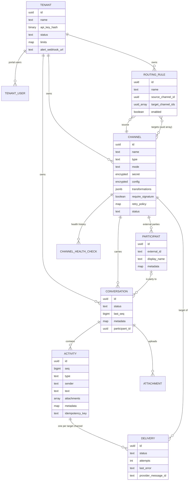

Converger has a small domain model. Every record belongs to a **tenant**. Messages enter and leave through **channels**, are grouped into **conversations**, and are stored as **activities**. Each outbound copy of an activity is a **delivery**. **Routing rules** decide which additional channels receive a conversation's activities, and **middleware** transforms an activity per target channel just before delivery.

## Entity relationships

All primary keys are UUIDs. Ownership foreign keys (channel to tenant, conversation to channel, activity to conversation, delivery to activity and channel, and so on) use `ON DELETE CASCADE`, so deleting a tenant removes everything it owns. A few references are cleared instead of cascading: deleting a participant sets `conversations.participant_id` to `NULL`, deleting an activity sets `attachments.activity_id` to `NULL`, and deleting a tenant sets `audit_logs.tenant_id` to `NULL`, so the audit trail survives.

Platform administrators (`admin_users`) and audit logs are not tenant-owned and are left out of the diagram. Audit log entries do carry an optional `tenant_id`.

## The concepts

| Concept | One-line definition | Page |
| --- | --- | --- |
| Tenant | An isolated customer of the hub. It holds a hashed API key, a status, rate-limit overrides and an alert webhook. | [Tenants](tenants.md) |
| Channel | An endpoint of a given adapter type (`webhook`, `websocket`, `whatsapp_meta`, `whatsapp_infobip`, `echo`) and mode (`inbound`, `outbound`, `duplex`), with an encrypted secret and config. | [Channels](channels.md) |
| Conversation | An ordered thread of activities on one channel. It is `active` or `closed`, and expires after inactivity. | [Conversations](conversations.md) |
| Participant | An external party on a channel (phone number, chat id), unique per channel. Inbound messages find their conversation through it. | [Participants](participants.md) |
| Activity | One message or event in a conversation, with a server-assigned, gap-free `seq`. | [Activities](activities.md) |
| Delivery | The record of one activity being sent to one channel: status, attempts, receipts, errors. | [Deliveries](deliveries.md) |
| Routing rule | "Activities of conversations on channel A also go to channels B, C". | [Routing rules](routing-rules.md) |
| Middleware | Per-channel transformation steps (`add_prefix`, `truncate_text`, `content_filter`, ...) applied before the adapter. | [Middleware](middleware.md) |

## How they work together

1. A message arrives through the REST API, a WebSocket, or a channel's inbound webhook (`/api/v1/channels/:id/inbound`). Inbound messages are matched to a conversation: an explicit `conversation_id`, else the [participant](participants.md)'s active conversation, else a new one.
2. The [activity](activities.md) is inserted. In the same transaction the conversation's `last_seq` is incremented under a row lock (this also checks that the conversation is open), and one Oban delivery job is inserted per target channel ([ADR-0001](../adr/0001-transactional-outbox-with-oban.md)).
3. The target channels are the conversation's own channel (when its type is delivered through an adapter and its mode can send) plus the targets of every enabled [routing rule](routing-rules.md) whose source is that channel.
4. After commit, the canonical activity is broadcast over PubSub to every socket subscribed to the conversation.
5. For each job, the target channel's [middleware](middleware.md) chain runs, then the adapter delivers. The [delivery](deliveries.md) record moves to `sent`, or stays `pending` and is retried with backoff, or is dead-lettered as `failed`. Provider receipts later advance it to `delivered` and `read`.

The [architecture section](../architecture/overview.md) describes the processes behind these steps. The [data model page](../architecture/data-model.md) lists every table and index.
