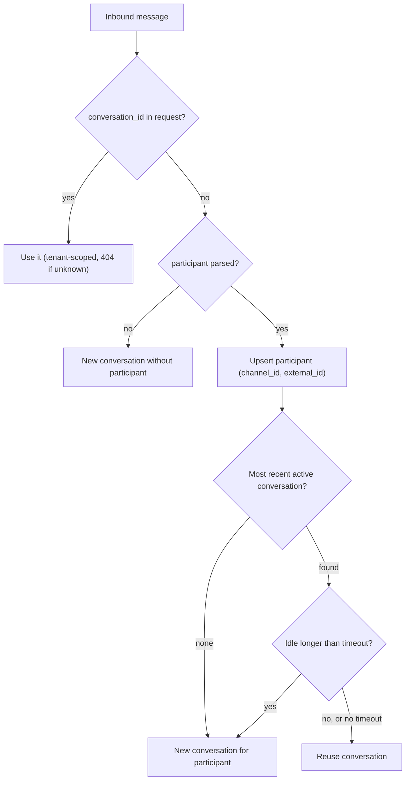

A participant is an external party on a channel, such as a WhatsApp phone number, a chat id or an email address. It is identified by `external_id`, which is unique per channel. Participants solve two problems. Providers never send a Converger conversation id, so inbound messages need another way to find their conversation. And outbound adapters need to know whom to send a reply to.

Participant-based resolution was added for issue [#16](https://github.com/AimTune/converger/issues/16). Before that, every inbound message without a `conversation_id` started a new conversation. See [ADR-0016](../adr/0016-participant-based-conversation-resolution.md).

Source: [`lib/converger/participants/participant.ex`](https://github.com/AimTune/converger/blob/main/lib/converger/participants/participant.ex), [`lib/converger/participants.ex`](https://github.com/AimTune/converger/blob/main/lib/converger/participants.ex), migration [`20261009150100_create_participants`](https://github.com/AimTune/converger/blob/main/priv/repo/migrations/20261009150100_create_participants.exs).

## Schema

Table `participants`:

| Field | Type | Notes |
| --- | --- | --- |
| `id` | uuid | Primary key. |
| `tenant_id` | uuid | Set from the channel. Never cast. |
| `channel_id` | uuid | The channel the party is reached on. Never cast. |
| `external_id` | text | Required, at most 255 characters. The provider's identifier, for example `905551112233`. Unique together with `channel_id`. |
| `display_name` | text, nullable | At most 255 characters, for example the WhatsApp profile name. |
| `metadata` | map | Default `{}`. |
| `inserted_at`, `updated_at` | utc_datetime_usec | |

`conversations.participant_id` references a participant (`ON DELETE SET NULL`), indexed together with `status`. A participant can have many conversations over time, but at most one is reused at a time: the most recent `active` one.

The same phone number on two channels is two participants. Resolution is always per channel.

## Resolution of inbound messages

An adapter's `parse_inbound/2` returns one map per message. When it can identify the sender, it includes a participant:

```json
{
  "type": "message",
  "text": "Hi, is my order shipped?",
  "sender": "905551112233",
  "idempotency_key": "wamid.HBgMOTA1NTUxMTEyMjMzFQIAEhgg...",
  "participant": { "external_id": "905551112233", "display_name": "Ayse" }
}
```

If the request carries no `conversation_id`, the inbound controller calls `Participants.resolve_conversation(channel, participant)`. In one transaction, it:

1. **Upserts** the participant with `INSERT ... ON CONFLICT (channel_id, external_id) DO UPDATE`. A non-null `display_name` overwrites the stored one, and a null one keeps it (`COALESCE`). The conflict update locks the participant row until commit.
2. **Finds** the participant's most recent conversation on this channel with `status = 'active'` (ordered by `inserted_at` descending).
3. **Checks the idle timeout.** If the channel has an idle timeout and the conversation's last activity (or, without activities, its creation time) is older than that, the conversation is not reused.
4. **Reuses** that conversation, or **creates** a new one with `participant_id` set and `metadata: {"source": "inbound_webhook"}`.

Because of the row lock in step 1, concurrent messages from the same participant are resolved one at a time and share a single conversation instead of racing to create two.



Closed conversations, whether closed manually or by [expiry](conversations.md#expiry), are never reused. The next message from that participant starts a new conversation.

### Idle timeout

| Setting | Default | Description |
| --- | --- | --- |
| channel `config["conversation_idle_timeout_seconds"]` | unset | Positive integer, per channel. |
| `config :converger, :inbound_conversation_idle_timeout_seconds` | unset | Installation-wide fallback. |

With neither set, the active conversation is reused until it is closed or expires (by default after 24 hours without activity, see [conversations](conversations.md#expiry)).

### Duplicates and invalid participants

Before resolution, the controller looks up the message's `idempotency_key` across all conversations of the channel (`Activities.get_activity_by_channel_idempotency_key/2`, served by a partial index on `activities.idempotency_key`). A redelivered provider message is reported as a duplicate and creates nothing. A participant that fails validation, for example an `external_id` longer than 255 characters, rejects only that message: it is logged and counted in `rejected`, and the rest of the batch is processed ([ADR-0015](../adr/0015-per-message-idempotent-inbound-batches.md)).

## Outbound addressing

Outbound adapters find the recipient with `Participants.recipient_for(activity, channel_id)`. It returns the `external_id` of the conversation's participant **when that participant belongs to the target channel** (for example, the WhatsApp number to reply to), and `nil` otherwise. The WhatsApp adapters first look at the activity's `metadata["recipient_phone"]` or `metadata["to"]`, then fall back to the participant. With no recipient at all, the delivery fails permanently: it is dead-lettered without retries.

The pipeline never delivers an inbound message back to its author. When the activity's `sender` equals the conversation participant's `external_id`, the participant's own channel is removed from the delivery targets. Routing rule targets still receive it. See [routing rules](routing-rules.md).

## Querying by participant

`GET /api/v1/conversations?external_id=905551112233` (tenant API key) returns conversations whose participant on the conversation's channel has this external id. Conversation responses include the preloaded participant as `{"id", "external_id", "display_name"}`.
