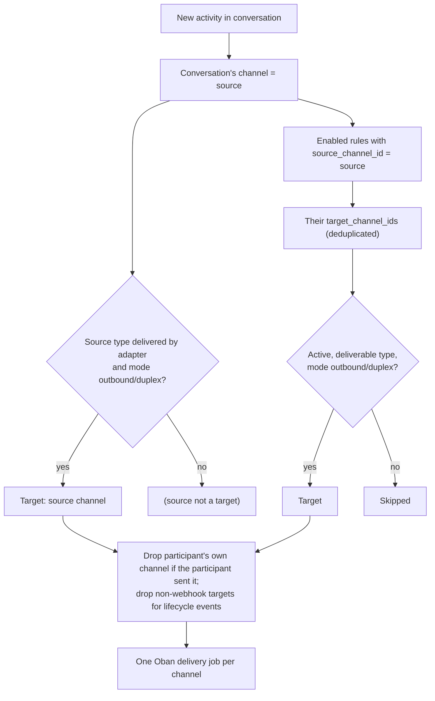

A routing rule says: "every activity in a conversation on channel **A** is also delivered to channels **B**, **C**, ...". Rules are how Converger bridges channels. For example, it forwards WhatsApp messages to a webhook that feeds an agent console. Without a rule, an activity goes only to the conversation's own channel, and only if that channel can send.

Source: [`lib/converger/routing_rules/routing_rule.ex`](https://github.com/AimTune/converger/blob/main/lib/converger/routing_rules/routing_rule.ex), [`lib/converger/routing_rules.ex`](https://github.com/AimTune/converger/blob/main/lib/converger/routing_rules.ex), [`Converger.Pipeline.resolve_delivery_channels/1`](https://github.com/AimTune/converger/blob/main/lib/converger/pipeline.ex).

## Schema

Table `routing_rules`:

| Field | Type | Default | Notes |
| --- | --- | --- | --- |
| `id` | uuid | | Primary key. |
| `tenant_id` | uuid | | Owner. `(tenant_id, name)` is unique. |
| `name` | text | | Required. |
| `source_channel_id` | uuid | | Required. Deleting the channel deletes its rules. |
| `target_channel_ids` | uuid array | `[]` | Required, 1 to 20 entries. |
| `enabled` | boolean | `true` | Disabled rules are ignored for delivery and for cycle detection. |
| `inserted_at`, `updated_at` | utc_datetime | | |

## Validation

`create_routing_rule/2` and `update_routing_rule/3` enforce:

| Rule | Error (on `target_channel_ids` unless noted) |
| --- | --- |
| 1 to 20 targets | `should have at least 1 item(s)` / `should have at most 20 item(s)` |
| The source is not among the targets | `cannot include the source channel` |
| The source and all targets belong to the rule's tenant | `all channels must belong to the same tenant` |
| The source can receive (`inbound` or `duplex`) | on `source_channel_id`: `source channel is outbound-only and cannot receive inbound messages` |
| No target is `inbound`-only | `these target channels are inbound-only and cannot deliver outbound: <names>` |
| No cycle among the tenant's enabled rules | `would create a routing cycle` |
| Unique name per tenant | on `tenant_id`: `has already been taken` (Ecto reports a composite unique constraint on its first field) |

Cycle detection (`would_create_cycle?/4`) builds the graph of the tenant's enabled rules, excluding the rule being updated, adds the proposed edges, and runs a breadth-first search from each target to see whether it leads back to the source. Toggling a rule on with `toggle_routing_rule/2` re-checks tenant isolation and cycles.

## How activities fan out

Routing is resolved per activity, when it is created, inside the transaction that enqueues its delivery jobs:



The details that matter:

- **The source is the conversation's channel**, not the path the activity came in on. An inbound WhatsApp message, an agent reply posted through the tenant API, and an echo reply in the same conversation all fan out through the same rules.
- **One hop.** Only rules whose source is the conversation's channel apply. A target channel's own rules are **not** followed. Routing is not transitive, and cycle detection is a safety net for rule edits.
- **Deliverable types** are `echo`, `webhook`, `whatsapp_meta` and `whatsapp_infobip`. A `websocket` target gets no adapter delivery. Its clients see conversations through the PubSub broadcast. A first-class WebSocket fan-out target is Planned ([#22](https://github.com/AimTune/converger/issues/22)).
- **No echo to the author.** When the activity's `sender` is the conversation participant's `external_id`, the participant's own channel is dropped, so a WhatsApp user does not get their own message back. Rule targets still receive it.
- **Lifecycle events** (`conversationUpdate` from close and reopen) go only to `webhook` targets.
- Each target gets its own [delivery](deliveries.md), its own retries, and its own [middleware](middleware.md) chain (the target channel's `transformations`).

### Example

A tenant has a `whatsapp_meta` channel `wa-support` (duplex) and a `webhook` channel `agent-console` (outbound), with the rule `wa-support -> [agent-console]`:

| Activity in a `wa-support` conversation | Delivered to |
| --- | --- |
| Inbound message from the WhatsApp user `905551112233` | `agent-console` only (`wa-support` is dropped: the participant is the sender) |
| Agent reply posted with `POST /api/v1/conversations/:id/activities`, `"sender": "agent-7"` | `wa-support` (to the participant's number) **and** `agent-console` |
| Conversation closed | `agent-console` (lifecycle event, webhook only) |

The agent console receives its own reply as well, because rules apply to every activity of the conversation. Filter on `sender` in the receiving system. Conditional rules (filters on type, sender or metadata, priority, reply-back routing to the origin channel, per-rule transformations, dry-run) are Planned ([#43](https://github.com/AimTune/converger/issues/43)).

## Managing rules

| Where | How |
| --- | --- |
| Admin panel | **Admin, Routing Rules** (`/admin/routing_rules`) |
| Tenant portal | `/portal/routing_rules`, roles `owner`, `admin`, `member` |
| Tenant API (`x-api-key`) | `/api/v1/routing_rules` |

Tenant API endpoints:

| Method and path | Body | Success |
| --- | --- | --- |
| `GET /api/v1/routing_rules` | | `200 {"data": [rule, ...]}` |
| `GET /api/v1/routing_rules/:id` | | `200 {"data": rule}` |
| `POST /api/v1/routing_rules` | `{"routing_rule": {"name", "source_channel_id", "target_channel_ids", "enabled"}}` | `201 {"data": rule}` |
| `PATCH` or `PUT /api/v1/routing_rules/:id` | `{"routing_rule": {...changed fields}}` | `200 {"data": rule}` |
| `DELETE /api/v1/routing_rules/:id` | | `204` |

```bash
curl -s -X POST http://localhost:4000/api/v1/routing_rules \
  -H "x-api-key: $API_KEY" -H "content-type: application/json" \
  -d '{"routing_rule": {"name": "wa-to-console", "source_channel_id": "8d1e...", "target_channel_ids": ["4b7c..."]}}'
```

```json
{
  "data": {
    "id": "e2a9...",
    "name": "wa-to-console",
    "source_channel_id": "8d1e...",
    "target_channel_ids": ["4b7c..."],
    "enabled": true,
    "tenant_id": "3f2a...",
    "inserted_at": "2026-10-09T10:30:00Z",
    "updated_at": "2026-10-09T10:30:00Z"
  }
}
```

`tenant_id` always comes from the API key. Validation errors return `422 {"errors": {"target_channel_ids": ["would create a routing cycle"]}}`. Rule changes made through the API are audit-logged with actor type `tenant_api`.
