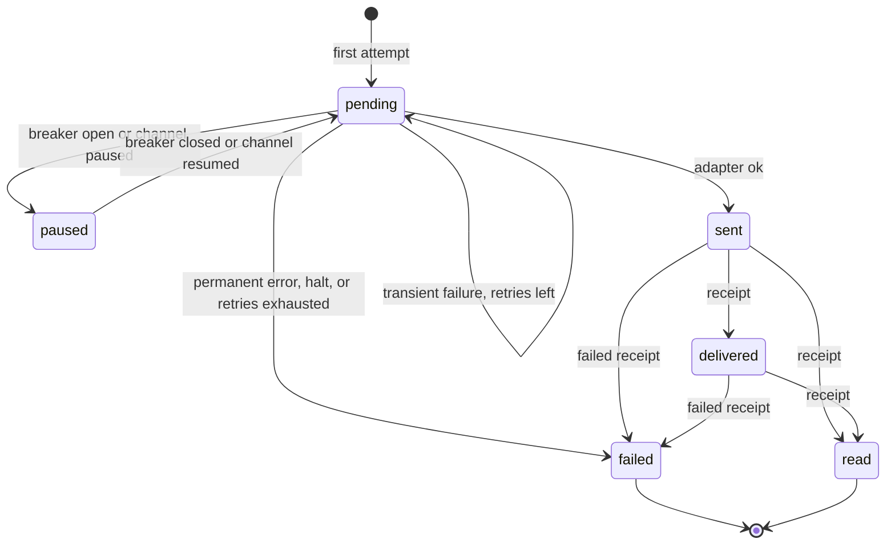
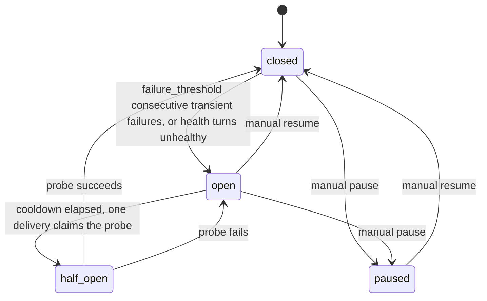

Every activity that must reach an external channel (a webhook, WhatsApp via Meta or Infobip, the echo bot) gets one **delivery** per target channel. A delivery is attempted by the [delivery pipeline](architecture/delivery-pipeline.md), retried with backoff on transient failures, and **dead-lettered** when it cannot succeed. This page describes the rules, where they live in the code and how to operate them. The design is recorded in [ADR-0019](adr/0019-per-channel-retry-policy-delivery-error-and-lifeline.md) and [ADR-0002](adr/0002-broadway-for-throughput-oban-for-retries.md).

`websocket` channels have no deliveries: their clients receive activities through the PubSub broadcast (see [Real-time](architecture/realtime.md)).

## Delivery records

`Converger.Deliveries` ([source](https://github.com/AimTune/converger/blob/main/lib/converger/deliveries.ex)) keeps exactly one row in `deliveries` per `(activity_id, channel_id)` (unique index). The row is created as `pending` on the first attempt and is the source of truth for delivery state; Oban jobs are only the scheduling mechanism.

| Status | Meaning | Set by |
| --- | --- | --- |
| `pending` | Not delivered yet; eligible for (re)tries. | first attempt, every failed attempt with retries left |
| `paused` | Parked: the channel's circuit breaker is open or its deliveries are paused. No attempt is made; it goes back to `pending` when the channel recovers or is resumed. Ranks like `pending`. | [flow control](#flow-control-circuit-breaker-rate-limits-and-tenant-fairness) |
| `sent` | The provider accepted the request. `sent_at`, `provider_message_id` and response metadata are stored. | `Deliveries.mark_sent/2` |
| `delivered` | The provider reported delivery to the device. | provider receipt (`POST /api/v1/channels/:channel_id/status`) |
| `read` | The provider reported that the recipient read it. | provider receipt |
| `failed` | **Dead letter.** No further automatic attempts. `last_error` says why. | permanent error, middleware halt, exhausted retries, or a `failed` provider receipt |



Provider receipts only move a delivery forward (`pending` < `sent` < `delivered` < `read`); a late `delivered` after `read` is ignored. A `failed` receipt is applied from any status except `read`, and nothing moves a delivery out of `failed` automatically. Every change is broadcast as `delivery_status` on `conversation:<conversation_id>`.

`attempts` counts attempts made, successful or not: `mark_sent/2`, `mark_attempt_failed/3` and `mark_dead/2` all increment it.

## Retry policy

[`Converger.Pipeline.RetryPolicy`](https://github.com/AimTune/converger/blob/main/lib/converger/pipeline/retry_policy.ex) is the single source of truth for retries, shared by every pipeline backend, the Oban worker and `Converger.Deliveries`. The effective policy of a channel (`RetryPolicy.for_channel/1`) is built by merging, later entries winning:

1. **Global defaults**: the `RetryPolicy` struct defaults, overridable with `config :converger, :retry_policy, [...]`.
2. **Adapter defaults**: the optional `retry_policy/0` callback of the channel's adapter. Today only the webhook adapter defines one: `%{timeout_ms: 10_000}`.
3. **Channel overrides**: the channel's `retry_policy` column (a JSON map with string keys).

### Fields

| Field | Default | Meaning |
| --- | --- | --- |
| `max_attempts` | `5` | Total attempts before the delivery is dead-lettered. |
| `backoff` | `exponential` | `exponential`, `linear` or `fixed`. |
| `base_ms` | `10000` | Backoff base, in milliseconds. |
| `max_ms` | `3600000` (1 hour) | Cap on the computed backoff. |
| `timeout_ms` | `15000` | Adapter request timeout. The WhatsApp adapters use it as the HTTP `receive_timeout`; the webhook adapter uses it unless the channel config sets `receive_timeout` explicitly (both are capped by the webhook limits). |

The shipped config files do not set `:retry_policy`, so the struct defaults apply. A global override looks like this (the pre-per-channel key `base_backoff_seconds` is still honoured and converted to `base_ms`):

```elixir
config :converger, :retry_policy,
  max_attempts: 8,
  backoff: :exponential,
  base_ms: 5_000,
  max_ms: :timer.minutes(30),
  timeout_ms: 10_000
```

A channel override, stored in `channels.retry_policy`:

```json
{ "max_attempts": 3, "backoff": "linear", "base_ms": 30000 }
```

The channel changeset validates the map (`RetryPolicy.validate/1`): only the five keys above are allowed, integers must be positive, and `backoff` must be one of the three names. Invalid values coming from the adapter or config layers are ignored during the merge.

:::note
There is no REST endpoint or admin form for `retry_policy` today. Set it through `Converger.Channels.update_channel/3` (for example from a release remote console) or directly in the database.
:::

### Backoff formula

For the retry that follows attempt `n` (1-based):

| `backoff` | Delay |
| --- | --- |
| `exponential` | `min(base_ms * 3^n, max_ms)` |
| `linear` | `min(base_ms * n, max_ms)` |
| `fixed` | `min(base_ms, max_ms)` |

Oban schedules in whole seconds: the worker's `backoff/1` returns `max(div(delay_ms, 1000), 1)`.

With the defaults (`exponential`, 10 s base, 5 attempts) a delivery that keeps failing transiently is attempted at:

| Attempt | Delay before it | Cumulative |
| --- | --- | --- |
| 1 | - | 0 |
| 2 | 30 s | 30 s |
| 3 | 90 s | 2 min |
| 4 | 270 s | 6.5 min |
| 5 | 810 s | 20 min |
| - | dead-lettered after attempt 5 fails | |

## DeliveryError: permanent vs. transient

Adapters return `{:error, reason}` on failure. When `reason` is a [`%Converger.Channels.DeliveryError{}`](https://github.com/AimTune/converger/blob/main/lib/converger/channels/delivery_error.ex) it controls what happens next:

| Field | Type | Meaning |
| --- | --- | --- |
| `reason` | term | Human-readable cause, stored in `last_error`. |
| `status` | integer or nil | HTTP status, when there was a response. |
| `retryable?` | boolean, default `true` | `false` dead-letters the delivery immediately. |
| `retry_after_ms` | integer or nil | Provider-requested delay; overrides the policy backoff for the next attempt. |

A plain `{:error, term}` (not a `DeliveryError`) is treated as retryable.

Built-in classification, used by the webhook and WhatsApp adapters:

| Constructor | Result |
| --- | --- |
| `DeliveryError.from_http(status, headers, body, label)` | Retryable for `408`, `425`, `429` and any `5xx`; **permanent** for every other non-2xx status (e.g. `400` invalid recipient, `401`, `403`, `404`). `retry_after_ms` is parsed from the `Retry-After` header. |
| `DeliveryError.from_transport(reason, label)` | Always retryable (timeouts, connection refused, DNS errors). |
| `DeliveryError.permanent(reason)` | Never retried. Used for configuration errors that cannot heal by retrying: no recipient for a WhatsApp message, an invalid webhook `method`, an invalid or blocked (private) webhook URL. An unresolvable webhook host is treated as transient. |

### Provider-directed retry (Retry-After)

`Retry-After` is accepted as delta-seconds (`120`) or an IMF-fixdate (`Wed, 21 Oct 2015 07:28:00 GMT`; dates in the past give `0`). When present, `Pipeline.retry_delay_ms/3` uses it instead of the policy backoff for the next attempt, and it is **not** capped by `max_ms`. The attempt still counts toward `max_attempts`; this is a delayed retry, not an Oban snooze.

In the Oban worker, `backoff/1` recovers the `DeliveryError` from the job's error and applies the same rule; in the Broadway backend, `Pipeline.schedule_retry/3` does.

## How attempts map to Oban jobs

`Converger.Workers.ActivityDeliveryWorker` ([source](https://github.com/AimTune/converger/blob/main/lib/converger/workers/activity_delivery_worker.ex)) runs one attempt per execution:

| `Pipeline.deliver/2` result | Delivery record | Job returns | Oban does |
| --- | --- | --- | --- |
| `:ok` (sent now, or already `sent` / `delivered` / `read`) | `sent` (unchanged if already further) | `:ok` | completes the job |
| `{:error, reason}`, transient, retries left | `pending`, `attempts + 1`, `last_error` | `{:error, reason}` | schedules the next attempt after `backoff/1` |
| transient, `attempts` reaches `max_attempts` | `failed` | `{:cancel, reason}` | cancels the job |
| permanent `DeliveryError` | `failed` | `{:cancel, reason}` | cancels the job |
| middleware halt or crash | `failed`, `last_error` `"halted: ..."` | `{:cancel, reason}` | cancels the job |

The **delivery record's `attempts`** decides when to stop, using the channel's policy at the time of the attempt. The worker's own `max_attempts: 100` is only a safety cap above any sane policy. Two cases where the counters diverge:

- An exception inside `perform/1` (for example the activity or channel was deleted, or the database is unavailable) fails the job without touching the delivery record. Oban retries it with the policy backoff until the 100-attempt cap, then discards it.
- With the Broadway backend, the first attempts run in Broadway; the hand-off job starts at Oban attempt 1 while the delivery record already counts the Broadway attempt. Exhaustion is still decided by the delivery record.

### Unique jobs

Delivery jobs are unique on `[:activity_id, :channel_id]` (fields `[:worker, :args]`, so a job is unique whatever its [tier queue](#tenant-tiers-fair-queueing)) over `period: :infinity`, with Oban's default state set (available, scheduled, executing, retryable, completed). Re-processing an activity (`Converger.Pipeline.process/1`) or a duplicate insert therefore never creates a second job for the same delivery, while a cancelled or discarded job does not block a deliberate re-enqueue.

### At-least-once to providers

A delivery that is already `sent`, `delivered` or `read` is never sent again. But if a node dies after the provider accepted a request and before `mark_sent` committed, the job is retried and the provider receives the message a second time. Delivery to external channels is at-least-once; webhook receivers should de-duplicate (the payload carries the activity `id` and `seq`, see [webhooks](webhooks.md)).

## Lifeline: rescuing orphaned jobs

A job that was `executing` on a node that crashed or was killed stays `executing` in `oban_jobs`. `Oban.Plugins.Lifeline` moves such jobs back so they run again. It is configured in [config/config.exs](https://github.com/AimTune/converger/blob/main/config/config.exs):

```elixir
{Oban.Plugins.Lifeline, rescue_after: :timer.minutes(30)}
```

Lifeline rescues jobs that have been `executing` for longer than `rescue_after`, regardless of why. 30 minutes is far above any delivery's runtime (adapter timeouts are seconds), so a healthy, slow delivery is never rescued while it is still running. Rescued jobs go back to `available` (or are discarded if they have no attempts left). Combined with the delivery-record short-circuit above, a rescued job that had in fact finished sending is a no-op, and one that had not finishes the delivery.

Other Oban plugins in use: `Oban.Plugins.Pruner` (`max_age: 86_400`, removes completed, cancelled and discarded jobs after 24 hours) and `Oban.Plugins.Cron` (expiration and health workers).

## Dead letters

A delivery is dead-lettered when it reaches `status: "failed"` through `Deliveries.mark_dead/2` (permanent error, middleware halt) or `mark_attempt_failed/3` (retries exhausted). On dead-lettering Converger:

- updates the row (`status: "failed"`, `attempts`, `last_error`);
- emits the telemetry event `[:converger, :deliveries, :dead_lettered]` with measurement `attempts` and metadata `delivery_id`, `activity_id`, `channel_id`, `error`;
- logs a `"Delivery dead-lettered"` warning with the same ids;
- broadcasts `delivery_status` with `status: "failed"`;
- cancels the Oban job (`{:cancel, reason}`).

Nothing else happens automatically: the activity stays committed and other channels' deliveries are unaffected.

### Finding dead letters

| Where | What you see |
| --- | --- |
| Admin dashboard (`/admin`) | Count of `failed` deliveries (`Deliveries.count_by_status/0`). |
| Admin conversation view (`/admin/conversations/:id`) | Per-activity delivery badge; failed deliveries are marked. |
| Oban Web (`/admin/oban`) | Cancelled `ActivityDeliveryWorker` jobs with their error, until the Pruner removes them after 24 hours. |
| Elixir API | `Converger.Deliveries.list_dead_letters/2` and `paginate_dead_letters/2` (keyset on `(updated_at, id)`, most recent first; filters `channel_id`, `activity_id`). |
| SQL | `SELECT id, activity_id, channel_id, attempts, last_error, updated_at FROM deliveries WHERE status = 'failed' ORDER BY updated_at DESC;` |
| Metrics | Attach a handler to `[:converger, :deliveries, :dead_lettered]`; it is not exported as a Prometheus metric by default. |

### Replaying a dead letter (manual)

There is no replay endpoint yet. A dead letter can be re-enqueued from a remote console; the unique job constraint allows it because the previous job was cancelled:

```elixir
alias Converger.{Repo, Deliveries}
alias Converger.Deliveries.Delivery

delivery = Deliveries.get_delivery!("<delivery_id>")

# Reset the counters, otherwise the first failure dead-letters it again
# (attempts is already at max_attempts).
{:ok, delivery} =
  delivery |> Delivery.changeset(%{status: "pending", attempts: 0}) |> Repo.update()

%{activity_id: delivery.activity_id, channel_id: delivery.channel_id}
|> Converger.Workers.ActivityDeliveryWorker.new()
|> Oban.insert()
```

Retrying the cancelled job from Oban Web also re-runs the delivery, with the same caveat about `attempts`.

:::info Planned
A dead-letter queue with inspection and replay through the API and admin UI: Planned ([#32](https://github.com/AimTune/converger/issues/32)).
:::

## Oban Web dashboard

The Oban Web dashboard is mounted at `/admin/oban` (`oban_dashboard/2` in [router.ex](https://github.com/AimTune/converger/blob/main/lib/converger_web/router.ex)) behind the same pipelines as the admin UI: the admin IP allowlist (`ADMIN_IP_WHITELIST`) and an admin session. `ConvergerWeb.ObanResolver` maps admin roles to access:

| Admin role (status `active`) | Access |
| --- | --- |
| `super_admin`, `admin` | full (retry, cancel, delete jobs, pause queues) |
| `viewer` | read-only |
| anyone else | redirected to `/admin/login` |

Queues: `deliveries_high` (10 per node), `deliveries` (20) and `deliveries_bulk` (5) for delivery jobs (one per [tenant tier](#tenant-tiers-fair-queueing)), `default` (10) for the cron workers and the circuit probe. Parked deliveries show up as `scheduled` jobs with priority 3.

## Channel health checks

`Converger.Workers.ChannelHealthWorker` runs every 5 minutes (`*/5 * * * *`, queue `default`, `max_attempts: 3`). For every **active** channel of type `webhook`, `whatsapp_meta` or `whatsapp_infobip` it computes, over deliveries created in the last 60 minutes ([`Converger.Channels.Health`](https://github.com/AimTune/converger/blob/main/lib/converger/channels/health.ex)):

| Status | Failure rate (`failed / total`) |
| --- | --- |
| `unknown` | no deliveries in the window |
| `healthy` | below 10% |
| `degraded` | 10% up to (not including) 50% |
| `unhealthy` | 50% or more |

Each run inserts a row into `channel_health_checks`. When a channel's status differs from its previous check, the worker broadcasts `health_changed` on the `channel_health` PubSub topic (shown live in the admin dashboard and channel list) and, if the tenant has an `alert_webhook_url`, POSTs a `channel_health_changed` event to it (fire-and-forget, 10 s timeout):

```json
{
  "event": "channel_health_changed",
  "channel_id": "<uuid>",
  "channel_name": "support-whatsapp",
  "tenant_id": "<uuid>",
  "previous_status": "healthy",
  "new_status": "degraded",
  "failure_rate": 0.125,
  "total_deliveries": 80,
  "failed_deliveries": 10,
  "checked_at": "2026-10-09T12:05:00.000000Z"
}
```

Health checks older than 7 days are pruned at the end of each run. A channel whose status **changes to** `unhealthy` has its [circuit breaker](#circuit-breaker) opened. Only the transition counts, so a breaker closed by a successful probe is not re-opened while the 60-minute window still contains the old failures.

## Flow control: circuit breaker, rate limits and tenant fairness

A dead webhook or a provider returning 429 must not occupy the shared delivery workers and delay every other tenant (the noisy-neighbour problem). Three mechanisms handle this, all applied by `ActivityDeliveryWorker` **before** the activity is loaded or the adapter is called ([`Converger.Channels.Circuit`](https://github.com/AimTune/converger/blob/main/lib/converger/channels/circuit.ex)). The design is recorded in [ADR-0031](adr/0031-per-channel-circuit-breaker-rate-limit-and-tier-queues.md).

### Circuit breaker

Each channel has a breaker stored on its row (`circuit_state`, `circuit_changed_at`, `consecutive_failures`). That way every node sees the same state, and every transition is a single conditional `UPDATE`, so two workers can never both open, probe or close it.



| State | Deliveries |
| --- | --- |
| `closed` | Attempted normally (subject to the rate limit). |
| `open` | Parked. The first delivery that runs after `cooldown_ms` becomes the half-open probe. |
| `half_open` | One probe in flight; every other delivery is parked. A probe stuck for longer than `cooldown_ms` (for example because its node died) can be taken over. |
| `paused` | Parked until resumed. Never probed. |

**What counts.** A transient failure (transport error, 5xx, 408/425/429, a timeout) increments `consecutive_failures`, and any success resets it to 0. A permanent error (`DeliveryError` with `retryable?: false`, for example an invalid recipient) and a middleware halt are about the message, not the endpoint, so they are ignored. Outcomes are recorded by `Converger.Pipeline` for every backend, but only the Oban worker parks deliveries. Broadway hands its retries to that worker.

**Parking.** A parked job is snoozed for `park_seconds` (plus up to 10% jitter) and its Oban priority drops from 1 to 3. A snooze never uses up an Oban attempt or a delivery attempt. The delivery row becomes `paused`. Because Oban fetches jobs by priority, a fresh delivery of a healthy channel in the same queue is always picked before a parked one. With 10,000 jobs parked for a dead channel, the queue still serves everyone else first.

**Probing.** When the breaker opens, `Converger.Workers.ChannelCircuitProbeWorker` (queue `default`, unique per channel) is scheduled `cooldown_ms` later. While the breaker stays open, it wakes one parked job every cooldown. That job claims `half_open` and is the probe. The loop stops once the breaker is closed or paused, or when nothing is parked; in that case the next delivery to the channel probes itself.

**Closing.** When a probe succeeds, the breaker closes, `consecutive_failures` is reset, and **every** parked job of the channel is released at once: it becomes `available` now with priority 1, and its `paused` delivery goes back to `pending`. Recovery therefore does not wait for `park_seconds`.

Configuration (defaults shown):

```elixir
config :converger, :circuit_breaker,
  failure_threshold: 5,   # consecutive transient failures before opening
  cooldown_ms: 30_000,    # time open before a probe
  park_seconds: 600       # sleep of a parked job before it re-checks on its own
```

When the breaker opens or closes, the tenant's `alert_webhook_url` (if set) receives a POST. The request is fire-and-forget with a 10 s timeout, and a failed probe re-opening the breaker sends nothing:

```json
{
  "event": "channel.circuit_opened",
  "channel_id": "<uuid>",
  "channel_name": "support-webhook",
  "tenant_id": "<uuid>",
  "reason": "failures",
  "changed_at": "2026-10-09T12:05:00.000000Z"
}
```

`event` is `channel.circuit_opened` (`reason`: `failures` or `unhealthy`) or `channel.circuit_closed` (`reason`: `probe_succeeded`). Every transition, manual ones included, is also broadcast as `circuit_changed` on the `channel_health` PubSub topic, and the admin channel list updates live. For metrics, see [Observability](operations/observability.md).

### Manual pause and resume

An operator can stop deliveries to a channel without disabling it. While it is paused, inbound traffic and the WebSocket keep working, and outbound deliveries are parked:

- **Admin UI**: the channel list has a *Delivery* column (Flowing / Breaker open / Probing / Paused) and *Pause deliveries* / *Resume deliveries* buttons.
- **Tenant API**: `POST /api/v1/channels/:channel_id/pause`, `POST /api/v1/channels/:channel_id/resume` and `GET /api/v1/channels/:channel_id/delivery` (see [Tenant API](api/tenant-api.md#channel-delivery-state)).

Resume also force-closes an open breaker. Both actions are written to the audit log (`pause_deliveries` / `resume_deliveries`).

### Rate limits

A channel can cap its outbound throughput with `rate_limit`: `"<count>/s"`, `"<count>/m"` or `"<count>/h"`, for example `"80/s"`. Without one, the adapter default applies. Today only `whatsapp_meta` has a default: `80/s`, the Cloud API's default throughput per business phone number. Raise it per channel for numbers with higher throughput. The check uses the same Hammer counters as the API rate limits (bucket `channel_outbound`, keyed by channel; see [Rate limiting](operations/rate-limiting.md)), so with `RATE_LIMIT_BACKEND=cluster` it applies across nodes.

A delivery over the limit is **snoozed** until the window resets. It is not counted as a failure, keeps its priority, and does not use up an attempt.

### Tenant tiers (fair queueing)

`tenants.tier` (`high`, `default`, `bulk`; set by an admin on the Tenants page) selects the Oban queue for the tenant's delivery jobs:

| Tier | Queue | Concurrency per node |
| --- | --- | --- |
| `high` | `deliveries_high` | 10 |
| `default` | `deliveries` | 20 |
| `bulk` | `deliveries_bulk` | 5 |

Each queue has its own workers, so a bulk tenant sending a million messages cannot hold up a `high` tenant's deliveries. The `default` tier keeps the historical queue name `deliveries`, so jobs enqueued before tiers existed still run. Retries handed off by Broadway use the same tier queue.

Trade-off: tiers isolate classes of tenants, not individual tenants. Two tenants in the same tier still share that queue's workers. Within a queue, the circuit breaker and parking priority keep a dead channel from blocking the queue, and rate limits keep one provider from taking all of it. True per-tenant partitioning, with one queue partition and a global limit per tenant, would need Oban Pro's partitioned queues (`Smart` engine). We chose not to require that.

## Related

- [Delivery pipeline](architecture/delivery-pipeline.md) and [Activity flow](architecture/activity-flow.md)
- [Webhooks](webhooks.md)
- [ADR-0019](adr/0019-per-channel-retry-policy-delivery-error-and-lifeline.md), [ADR-0002](adr/0002-broadway-for-throughput-oban-for-retries.md), [ADR-0001](adr/0001-transactional-outbox-with-oban.md)
