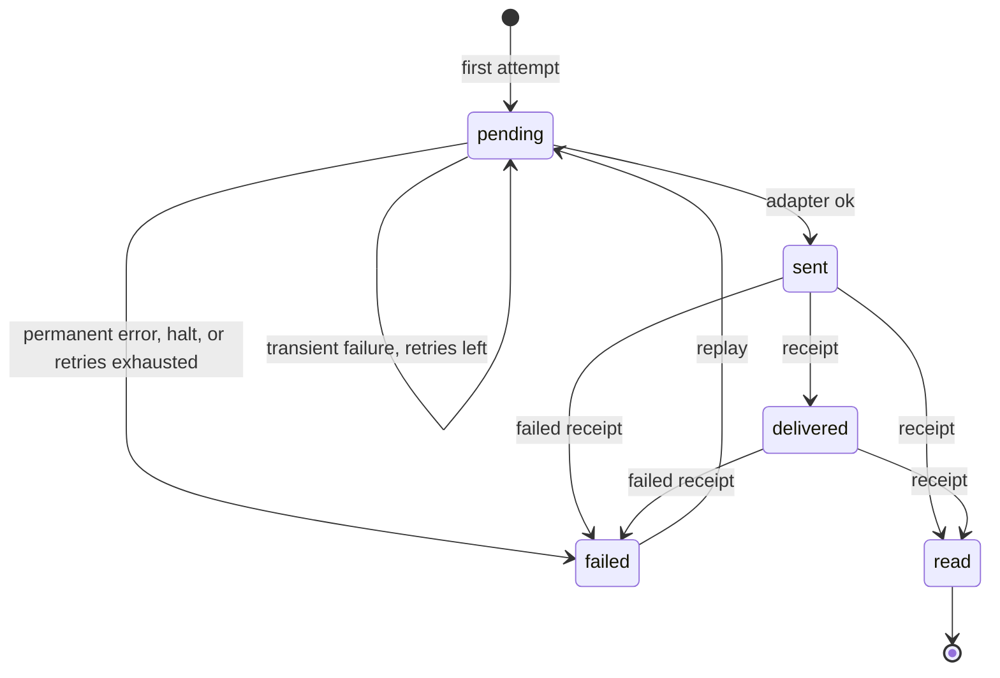

Every activity that must reach an external channel (a webhook, WhatsApp via Meta or Infobip, the echo bot) gets one **delivery** per target channel. A delivery is attempted by the [delivery pipeline](architecture/delivery-pipeline.md), retried with backoff on transient failures, and **dead-lettered** when it cannot succeed. This page describes the rules, where they live in the code and how to operate them. The design is recorded in [ADR-0019](adr/0019-per-channel-retry-policy-delivery-error-and-lifeline.md) and [ADR-0002](adr/0002-broadway-for-throughput-oban-for-retries.md).

`websocket` channels have no deliveries: their clients receive activities through the PubSub broadcast (see [Real-time](architecture/realtime.md)).

## Delivery records

`Converger.Deliveries` ([source](https://github.com/AimTune/converger/blob/main/lib/converger/deliveries.ex)) keeps exactly one row in `deliveries` per `(activity_id, channel_id)` (unique index). The row is created as `pending` on the first attempt and is the source of truth for delivery state; Oban jobs are only the scheduling mechanism.

| Status | Meaning | Set by |
| --- | --- | --- |
| `pending` | Not delivered yet; eligible for (re)tries. | first attempt, every failed attempt with retries left |
| `sent` | The provider accepted the request. `sent_at`, `provider_message_id` and response metadata are stored. | `Deliveries.mark_sent/2` |
| `delivered` | The provider reported delivery to the device. | provider receipt (`POST /api/v1/channels/:channel_id/status`) |
| `read` | The provider reported that the recipient read it. | provider receipt |
| `failed` | **Dead letter.** No further automatic attempts. `last_error` says why. | permanent error, middleware halt, exhausted retries, or a `failed` provider receipt |



Provider receipts only move a delivery forward (`pending` < `sent` < `delivered` < `read`); a late `delivered` after `read` is ignored. A `failed` receipt is applied from any status except `read`, and nothing moves a delivery out of `failed` automatically: only a [replay](#replaying-dead-letters) does. Every change is broadcast as `delivery_status` on `conversation:<conversation_id>`.

`attempts` counts attempts made, successful or not: `mark_sent/2`, `mark_attempt_failed/3` and `mark_dead/2` all increment it.

## Retry policy

[`Converger.Pipeline.RetryPolicy`](https://github.com/AimTune/converger/blob/main/lib/converger/pipeline/retry_policy.ex) is the single source of truth for retries, shared by every pipeline backend, the Oban worker and `Converger.Deliveries`. The effective policy of a channel (`RetryPolicy.for_channel/1`) is built by merging, later entries winning:

1. **Global defaults**: the `RetryPolicy` struct defaults, overridable with `config :converger, :retry_policy, [...]`.
2. **Adapter defaults**: the optional `retry_policy/0` callback of the channel's adapter. Today only the webhook adapter defines one: `%{timeout_ms: 10_000}`.
3. **Channel overrides**: the channel's `retry_policy` column (a JSON map with string keys).

### Fields

| Field | Default | Meaning |
| --- | --- | --- |
| `max_attempts` | `5` | Total attempts before the delivery is dead-lettered. |
| `backoff` | `exponential` | `exponential`, `linear` or `fixed`. |
| `base_ms` | `10000` | Backoff base, in milliseconds. |
| `max_ms` | `3600000` (1 hour) | Cap on the computed backoff. |
| `timeout_ms` | `15000` | Adapter request timeout. The WhatsApp adapters use it as the HTTP `receive_timeout`; the webhook adapter uses it unless the channel config sets `receive_timeout` explicitly (both are capped by the webhook limits). |

The shipped config files do not set `:retry_policy`, so the struct defaults apply. A global override looks like this (the pre-per-channel key `base_backoff_seconds` is still honoured and converted to `base_ms`):

```elixir
config :converger, :retry_policy,
  max_attempts: 8,
  backoff: :exponential,
  base_ms: 5_000,
  max_ms: :timer.minutes(30),
  timeout_ms: 10_000
```

A channel override, stored in `channels.retry_policy`:

```json
{ "max_attempts": 3, "backoff": "linear", "base_ms": 30000 }
```

The channel changeset validates the map (`RetryPolicy.validate/1`): only the five keys above are allowed, integers must be positive, and `backoff` must be one of the three names. Invalid values coming from the adapter or config layers are ignored during the merge.

:::note
There is no REST endpoint or admin form for `retry_policy` today. Set it through `Converger.Channels.update_channel/3` (for example from a release remote console) or directly in the database.
:::

### Backoff formula

For the retry that follows attempt `n` (1-based):

| `backoff` | Delay |
| --- | --- |
| `exponential` | `min(base_ms * 3^n, max_ms)` |
| `linear` | `min(base_ms * n, max_ms)` |
| `fixed` | `min(base_ms, max_ms)` |

Oban schedules in whole seconds: the worker's `backoff/1` returns `max(div(delay_ms, 1000), 1)`.

With the defaults (`exponential`, 10 s base, 5 attempts) a delivery that keeps failing transiently is attempted at:

| Attempt | Delay before it | Cumulative |
| --- | --- | --- |
| 1 | - | 0 |
| 2 | 30 s | 30 s |
| 3 | 90 s | 2 min |
| 4 | 270 s | 6.5 min |
| 5 | 810 s | 20 min |
| - | dead-lettered after attempt 5 fails | |

## DeliveryError: permanent vs. transient

Adapters return `{:error, reason}` on failure. When `reason` is a [`%Converger.Channels.DeliveryError{}`](https://github.com/AimTune/converger/blob/main/lib/converger/channels/delivery_error.ex) it controls what happens next:

| Field | Type | Meaning |
| --- | --- | --- |
| `reason` | term | Human-readable cause, stored in `last_error`. |
| `status` | integer or nil | HTTP status, when there was a response. |
| `retryable?` | boolean, default `true` | `false` dead-letters the delivery immediately. |
| `retry_after_ms` | integer or nil | Provider-requested delay; overrides the policy backoff for the next attempt. |

A plain `{:error, term}` (not a `DeliveryError`) is treated as retryable.

Built-in classification, used by the webhook and WhatsApp adapters:

| Constructor | Result |
| --- | --- |
| `DeliveryError.from_http(status, headers, body, label)` | Retryable for `408`, `425`, `429` and any `5xx`; **permanent** for every other non-2xx status (e.g. `400` invalid recipient, `401`, `403`, `404`). `retry_after_ms` is parsed from the `Retry-After` header. |
| `DeliveryError.from_transport(reason, label)` | Always retryable (timeouts, connection refused, DNS errors). |
| `DeliveryError.permanent(reason)` | Never retried. Used for configuration errors that cannot heal by retrying: no recipient for a WhatsApp message, an invalid webhook `method`, an invalid or blocked (private) webhook URL. An unresolvable webhook host is treated as transient. |

### Provider-directed retry (Retry-After)

`Retry-After` is accepted as delta-seconds (`120`) or an IMF-fixdate (`Wed, 21 Oct 2015 07:28:00 GMT`; dates in the past give `0`). When present, `Pipeline.retry_delay_ms/3` uses it instead of the policy backoff for the next attempt, and it is **not** capped by `max_ms`. The attempt still counts toward `max_attempts`; this is a delayed retry, not an Oban snooze.

In the Oban worker, `backoff/1` recovers the `DeliveryError` from the job's error and applies the same rule; in the Broadway backend, `Pipeline.schedule_retry/3` does.

## How attempts map to Oban jobs

`Converger.Workers.ActivityDeliveryWorker` ([source](https://github.com/AimTune/converger/blob/main/lib/converger/workers/activity_delivery_worker.ex)) runs one attempt per execution:

| `Pipeline.deliver/2` result | Delivery record | Job returns | Oban does |
| --- | --- | --- | --- |
| `:ok` (sent now, or already `sent` / `delivered` / `read`) | `sent` (unchanged if already further) | `:ok` | completes the job |
| `{:error, reason}`, transient, retries left | `pending`, `attempts + 1`, `last_error` | `{:error, reason}` | schedules the next attempt after `backoff/1` |
| transient, `attempts` reaches `max_attempts` | `failed` | `{:cancel, reason}` | cancels the job |
| permanent `DeliveryError` | `failed` | `{:cancel, reason}` | cancels the job |
| middleware halt or crash | `failed`, `last_error` `"halted: ..."` | `{:cancel, reason}` | cancels the job |

The **delivery record's `attempts`** decides when to stop, using the channel's policy at the time of the attempt. The worker's own `max_attempts: 100` is only a safety cap above any sane policy. Two cases where the counters diverge:

- An exception inside `perform/1` (for example the activity or channel was deleted, or the database is unavailable) fails the job without touching the delivery record. Oban retries it with the policy backoff until the 100-attempt cap, then discards it.
- With the Broadway backend, the first attempts run in Broadway; the hand-off job starts at Oban attempt 1 while the delivery record already counts the Broadway attempt. Exhaustion is still decided by the delivery record.

### Unique jobs

Delivery jobs are unique on `[:activity_id, :channel_id]` over `period: :infinity`, with Oban's default state set (available, scheduled, executing, retryable, completed). Re-processing an activity (`Converger.Pipeline.process/1`) or a duplicate insert therefore never creates a second job for the same delivery, while a cancelled or discarded job does not block a deliberate re-enqueue.

### At-least-once to providers

A delivery that is already `sent`, `delivered` or `read` is never sent again. But if a node dies after the provider accepted a request and before `mark_sent` committed, the job is retried and the provider receives the message a second time. Delivery to external channels is at-least-once; webhook receivers should de-duplicate (the payload carries the activity `id` and `seq`, see [webhooks](webhooks.md)).

## Lifeline: rescuing orphaned jobs

A job that was `executing` on a node that crashed or was killed stays `executing` in `oban_jobs`. `Oban.Plugins.Lifeline` moves such jobs back so they run again. It is configured in [config/config.exs](https://github.com/AimTune/converger/blob/main/config/config.exs):

```elixir
{Oban.Plugins.Lifeline, rescue_after: :timer.minutes(30)}
```

Lifeline rescues jobs that have been `executing` for longer than `rescue_after`, regardless of why. 30 minutes is far above any delivery's runtime (adapter timeouts are seconds), so a healthy, slow delivery is never rescued while it is still running. Rescued jobs go back to `available` (or are discarded if they have no attempts left). Combined with the delivery-record short-circuit above, a rescued job that had in fact finished sending is a no-op, and one that had not finishes the delivery.

Other Oban plugins in use: `Oban.Plugins.Pruner` (`max_age: 86_400`, removes completed, cancelled and discarded jobs after 24 hours) and `Oban.Plugins.Cron` (expiration and health workers).

## Dead letters

A delivery is dead-lettered when it reaches `status: "failed"` through `Deliveries.mark_dead/2` (permanent error, middleware halt) or `mark_attempt_failed/3` (retries exhausted). On dead-lettering Converger:

- updates the row (`status: "failed"`, `attempts`, `last_error`);
- emits the telemetry event `[:converger, :deliveries, :dead_lettered]` with measurement `attempts` and metadata `delivery_id`, `activity_id`, `channel_id`, `error`;
- logs a `"Delivery dead-lettered"` warning with the same ids;
- broadcasts `delivery_status` with `status: "failed"`;
- cancels the Oban job (`{:cancel, reason}`).

Nothing else happens automatically: the activity stays committed and other channels' deliveries are unaffected.

### Finding dead letters

| Where | What you see |
| --- | --- |
| Deliveries page (`/admin/deliveries`, `/portal/deliveries`) | Failed deliveries by default, filterable by tenant (admin only), channel, status and date range, with the error, attempts, replay history and a payload preview. See [Deliveries page](#deliveries-page). |
| Tenant API | `GET /api/v1/deliveries?status=failed` with the same filters; see [tenant API](api/tenant-api.md#deliveries). |
| Admin dashboard (`/admin`) | Count of `failed` deliveries (`Deliveries.count_by_status/0`). |
| Admin conversation view (`/admin/conversations/:id`) | Per-activity delivery badge; failed deliveries are marked. |
| Oban Web (`/admin/oban`) | Cancelled `ActivityDeliveryWorker` jobs with their error, until the Pruner removes them after 24 hours. |
| Elixir API | `Converger.Deliveries.search_deliveries/2` (filters `status`, `channel_id`, `activity_id`, `tenant_id`, `from`, `to`), and `list_dead_letters/2` / `paginate_dead_letters/2` for `status: "failed"`. All are keyset-paginated on `(updated_at, id)`, most recent first. |
| SQL | `SELECT id, activity_id, channel_id, attempts, last_error, updated_at FROM deliveries WHERE status = 'failed' ORDER BY updated_at DESC;` |
| Metrics | Attach a handler to `[:converger, :deliveries, :dead_lettered]`; it is not exported as a Prometheus metric by default. |

### Replaying dead letters

Fix the cause first (for example the channel's webhook URL), then replay. A replay sends the stored activity again through the channel's middleware and adapter, exactly like the first attempt. The design is recorded in [ADR-0026](adr/0026-dead-letter-replay-in-place-through-oban.md).

| Where | One delivery | Many deliveries |
| --- | --- | --- |
| Deliveries page | **Retry** button on a failed row | **Retry all failed**: every failed delivery that matches the current filters |
| Tenant API | `POST /api/v1/deliveries/:id/retry` | `POST /api/v1/channels/:channel_id/deliveries/retry`, optionally with `from`, `to`, `activity_id` |
| Elixir | `Deliveries.retry_delivery(delivery, actor)` | `Deliveries.retry_dead_letters(filters, actor, limit: n)` |

`actor` is `%{type: "admin" | "tenant_api" | "tenant_user" | "system", id: id}`, the same shape as for audit logs.

A replay, in one transaction:

1. moves the delivery from `failed` to `pending` with an `UPDATE ... WHERE status = 'failed'`. A delivery that is not (or no longer) failed is not touched, so two operators clicking at once replay it once;
2. resets `attempts` to `0`, so the channel's [retry policy](#retry-policy) starts over (otherwise the first failure would dead-letter it again), increments `retry_count`, and sets `retried_by` (`"<actor type>:<actor id>"`) and `retried_at`;
3. inserts one `ActivityDeliveryWorker` job, unless a job for the same activity and channel is still `available`, `scheduled`, `executing`, `retryable` or `suspended`;
4. writes an audit log entry with action `retry` and resource type `delivery` (`changes` holds the activity and channel ids, the new `retry_count`, and for a single retry the previous `status`, `attempts` and `last_error`; bulk entries carry `"bulk": true`).

After commit it broadcasts `delivery_status` with `status: "pending"` and emits `[:converger, :deliveries, :retried]` (measurement `count`, metadata `delivery_ids`).

Rules:

- Only `failed` deliveries can be replayed. The API answers `409` for any other status.
- Deliveries on an **inactive** channel are refused (`400 Channel is inactive`) and skipped by bulk replays. Enable the channel first.
- Replays always go through Oban, whatever the pipeline backend, the same as automatic retries ([ADR-0002](adr/0002-broadway-for-throughput-oban-for-retries.md)). The job is inserted in the same transaction as the reset, so a committed replay always has its job.
- `last_error` is kept until the next attempt overwrites it, so the cause stays visible while the replay is pending.
- A delivery that was `sent` and then failed by a provider receipt is sent to the provider again: that is what replay means.

Bulk replays work in chunks of 500 deliveries, oldest failure first. Each chunk selects its rows with `FOR UPDATE SKIP LOCKED` and commits separately, so concurrent bulk replays never pick the same delivery and a large replay does not hold one long transaction. Only deliveries that were already failed when the call started are replayed: one that fails again during the call (a permanent error fails after one attempt) is not picked up a second time. One call replays at most `bulk_retry_limit` deliveries (default 10 000, see [configuration](#configuration)). The result says whether more remain:

```json
{ "retried": 10000, "has_more": true }
```

Retrying a cancelled job from Oban Web also re-runs the delivery, but it does not reset `attempts`, so the first failure dead-letters it again, and it is neither audited nor recorded in `retried_by`. Use the Deliveries page or the API instead.

:::info Planned
Automatic replay when a channel's circuit breaker closes depends on the breaker itself. The per-channel circuit breaker, provider rate limiting and tenant-fair queueing are Planned ([#31](https://github.com/AimTune/converger/issues/31)).
:::

### Deliveries page

`/admin/deliveries` (all tenants) and `/portal/deliveries` (the user's tenant) list deliveries, most recently changed first, with **Load more**. The filters (tenant for admins, channel, status, from and to date) are kept in the URL. The status filter defaults to `failed`. The from and to dates are UTC days and filter on `updated_at`, the time of the last status change.

Each row shows the channel, the activity, the status, `attempts`, `retry_count` with `retried_by` and `retried_at`, `last_error`, and a **Payload** preview: the canonical activity ([ADR-0004](adr/0004-single-canonical-activity-serializer.md)) with sensitive keys such as `api_key`, `password` and `*_token` replaced by `"[REDACTED]"` (`Converger.Secrets.redact/1`). This is the stored activity, before the channel's middleware transformed its copy.

| Role | Browse and export | Retry |
| --- | --- | --- |
| Admin `super_admin`, `admin` | yes | yes |
| Admin `viewer` | yes | no |
| Tenant user `owner`, `admin`, `member` | yes, own tenant only | yes, own tenant only |
| Tenant user `viewer` | yes, own tenant only | no |

**Export CSV** downloads the rows that match the current filters (`/admin/deliveries/export`, `/portal/deliveries/export`, streamed, at most `export_limit` rows). The columns are `id`, `tenant_id`, `channel_id`, `channel_name`, `activity_id`, `status`, `attempts`, `last_error`, `retry_count`, `retried_by`, `retried_at`, `inserted_at` and `updated_at`. Payloads are not exported. Text that starts with `=`, `+`, `-` or `@` is prefixed with `'` so that spreadsheets do not evaluate provider error text as a formula. The portal export is always limited to the user's tenant, whatever the query string says.

### Configuration

```elixir
config :converger, :dead_letters,
  # Max deliveries replayed by one bulk retry call (API or "Retry all failed")
  bulk_retry_limit: 10_000,
  # Max rows in one CSV export
  export_limit: 10_000
```

The API's bulk `limit` parameter can lower `bulk_retry_limit` for one call but not raise it.

## Oban Web dashboard

The Oban Web dashboard is mounted at `/admin/oban` (`oban_dashboard/2` in [router.ex](https://github.com/AimTune/converger/blob/main/lib/converger_web/router.ex)) behind the same pipelines as the admin UI: the admin IP allowlist (`ADMIN_IP_WHITELIST`) and an admin session. `ConvergerWeb.ObanResolver` maps admin roles to access:

| Admin role (status `active`) | Access |
| --- | --- |
| `super_admin`, `admin` | full (retry, cancel, delete jobs, pause queues) |
| `viewer` | read-only |
| anyone else | redirected to `/admin/login` |

Queues: `deliveries` (concurrency 20 per node) for delivery jobs, `default` (10) for the cron workers.

## Channel health checks

`Converger.Workers.ChannelHealthWorker` runs every 5 minutes (`*/5 * * * *`, queue `default`, `max_attempts: 3`). For every **active** channel of type `webhook`, `whatsapp_meta` or `whatsapp_infobip` it computes, over deliveries created in the last 60 minutes ([`Converger.Channels.Health`](https://github.com/AimTune/converger/blob/main/lib/converger/channels/health.ex)):

| Status | Failure rate (`failed / total`) |
| --- | --- |
| `unknown` | no deliveries in the window |
| `healthy` | below 10% |
| `degraded` | 10% up to (not including) 50% |
| `unhealthy` | 50% or more |

Each run inserts a row into `channel_health_checks`. When a channel's status differs from its previous check, the worker broadcasts `health_changed` on the `channel_health` PubSub topic (shown live in the admin dashboard and channel list) and, if the tenant has an `alert_webhook_url`, POSTs a `channel_health_changed` event to it (fire-and-forget, 10 s timeout):

```json
{
  "event": "channel_health_changed",
  "channel_id": "<uuid>",
  "channel_name": "support-whatsapp",
  "tenant_id": "<uuid>",
  "previous_status": "healthy",
  "new_status": "degraded",
  "failure_rate": 0.125,
  "total_deliveries": 80,
  "failed_deliveries": 10,
  "checked_at": "2026-10-09T12:05:00.000000Z"
}
```

Health checks older than 7 days are pruned at the end of each run. Health is informational today: an unhealthy channel still receives deliveries (see the circuit breaker plan in [#31](https://github.com/AimTune/converger/issues/31)).

## Related

- [Delivery pipeline](architecture/delivery-pipeline.md) and [Activity flow](architecture/activity-flow.md)
- [Webhooks](webhooks.md)
- [ADR-0019](adr/0019-per-channel-retry-policy-delivery-error-and-lifeline.md), [ADR-0002](adr/0002-broadway-for-throughput-oban-for-retries.md), [ADR-0001](adr/0001-transactional-outbox-with-oban.md), [ADR-0026](adr/0026-dead-letter-replay-in-place-through-oban.md)
