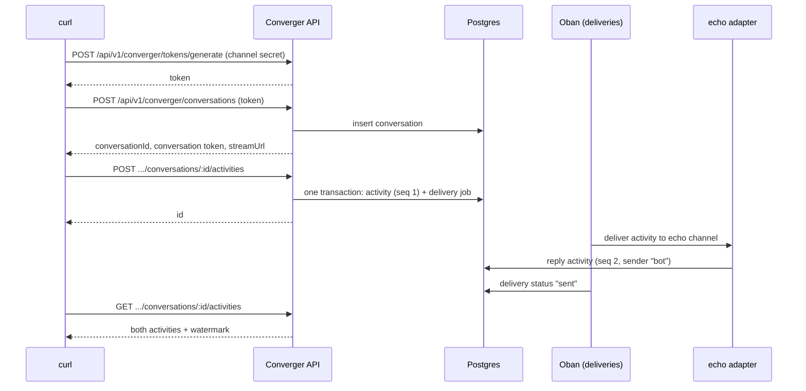

This page covers three things: running Converger with docker compose (the quickest way to try it), setting up a local development environment on Linux, macOS or Windows, and sending a first message through the REST API to watch it get delivered.

## Option A: docker compose

`docker-compose.yml` starts Postgres, a one-shot migration step, the app and a local observability stack (Prometheus, Grafana, Loki, Jaeger, an OpenTelemetry collector). No secret is committed to the repository. Compose reads them from a `.env` file next to `docker-compose.yml` and **refuses to start** while a required one is missing.

### 1. Create `.env` with generated secrets

| Variable | Required | How to generate | Used by |
| --- | --- | --- | --- |
| `POSTGRES_PASSWORD` | yes | `openssl rand -hex 24` (hex keeps it URL-safe, it is embedded in `DATABASE_URL`) | `db`, `migrate`, `app` |
| `SECRET_KEY_BASE` | yes | `mix phx.gen.secret` or `openssl rand -base64 64 \| tr -d '\n'` (at least 64 bytes) | `migrate`, `app` |
| `CLOAK_KEY` | yes | `openssl rand -base64 32` (base64 of exactly 32 bytes) | `migrate`, `app` (encrypts channel secrets and configs at rest) |
| `GF_SECURITY_ADMIN_PASSWORD` | yes | `openssl rand -hex 16` | `grafana` |
| `PHX_HOST` | no, default `localhost` | public host name for generated URLs and the default WebSocket origin check | `app` |
| `FORCE_SSL` | no, default `false` in compose | set `true` only behind a TLS-terminating proxy (together with `TRUSTED_PROXIES`) | `app` |
| `TRUSTED_PROXIES` | no | comma-separated proxy IPs/CIDRs | `app` |

On Linux, macOS, or Git Bash on Windows (which ships `openssl`):

```bash
cat > .env <<EOF
POSTGRES_PASSWORD=$(openssl rand -hex 24)
SECRET_KEY_BASE=$(openssl rand -base64 64 | tr -d '\n')
CLOAK_KEY=$(openssl rand -base64 32)
GF_SECURITY_ADMIN_PASSWORD=$(openssl rand -hex 16)
EOF
```

In Windows PowerShell without `openssl`:

```powershell
function New-Secret([int]$bytes) {
  $b = New-Object byte[] $bytes
  [System.Security.Cryptography.RandomNumberGenerator]::Create().GetBytes($b)
  return $b
}
$hex = { param($n) -join ((New-Secret $n) | ForEach-Object { $_.ToString("x2") }) }
@(
  "POSTGRES_PASSWORD=$(& $hex 24)"
  "SECRET_KEY_BASE=$([Convert]::ToBase64String((New-Secret 64)))"
  "CLOAK_KEY=$([Convert]::ToBase64String((New-Secret 32)))"
  "GF_SECURITY_ADMIN_PASSWORD=$(& $hex 16)"
) | Set-Content -Encoding ascii .env
```

You can also `cp .env.example .env` and fill in the values by hand. `.env` is gitignored and excluded from the Docker build context. Never commit it.

:::warning
The release refuses to boot with a `SECRET_KEY_BASE` shorter than 64 bytes, and with the `SECRET_KEY_BASE` or `CLOAK_KEY` values that were once published in this repository ([security](security.md#rotating-leaked-secrets)). Back up `CLOAK_KEY` together with the database: without it, channel secrets cannot be decrypted ([ADR-0012](adr/0012-secrets-at-rest-and-audit-redaction.md)).
:::

`POSTGRES_PASSWORD` only takes effect when the `postgres_data` volume is first initialized. If you already have that volume from an older checkout, either change the password inside Postgres (`ALTER USER postgres PASSWORD '...'`) or remove the volume (`docker compose down -v`).

### 2. Allow your browser to reach `/admin`

The admin panel is protected by an IP allowlist, `ADMIN_IP_WHITELIST`, which defaults to `127.0.0.1,::1`. Inside the container, requests from your host's browser arrive from a Docker network address rather than from `127.0.0.1`, so `/admin` will most likely answer `403 Forbidden`. `docker-compose.yml` does not pass `ADMIN_IP_WHITELIST` through. For a **local, non-public** setup, add a `docker-compose.override.yml` (compose merges it automatically):

```yaml
# docker-compose.override.yml - local use only
services:
  app:
    environment:
      ADMIN_IP_WHITELIST: "127.0.0.1,::1,172.16.0.0/12,192.168.0.0/16"
```

The allowlist accepts single addresses and CIDR ranges, IPv4 and IPv6. Behind a reverse proxy, set `TRUSTED_PROXIES` instead, so that the real client IP is used ([ADR-0011](adr/0011-custom-trusted-proxies-plug.md), [security](security.md)). The tenant portal (`/portal`) has no IP allowlist.

### 3. Start the stack

```bash
docker compose up -d --build
docker compose ps
```

Start-up order:

1. `db` (Postgres 17) becomes healthy (`pg_isready`).
2. `migrate` runs `/app/bin/migrate` once with `CREATE_DB=true`. It creates the `converger_prod` database and applies all migrations under a Postgres advisory lock, so concurrent runs apply each migration exactly once. Then it exits.
3. `app` starts only after `migrate` has completed successfully, and runs `/app/bin/server` (`PHX_SERVER=true bin/converger start`). The image's default command never runs migrations ([ADR-0022](adr/0022-deployment-hardening.md), [deployment](deployment.md#migrations)).

| Service | URL / port |
| --- | --- |
| Converger (API, `/admin`, `/portal`, WebSockets) | `http://localhost:4000` |
| Prometheus metrics exporter of the app | `http://localhost:9568/metrics` |
| Prometheus | `http://localhost:9090` |
| Grafana (user `admin`, password `GF_SECURITY_ADMIN_PASSWORD`) | `http://localhost:3000` |
| Jaeger UI (traces) | `http://localhost:16686` |
| Postgres (loopback only) | `127.0.0.1:5432` |

Check the migration output with `docker compose logs migrate`, and the app with `docker compose logs -f app`. The production log format is JSON.

To apply new migrations after pulling a newer version, run `docker compose up -d --build` again. The `migrate` service runs before the new `app` container starts.

### 4. Create the first admin account

There is no built-in admin password. Create the first `super_admin` with the release task `Converger.Release.seed_admin/0`:

```bash
docker compose exec \
  -e ADMIN_EMAIL=ops@example.com \
  -e ADMIN_PASSWORD='choose-a-long-password' \
  app /app/bin/converger eval "Converger.Release.seed_admin()"
```

| Variable | Default | Behavior |
| --- | --- | --- |
| `ADMIN_EMAIL` | `admin@converger.local` | Email of the account. |
| `ADMIN_PASSWORD` | generated | At least 8 characters. When unset, a random password is printed **once**. The account is then flagged `must_change_password`, and after the first login you are sent to `/admin/password` until you change it. |

The task does nothing if an admin user already exists, and prints `Admin users already exist; nothing to seed`.

### 5. Log in

Open `http://localhost:4000/admin/login` and sign in with the email and password. Failed logins are rate limited to 5 per minute per IP and per account. The admin panel has pages for tenants, channels, conversations, routing rules, admin users, tenant users and audit logs, plus the Oban dashboard at `/admin/oban`.

## Option B: local development

### Toolchain

`.tool-versions` pins the versions used in CI and in the `Dockerfile`:

```text
elixir 1.19.5-otp-28
erlang 28.5.0.5
```

With [asdf](https://asdf-vm.com) or [mise](https://mise.jdx.dev), run `asdf install` or `mise install` in the repository root. `mix.exs` requires Elixir `~> 1.18`. Other Elixir 1.18+/OTP 27+ combinations may work, but only the pinned versions are tested.

You also need:

- **PostgreSQL** (17 is what compose and CI use; at least 11 is needed for the built-in `sha256()` used by a migration). The first migration creates the `uuid-ossp` and `pgcrypto` extensions, so the role needs the rights to do that (the default `postgres` superuser has them).
- **A C compiler and `make`**, because `bcrypt_elixir` (admin and portal password hashing) is a NIF compiled from C. See the per-OS notes below.
- **Node.js is not needed.** There is no asset pipeline. The admin and portal layouts load Phoenix and LiveView from jsDelivr.

### Per-OS notes

**Linux** (Debian/Ubuntu shown):

```bash
sudo apt-get install -y build-essential git
```

**macOS**:

```bash
xcode-select --install
```

**Windows**: `bcrypt_elixir` builds its NIF with MSVC and `nmake`. Without them, `mix compile` stops with `** (Mix) "nmake" not found in the path.` (issue [#53](https://github.com/AimTune/converger/issues/53)).

1. Install [Visual Studio Build Tools](https://visualstudio.microsoft.com/visual-cpp-build-tools/) and select the **"Desktop development with C++"** workload (MSVC compiler and Windows SDK).
2. Run every `mix` command from the **"x64 Native Tools Command Prompt for VS"** (or a Developer PowerShell set to x64), so that `cl.exe` and `nmake` are on `PATH`. A plain PowerShell or Git Bash window does not have them.
3. If `bcrypt_elixir` was already compiled in the wrong shell, rebuild it there with `mix deps.compile bcrypt_elixir --force`.

As an alternative, use WSL2 and follow the Linux instructions. Converger has no pure-Elixir password hashing fallback today: `bcrypt_elixir` is the only hashing dependency in `mix.exs`. A pluggable hasher and a dev container are proposed in [#53](https://github.com/AimTune/converger/issues/53).

### Postgres for development

The dev and test configs (`config/dev.exs`, `config/test.exs`) connect with these defaults:

| Variable | Default |
| --- | --- |
| `DB_USERNAME` | `postgres` |
| `DB_PASSWORD` | `postgres` |
| `DB_HOSTNAME` | `localhost` |
| `DB_NAME` | `converger_dev` (dev), `converger_test` + `MIX_TEST_PARTITION` (test) |

The simplest way to match them is a throwaway container:

```bash
docker run --name converger-pg -e POSTGRES_PASSWORD=postgres -p 127.0.0.1:5432:5432 -d postgres:17-alpine
```

To use the compose `db` service instead, run `docker compose up -d db` and set `DB_PASSWORD` to the `POSTGRES_PASSWORD` from your `.env`. Compose still validates every required variable in `.env`, even when you start only `db`.

### Set up, run, test

```bash
mix setup          # deps.get + ecto.create + ecto.migrate + priv/repo/seeds.exs
mix phx.server     # http://localhost:4000 (or: iex -S mix phx.server)
```

`mix setup` runs `priv/repo/seeds.exs`, which creates the first `super_admin` exactly like the release task. Set `ADMIN_EMAIL` and `ADMIN_PASSWORD` before running it, or copy the one-time password it prints. In PowerShell, set them with `$env:ADMIN_PASSWORD = "..."`.

In development:

- The endpoint binds to `127.0.0.1:4000` (`PORT` overrides the port), so the default admin allowlist (`127.0.0.1,::1`) already matches your browser.
- `CLOAK_KEY` is not needed. `config/dev.exs` uses a fixed development-only key.
- Webhook channels may target `localhost` and `127.0.0.0/8`. The SSRF guard blocks private targets everywhere else ([ADR-0014](adr/0014-webhook-ssrf-guard-and-outbound-signing.md)).
- Traces are not exported unless you set `OTEL_EXPORTER_OTLP_ENDPOINT` (for example `http://localhost:4318` with the compose collector running).

Tests and the pre-commit gate:

```bash
mix test                      # creates and migrates converger_test, then runs the suite
mix test test/path/to_test.exs
mix test --failed
mix precommit                 # run before every PR
mix dialyzer                  # slow, separate from precommit
```

`mix precommit` runs in the test environment and mirrors the CI `lint` and `test` jobs. It fixes formatting and unused lock entries instead of only checking them:

1. `compile --warnings-as-errors --force`
2. `deps.unlock --unused`
3. `format`
4. `credo --strict`
5. `sobelow --config`
6. `hex.audit`
7. `deps.audit`
8. `test --warnings-as-errors`

See [ADR-0021](adr/0021-ci-quality-gates-and-lf-line-endings.md) for the CI gates and the LF line-ending rule. On Windows, `.gitattributes` (`* text=auto eol=lf`) checks files out with LF even when `core.autocrlf=true`, so `mix format` gives the same result as on Linux CI.

## Your first message, end to end

This walkthrough uses an `echo` channel. Echo is an outbound-only adapter that answers every activity with a copy sent by `"bot"`. It needs no external service, but it goes through the full pipeline: transactional outbox, Oban delivery job, middleware, adapter and delivery record. The commands assume `http://localhost:4000` (compose or `mix phx.server`).



### 1. Create a tenant (admin UI)

Go to **Admin, Tenants**, enter a name (for example `acme`) and click **Create**. You can leave the alert webhook URL empty. The tenant's API key (`cvg_live_...`) is shown **once**. Only its SHA-256 hash is stored ([tenants](concepts/tenants.md)). Copy it:

```bash
export API_KEY='cvg_live_...'
```

### 2. Create a channel (admin UI)

Go to **Admin, Channels** and pick the tenant, type `echo`, mode `outbound` (the only mode echo supports) and a name such as `echo-test`. Click **Create**. The channel secret is shown **once**. It is stored encrypted, and you need it to issue client tokens:

```bash
export CHANNEL_SECRET='...'
```

Tenant users can sign in to the tenant portal (`/portal/login`, with tenant name, email and password) to see the tenant's channels, conversations and routing rules. They cannot create channels or tenants. An admin creates tenant users under **Admin, Tenant Users**.

### 3. Get a client token

The Converger client API (`/api/v1/converger`, inspired by Direct Line) takes the channel secret as a bearer token on `tokens/generate` and returns a short-lived token for that channel. `user.id` is optional. It identifies the end user for per-user socket ids.

```bash
curl -s -X POST http://localhost:4000/api/v1/converger/tokens/generate \
  -H "authorization: Bearer $CHANNEL_SECRET" \
  -H "content-type: application/json" \
  -d '{"user": {"id": "user-1"}}'
```

```json
{
  "conversationId": null,
  "token": "eyJhbGciOiJIUzI1NiIsInR5cCI6IkpXVCJ9...",
  "expires_in": 1800
}
```

```bash
export TOKEN='eyJ...'
```

Tokens are valid for 1800 seconds. Renew one with `POST /api/v1/converger/tokens/refresh` and the current token as the bearer. Token generation is rate limited to 10 requests per minute per channel.

### 4. Start a conversation

```bash
curl -s -X POST http://localhost:4000/api/v1/converger/conversations \
  -H "authorization: Bearer $TOKEN" \
  -H "content-type: application/json"
```

```json
{
  "conversationId": "5b0c8f2e-3c1d-4a8e-9f3a-1d2e3f4a5b6c",
  "token": "eyJhbGciOiJIUzI1NiIsInR5cCI6IkpXVCJ9...",
  "expires_in": 1800,
  "streamUrl": "ws://localhost:4000/socket/converger/websocket?token=eyJ...&conversation_id=5b0c8f2e-3c1d-4a8e-9f3a-1d2e3f4a5b6c"
}
```

The returned token is scoped to this conversation. Use it from now on. `streamUrl` is where a WebSocket client connects to receive activities in real time ([WebSocket](websocket.md)).

```bash
export CONV='5b0c8f2e-3c1d-4a8e-9f3a-1d2e3f4a5b6c'
export TOKEN='<conversation token from the response>'
```

### 5. Post an activity

```bash
curl -s -X POST "http://localhost:4000/api/v1/converger/conversations/$CONV/activities" \
  -H "authorization: Bearer $TOKEN" \
  -H "content-type: application/json" \
  -H "x-idempotency-key: hello-1" \
  -d '{"type": "message", "from": {"id": "user-1"}, "text": "Hello, Converger"}'
```

```json
{ "id": "0e7d4c1a-8b2f-4f6e-a1c3-7d9e2b4f6a80" }
```

The response comes back after the activity **and** its delivery job have been committed in the same transaction. If the job could not be enqueued, nothing is committed and you get `503` with `{"error": "Activity could not be accepted, please retry"}`. Send the same request again with the same `x-idempotency-key`: it returns the same `id` and creates no second activity.

Client-settable fields are `type`, `text`, `attachments` and `channelData` (stored as `metadata`). `from.id` becomes the activity's `sender`. The server sets everything else, including timestamps ([activities](concepts/activities.md), [ADR-0005](adr/0005-separate-client-and-system-changesets.md)).

### 6. Read the conversation

The echo reply is produced asynchronously by the Oban `deliveries` queue. It usually appears within a second.

```bash
curl -s "http://localhost:4000/api/v1/converger/conversations/$CONV/activities" \
  -H "authorization: Bearer $TOKEN"
```

```json
{
  "activities": [
    {
      "id": "0e7d4c1a-8b2f-4f6e-a1c3-7d9e2b4f6a80",
      "type": "message",
      "from": { "id": "user-1" },
      "text": "Hello, Converger",
      "timestamp": "2026-10-09T10:15:02.481230Z",
      "attachments": [],
      "conversationId": "5b0c8f2e-3c1d-4a8e-9f3a-1d2e3f4a5b6c",
      "channelData": {}
    },
    {
      "id": "9a1f3e5d-2c4b-4d6f-8e0a-1b3c5d7e9f21",
      "type": "message",
      "from": { "id": "bot" },
      "text": "Hello, Converger",
      "timestamp": "2026-10-09T10:15:02.733914Z",
      "attachments": [],
      "conversationId": "5b0c8f2e-3c1d-4a8e-9f3a-1d2e3f4a5b6c",
      "channelData": { "echo_of": "0e7d4c1a-8b2f-4f6e-a1c3-7d9e2b4f6a80" }
    }
  ],
  "watermark": "c2VxOjI",
  "has_more": false
}
```

`watermark` is opaque (it encodes the `seq` of the last activity returned). Pass it back as `?watermark=c2VxOjI` to fetch only newer activities. Use `?limit=` to change the page size (default 100, at most 1000).

The same conversation is visible through the server-to-server API with the tenant API key. That API returns the canonical activity shape, including `seq`:

```bash
curl -s "http://localhost:4000/api/v1/conversations/$CONV/activities" -H "x-api-key: $API_KEY"
```

```json
{
  "data": [
    {
      "id": "0e7d4c1a-8b2f-4f6e-a1c3-7d9e2b4f6a80",
      "type": "message",
      "sender": "user-1",
      "text": "Hello, Converger",
      "attachments": [],
      "metadata": {},
      "idempotency_key": "hello-1",
      "seq": 1,
      "conversation_id": "5b0c8f2e-3c1d-4a8e-9f3a-1d2e3f4a5b6c",
      "tenant_id": "3f2a1b0c-9d8e-4f7a-b6c5-d4e3f2a1b0c9",
      "inserted_at": "2026-10-09T10:15:02.481230Z"
    },
    {
      "id": "9a1f3e5d-2c4b-4d6f-8e0a-1b3c5d7e9f21",
      "type": "message",
      "sender": "bot",
      "text": "Hello, Converger",
      "attachments": [],
      "metadata": { "echo_of": "0e7d4c1a-8b2f-4f6e-a1c3-7d9e2b4f6a80" },
      "idempotency_key": "echo:0e7d4c1a-8b2f-4f6e-a1c3-7d9e2b4f6a80",
      "seq": 2,
      "conversation_id": "5b0c8f2e-3c1d-4a8e-9f3a-1d2e3f4a5b6c",
      "tenant_id": "3f2a1b0c-9d8e-4f7a-b6c5-d4e3f2a1b0c9",
      "inserted_at": "2026-10-09T10:15:02.733914Z"
    }
  ],
  "meta": { "watermark": "c2VxOjI", "has_more": false, "limit": 100 }
}
```

The server-to-server API can also post as a named sender. `POST /api/v1/conversations/:id/activities` with `x-api-key` and a body such as `{"type": "message", "text": "Hi from an agent", "sender": "agent-7"}` returns `201` with `{"data": {...canonical activity...}}`. Without `sender`, the sender is `"user"`.

### 7. See the delivery

Open **Admin, Conversations** and select the conversation. The transcript shows both activities with their delivery status: `sent` for the echo channel. A delivery that keeps failing would stay `pending` while it retries and end as `failed`. The Oban dashboard (`/admin/oban`) shows the jobs of the `deliveries` queue.

To close the conversation, run `POST /api/v1/converger/conversations/$CONV/close` (bearer token) or `POST /api/v1/conversations/$CONV/close` (`x-api-key`). The server then emits a `conversationUpdate` activity, and further posts are rejected with `409`:

```json
{ "error": "conversation_closed", "detail": "Conversation is closed" }
```

`.../reopen` opens it again ([conversations](concepts/conversations.md)).

### Common errors

| Status | Body | Cause |
| --- | --- | --- |
| `401` | `{"error": {"code": "Unauthorized", "message": "Missing or malformed Authorization header"}}` | No `authorization: Bearer ...` header on a `/api/v1/converger` route. |
| `401` | `{"error": {"code": "Unauthorized", "message": "Invalid or expired token"}}` | Expired token, a channel secret used where a token is required, or a token from another installation. |
| `403` | `{"error": {"code": "Forbidden", "message": "Channel not found or inactive"}}` | The channel was disabled or deleted. |
| `403` | `{"errors": {"detail": "Forbidden"}}` | A conversation-scoped token used for another conversation. |
| `401` | `{"error": "Unauthorized: Invalid or inactive API Key"}` | Wrong `x-api-key`, or the tenant is inactive (`/api/v1` routes). |
| `409` | `{"error": "conversation_closed", "detail": "Conversation is closed"}` | The conversation is closed or expired. |
| `422` | `{"errors": {"text": ["should be at most 65536 byte(s)"]}}` | Validation failed (size limits, unknown `type`, ...). |
| `429` | `{"error": "Too many requests. Please try again later."}` and a `Retry-After` header | Rate limit exceeded ([deployment](deployment.md#rate-limiting)). |

## Next steps

- [Concepts](concepts/overview.md): the domain model behind what you just did.
- [Channels](channels/overview.md): connect a real webhook or WhatsApp number, and [inbound webhooks](webhooks.md) for signing.
- [Routing rules](concepts/routing-rules.md): fan a conversation out to more channels.
- [Deployment](deployment.md): production environment variables, TLS, backups and upgrades.
