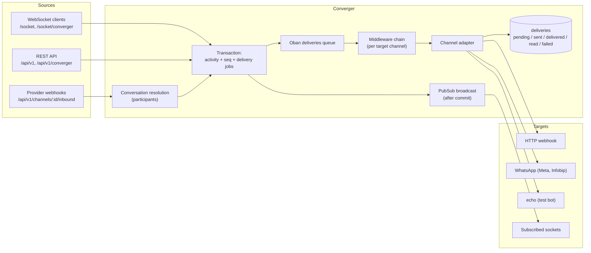

Converger is a self-hosted, multi-tenant **channel hub** written in Elixir on Phoenix, Ecto/Postgres and Oban. It connects communication channels (WebSocket clients, generic HTTP webhooks, WhatsApp through Meta or Infobip, and more to come) to each other. A message that enters through any channel is stored once as an **activity** in a **conversation**, given a strictly increasing per-conversation sequence number, and delivered to every channel that should receive it. Each delivery is tracked, retried and, when retries run out, dead-lettered.

## The model in one paragraph

A **tenant** owns **channels**. Each channel has a type (its adapter: `webhook`, `websocket`, `whatsapp_meta`, `whatsapp_infobip`, `echo`) and a mode (`inbound`, `outbound` or `duplex`). Messages arrive through the REST API, the WebSocket sockets or a channel's inbound webhook. They are written as **activities** in a **conversation** that belongs to one channel. Inbound messages from providers that never send a Converger conversation id are matched to a conversation through the external **participant**, such as a WhatsApp phone number. Each activity gets a `seq` (1, 2, 3, ...) that is allocated under a row lock on the conversation. In the same database transaction Converger enqueues one **delivery** job per target channel: the conversation's own channel, if it can send, plus the targets of any enabled **routing rules**. Each delivery passes through the target channel's **middleware** chain (transformations) and is then handed to the adapter. It ends as `sent`, `delivered` or `read`, or as `failed` once its retries run out.

See [Concepts](concepts/overview.md) for every entity, and [Architecture](architecture/overview.md) for how the processes fit together.

## High-level flow

## Design goals

### WebSocket-first, with its own protocol

WebSocket is meant to be Converger's primary, first-class channel. Two socket stacks exist today:

- `/socket/converger` (`ConvergerSocket`, topic `converger:conversation:<id>`), the client API inspired by Bot Framework Direct Line, authenticated with a Converger token. On join it replays activities after an opaque watermark, and clients send activities on it with `postActivity`. It is the single client socket stack ([#23](https://github.com/AimTune/converger/issues/23)).
- `/socket` (`UserSocket`, topic `conversation:<id>`), authenticated with a conversation token. **Deprecated**: new clients use `/socket/converger`; see [migrating from the legacy surfaces](api/migrating-from-legacy.md).

Both receive the same canonical activity payload as REST (see [ADR-0004](adr/0004-single-canonical-activity-serializer.md)). The direction is to merge them into one documented wire protocol, the Converger Protocol v1 (spec in progress, [#21](https://github.com/AimTune/converger/issues/21), [#63](https://github.com/AimTune/converger/issues/63)). It will be wire-compatible with mekik/1 ([ADR-0024](adr/0024-converger-protocol-v1-as-superset-of-mekik-1.md)) and will add client message ids with server acks, receipts, typing and presence. That work is tracked in the v3.0 epic [#58](https://github.com/AimTune/converger/issues/58). Today the `websocket` channel type is outbound-only and reaches its clients through the PubSub broadcast. Making it a full duplex adapter is Planned ([#22](https://github.com/AimTune/converger/issues/22)).

### Zero data loss

An acknowledged message must never be lost. These mechanisms are in place:

| Mechanism | What it guarantees | Where |
| --- | --- | --- |
| Transactional outbox | The activity row, its `seq` and its Oban delivery jobs commit in **one** database transaction. A crash cannot leave a committed activity without its deliveries. If enqueueing fails, the activity is rolled back and the client gets `503`. | [ADR-0001](adr/0001-transactional-outbox-with-oban.md), [`activities.ex`](https://github.com/AimTune/converger/blob/main/lib/converger/activities.ex) |
| Single delivery path | Every external delivery, whatever its origin (REST, WebSocket, inbound), goes through the pipeline. That means middleware, the adapter and a delivery record. | [ADR-0003](adr/0003-pipeline-is-the-only-delivery-path.md) |
| Idempotency | An `x-idempotency-key` header (REST) or the provider message id (inbound) is unique per conversation. A retried request returns the existing activity instead of creating a second one. Inbound batches are idempotent per message. | [ADR-0015](adr/0015-per-message-idempotent-inbound-batches.md) |
| Per-conversation `seq` | Strict, gap-free ordering that does not depend on clocks, and opaque watermarks for resuming. | [ADR-0006](adr/0006-per-conversation-seq-and-opaque-watermarks.md) |
| Retries with backoff | Per-channel retry policy (`max_attempts`, `backoff`, `base_ms`, `max_ms`, `timeout_ms`). A provider `Retry-After` is honored. Oban Lifeline rescues jobs orphaned by a crashed node. | [ADR-0019](adr/0019-per-channel-retry-policy-delivery-error-and-lifeline.md) |
| Dead letters | A delivery that runs out of attempts, gets a permanent provider error, or is halted by middleware is marked `failed` with `last_error`, and telemetry fires. | [Deliveries](concepts/deliveries.md) |

Broadway (`Converger.Pipeline.Broadway`) and inline (`Converger.Pipeline.Inline`) pipeline backends also exist, for throughput experiments and for tests. Only the default Oban backend is durable ([ADR-0002](adr/0002-broadway-for-throughput-oban-for-retries.md)).

## What Converger is

- A **message router and store** for conversations that span channels, with per-tenant isolation (API keys, channel secrets encrypted at rest, per-tenant rate limits).
- A **delivery tracker**: every outbound message has a delivery record with attempts, errors and provider receipts (`sent`, `delivered`, `read`).
- An **integration surface**: a server-to-server REST API (tenant API key), a client API with short-lived tokens and WebSocket streaming, inbound webhooks for providers, an admin panel (`/admin`) and a tenant portal (`/portal`).
- **Operable**: an Elixir release with separate migrations, Prometheus metrics, OpenTelemetry traces, audit logs and channel health checks.

## What Converger is not

- **Not a bot framework or AI agent runtime.** It carries messages to and from bots. It does not decide what to answer. The `echo` channel is a test helper, not a bot.
- **Not a chat UI.** The admin and portal show transcripts for operators. End-user widgets connect over the WebSocket or REST client API.
- **Not a general-purpose message broker.** Activities are conversation-scoped and stored in Postgres. Kafka and RabbitMQ appear only as optional Broadway producers. Broker channels are Planned ([#42](https://github.com/AimTune/converger/issues/42)).
- **Not finished.** Conditional routing ([#43](https://github.com/AimTune/converger/issues/43)), a dead-letter replay UI ([#32](https://github.com/AimTune/converger/issues/32)), a management API ([#51](https://github.com/AimTune/converger/issues/51)) and the SDKs ([#46](https://github.com/AimTune/converger/issues/46)) are on the [roadmap](roadmap.md).

## Where to go next

- [Getting started](getting-started.md): run Converger with docker compose or locally, and send a first message end to end.
- [Concepts overview](concepts/overview.md): tenants, channels, conversations, participants, activities, deliveries, routing rules and middleware.
- [Architecture overview](architecture/overview.md): processes, supervision, the activity flow and the delivery pipeline.
- [Architecture decision records](adr/index.md): why things are built the way they are.
- [Roadmap](roadmap.md): what is done and what is next.
