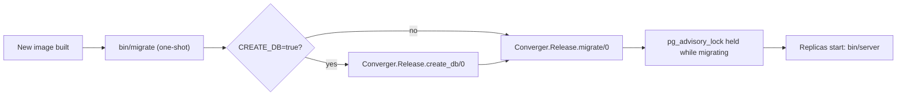

Converger's schema changes are ordinary Ecto migrations in
[`priv/repo/migrations`](https://github.com/AimTune/converger/tree/main/priv/repo/migrations). They run as a
separate deploy step, never from the replicas' start command, and are serialized with a Postgres advisory lock.
This page explains the mechanism, classifies every migration that changes existing data, and shows how to run
them on common platforms. The platform table and the expand/contract rules for writing new migrations are in
[Deployment: Migrations](../deployment.md#migrations); they are summarized, not repeated, here.

## How migrations run



| Piece | What it does |
| --- | --- |
| [`rel/overlays/bin/migrate`](https://github.com/AimTune/converger/blob/main/rel/overlays/bin/migrate) | Runs `bin/converger eval "Converger.Release.create_db()"` when `CREATE_DB=true`, then `exec bin/converger eval "Converger.Release.migrate()"`. Exits when done. |
| [`rel/overlays/bin/server`](https://github.com/AimTune/converger/blob/main/rel/overlays/bin/server) | `PHX_SERVER=true exec bin/converger start`. Does **not** migrate. It is the image's default `CMD`. |
| [`Converger.Release`](https://github.com/AimTune/converger/blob/main/lib/converger/release.ex) | `migrate/0` runs all pending migrations of every repo with `Ecto.Migrator.with_repo/2`; `rollback/2`, `create_db/0`, `seed_admin/0` and `reencrypt_secrets/0` are the other release tasks. |
| `config :converger, Converger.Repo, migration_lock: :pg_advisory_lock` | Every runner takes a session-level Postgres advisory lock (retrying every 1000 ms) instead of locking `schema_migrations`. |

### Why the advisory lock

Two runners can start at the same time, for example when migrations are wired as an init container and a
rolling deploy starts two pods. With the advisory lock the second runner waits for the first, then finds nothing
pending and exits, so each migration is applied exactly once (tested in
`test/converger/release_migration_lock_test.exs`). Unlike the default table lock it also works for
`@disable_ddl_transaction` migrations such as concurrent index builds.

On a brand-new database both runners can race on Ecto's `CREATE TABLE IF NOT EXISTS schema_migrations`, which
happens before the lock is taken. `migrate/0` retries once on `unique_violation` / `duplicate_table`; by then the
table exists and the runner simply waits for the lock.

:::warning
Advisory locks belong to a database session. Run migrations over a direct connection or PgBouncer in **session**
mode. With transaction pooling the lock and the migration may run on different server connections.
:::

### Environment needed by the migrate step

`bin/migrate` boots the release configuration, so in production it needs the same required variables as the
server: `DATABASE_URL`, `SECRET_KEY_BASE` and `CLOAK_KEY` (`config/runtime.exs` refuses to boot otherwise).
`CLOAK_KEY` is also used directly by the channel-secret encryption migration. The connection's role needs DDL
rights on the schema and, for the very first migration, the right to `CREATE EXTENSION` `uuid-ossp` and
`pgcrypto` (on managed Postgres, enable them beforehand if the application role cannot).

## Running migrations

### Docker compose

`docker-compose.yml` defines a one-shot `migrate` service (`command: ["/app/bin/migrate"]`, `CREATE_DB=true`), and
`app` waits for it with `condition: service_completed_successfully`:

```bash
docker compose build
docker compose up -d                 # runs migrate, then app
docker compose run --rm migrate      # run pending migrations again on demand
docker compose logs migrate
```

### Kubernetes

Run the migration as a `Job` with the new image before the `Deployment` rolls (Helm `pre-upgrade` hook, Argo CD
`PreSync` hook, or a CI step that waits for the Job):

```yaml
apiVersion: batch/v1
kind: Job
metadata:
  name: converger-migrate
  annotations:
    helm.sh/hook: pre-install,pre-upgrade
    helm.sh/hook-delete-policy: before-hook-creation
spec:
  backoffLimit: 1
  template:
    spec:
      restartPolicy: Never
      containers:
        - name: migrate
          image: registry.example.com/converger:2f1c9ab   # the NEW image
          command: ["/app/bin/migrate"]
          envFrom:
            - secretRef:
                name: converger-env   # DATABASE_URL, SECRET_KEY_BASE, CLOAK_KEY
```

An init container on the `Deployment` also works thanks to the advisory lock, but it makes every pod start wait
for the migration and couples migration failures to pod crash loops; prefer the Job. Kubernetes manifests are
Planned ([#29](https://github.com/AimTune/converger/issues/29)).

### Other platforms and development

| Where | Command |
| --- | --- |
| Fly.io, Heroku, Render, Railway | release / pre-deploy command `/app/bin/migrate` |
| ECS, Nomad | one-off task with `/app/bin/migrate` before updating the service |
| Development | `mix ecto.migrate` (also part of `mix setup` / `mix ecto.setup`) |
| Tests | `mix test` runs `ecto.create` and `ecto.migrate` first (alias in `mix.exs`) |

### Rolling back

```bash
bin/converger eval 'Converger.Release.rollback(Converger.Repo, 20261009190000)'
```

`rollback/2` migrates down to, and excluding, the given version. Run it with the **new** image (it has the
`down` code), after scaling the new release down, then deploy the old image. Prefer a forward fix; see the
[upgrade and rollback runbook](../deployment.md#upgrade-and-rollback-runbook).

## Rules for zero-downtime migrations

During a rolling deploy old and new code run against the already migrated schema, so each release's migrations
must keep the previous release working. In short (details in
[Deployment](../deployment.md#zero-downtime-schema-changes-expand--contract)):

- **Expand, migrate, contract** across releases: add nullable or constant-default columns and new tables first,
  backfill in batches, and only drop or tighten (`NOT NULL`, renames) one release later.
- Build indexes on large tables with `create index(..., concurrently: true)` in a migration with
  `@disable_ddl_transaction true`.
- Avoid in one deploy: dropping or renaming columns the old code uses, column type changes, unbatched full-table
  `UPDATE`s, non-concurrent indexes on large tables.
- Set a `lock_timeout` in risky migrations so a blocked DDL fails fast instead of queueing traffic behind it.

## Inventory of existing migrations

The baseline migrations from 2026-02 (`20260214...` to `20260228300001`) create the initial schema and include
small data fixes (for example renaming the channel type `standard` to `webhook`). The 2026-10 migrations below are
the ones to classify when upgrading an existing installation.

| Migration | What it does | Rolling deploy? | Reversible |
| --- | --- | --- | --- |
| `20261008100000_encrypt_channel_secrets` | Encrypts `channels.secret` and `channels.config` with Cloak, adds `secret_hash`, drops the plaintext columns | **No, maintenance window** | Yes (`down` decrypts, needs the same key) |
| `20261008100001_hash_tenant_api_keys` | Replaces `tenants.api_key` with a SHA-256 hash, adds rotation columns | **No, maintenance window** | **No** (`down` raises) |
| `20261008120000_add_require_signature_to_channels` | Adds `require_signature` (existing rows `false`, new rows default `true`) | Yes | Yes |
| `20261008130000_create_attachments` | New `attachments` table, nullable `tenants.allowed_upload_types` | Yes | Yes |
| `20261008150000_add_seq_to_activities` | Adds and backfills `activities.seq`, `conversations.last_seq`, unique index | **No, maintenance window** | Yes (drops the columns) |
| `20261009130000_add_limits_to_tenants` | `tenants.limits` with default `{}` | Yes | Yes |
| `20261009131000_upgrade_oban_jobs_to_v14` | Oban schema v12 to v14 | Yes, short locks on `oban_jobs` | Partly (see below) |
| `20261009150000_add_idempotency_key_index_to_activities` | Partial index on `activities.idempotency_key` | Care: non-concurrent on a large table | Yes |
| `20261009150100_create_participants` | New `participants` table, nullable `conversations.participant_id`, index | Care: non-concurrent index on `conversations` | Yes |
| `20261009170000_add_conversation_lifecycle_index` | Moves `conversations.updated_at` forward to the latest activity, adds `(status, updated_at)` index | Care: data update + non-concurrent index | Index only |
| `20261009180000_add_keyset_pagination_indexes` | Five composite `(inserted_at, id)` indexes, concurrently | Yes | Yes |
| `20261009190000_add_retry_policy_to_channels` | `channels.retry_policy` with default `{}` | Yes | Yes |
| `20261009550000_add_must_change_password_to_admin_users` | `admin_users.must_change_password` default `false` | Yes | Yes |
| `20261010300000_add_retention_and_archive_parts` | `tenants.retention_days` (default 365, `CHECK > 0`) and the new `archive_parts` table | Yes | Yes |
| `20261010300100_partition_activities_and_deliveries` | Converts `activities` and `deliveries` into monthly partitioned tables (shadow tables, batched copy, swap), adds `deliveries.tenant_id` and `activity_inserted_at`, drops the foreign keys from and to both tables | **No, maintenance window** (short with the online copy, see below) | **No** (`down` raises) |

Adding a column with a constant default is metadata-only on Postgres 11 and later, which is why the
`require_signature`, `limits`, `retry_policy` and `must_change_password` migrations are safe online.

### Data migrations in detail

#### Encrypt channel secrets (`20261008100000`)

Adds `encrypted_secret`, `encrypted_config` and `secret_hash`, then reads **all** channel rows in one query and
updates them one by one with `Converger.Vault.encrypt_offline!/1` (which works without the vault process, as in
`bin/migrate`). It then drops the plaintext `secret` and `config`, renames the encrypted columns, sets `NOT NULL`
and adds a unique index on `secret_hash`.

- Old code reads plaintext columns that no longer exist, so stop the old release first.
- `CLOAK_KEY` must be the production key at migration time; data encrypted with a wrong key is unreadable later.
  Back the key up before running it.
- The `channels` table is small, so the window is short.
- The unique index on `secret_hash` fails if two channels share a secret. Find them first with
  `SELECT secret, count(*) FROM channels GROUP BY secret HAVING count(*) > 1;` and give one of them a new secret.
- Audit log entries written before this release may still contain plaintext channel secrets (redaction applies
  to new entries). Consider purging or scrubbing old `audit_logs` rows for channels.
- `down` decrypts with the configured keys and restores plaintext columns.

#### Hash tenant API keys (`20261008100001`)

Stores `sha256(api_key)` in `api_key_hash` (Postgres built-in `sha256()`), keeps the first 4 characters in
`api_key_prefix`, drops `api_key` and adds unique and lookup indexes.

- Existing keys keep working: clients send the same key, and the server hashes it.
- Plaintext keys are gone. They can never be displayed again; a tenant that lost its key needs a rotation.
  Migrated keys show only their first 4 characters in the masked display (new keys show `cvg_live_` plus 4).
- Irreversible: `down` raises `Ecto.MigrationError`. Rolling back past it means restoring a backup.
- Old code authenticates against the dropped `api_key` column, so stop the old release first.

#### Add `seq` to activities (`20261008150000`)

In one transaction: adds `conversations.last_seq` (default 0) and a nullable `activities.seq`, numbers every
existing activity per conversation with `row_number() OVER (PARTITION BY conversation_id ORDER BY inserted_at,
id)`, sets each conversation's `last_seq` to its maximum, makes `seq` `NOT NULL` and builds a non-concurrent
unique index on `(conversation_id, seq)`.

- `activities` is rewritten in full and held under `ACCESS EXCLUSIVE` for the whole run. Expect WAL roughly the
  table size and dead tuples; run `VACUUM ANALYZE activities` afterwards.
- Old code inserts activities without `seq` and fails once the migration commits.
- Time it on a restored copy of production before the window. Background:
  [ADR-0006](../adr/0006-per-conversation-seq-and-opaque-watermarks.md).

#### Oban schema v14 (`20261009131000`)

`Oban.Migrations.up(version: 14)`: v13 adds two indexes on `oban_jobs` (`state, cancelled_at` and `state,
discarded_at`), v14 adds the `suspended` value to the `oban_job_state` enum. Oban 2.24 refuses to start until the
schema is at v14, so the new release cannot boot before this has run. The index builds are not concurrent, but the
Pruner keeps `oban_jobs` to about one day of jobs, so the lock is short. `down` goes back to v12: it drops the v13
indexes and moves `suspended` jobs to `scheduled` (Postgres cannot remove an enum value, so the value stays).

#### Conversation lifecycle (`20261009170000`)

The expiration worker now closes conversations by `updated_at`, which is bumped on every new activity. Older rows
were never bumped, so this migration first sets `updated_at` to the latest activity's `inserted_at` where that is
newer (an aggregate over all of `activities` and an update of the affected conversations), then builds a
`(status, updated_at)` index on `conversations` without `CONCURRENTLY`.

- It must run before the new release's hourly `ConversationExpirationWorker`; otherwise conversations with recent
  activity but an old `updated_at` would be closed on the first run. The separate migrate step guarantees this.
- On large installations the aggregate and the non-concurrent index block writes to `conversations` for a while;
  run it in a low-traffic period and time it on a copy first.

#### Indexes that block writes

`20261009150000` (`activities.idempotency_key`, partial) and `20261009150100` (`conversations (participant_id,
status)`) build indexes inside the migration transaction. `CREATE INDEX` without `CONCURRENTLY` takes a `SHARE`
lock: reads continue, but inserts and updates on the table wait until the build finishes. On small and medium
tables this takes seconds; on a large `activities` table schedule it like a maintenance window.

#### Partitioning activities and deliveries (`20261010300100`)

Issue [#30](https://github.com/AimTune/converger/issues/30),
[ADR-0034](../adr/0034-monthly-partitioning-and-per-tenant-retention.md). Converts the plain `activities` and
`deliveries` tables into tables partitioned by month (`activities` by `inserted_at`, `deliveries` by the new
`activity_inserted_at`) in three idempotent, resumable phases (`Converger.Partitions.Conversion`):

1. **Prepare**: creates `activities_part` and `deliveries_part` with monthly partitions from the oldest
   activity's month to 12 months ahead, and row triggers on the legacy tables that mirror every insert, update
   and delete into them. `CREATE TRIGGER` takes a `SHARE ROW EXCLUSIVE` lock for milliseconds (10 s lock
   timeout).
2. **Copy**: copies existing rows in primary-key order, 10,000 per transaction (`SELECT ... FOR SHARE`,
   `INSERT ... ON CONFLICT DO NOTHING`), with its cursor in `partition_conversion_state`. Old code keeps
   working; the triggers keep the copy current.
3. **Swap**: one transaction: `LOCK TABLE activities, deliveries IN ACCESS EXCLUSIVE MODE`, copy what is left,
   compare `count(*)` of legacy and new tables (rolls everything back on a mismatch), drop the triggers and every
   foreign key from or to the legacy tables (including `attachments.activity_id`), rename `activities` to
   `activities_legacy` and `activities_part` to `activities` (same for deliveries, indexes included), create the
   current and next three months' partitions. Empty legacy tables are dropped; populated ones are kept.

**Fresh installations and installations with up to `PARTITION_MAX_INLINE_ROWS` (default 1,000,000) activities**
run all three phases inside `bin/migrate`: an ordinary maintenance-window upgrade (stop the old release, migrate,
start the new one). Time it on a copy: roughly the time to copy both tables plus two `count(*)`.

**Larger installations** must copy online first, otherwise the migration stops with instructions and changes
nothing:

1. While the **old** release is still serving traffic, run the copy with the **new** image (same environment as
   `bin/migrate`):

   ```bash
   bin/converger eval "Converger.Release.prepare_partitioning()"
   ```

   It prints progress per batch and can be interrupted and re-run. Plan for disk space of about the size of both
   tables and their indexes, WAL of the same order (watch replicas and archiving), and a small write overhead from
   the triggers until the swap. Do the maintenance window within 12 months (the shadow partitions created by
   prepare cover that; running prepare again extends them).
2. **Maintenance window**: stop the old release, take a backup or note the PITR point, run `bin/migrate`. The swap
   only copies the rows written since the last copy batch, but the two `count(*)` scan both tables in full: rehearse on a restored copy to
   know how long the window is. Start the new release.
3. After verifying the new tables (row counts, a conversation's history, delivery receipts), drop the legacy
   copies:

   ```bash
   bin/converger eval "Converger.Release.drop_legacy_partition_tables()"
   ```

What changes for operators:

- The partitioned tables have no foreign keys. Deleting a tenant, channel or conversation through the application
  enqueues a `PurgeWorker` job (queue `maintenance`) that deletes their activities and deliveries in batches; a
  raw-SQL `DELETE FROM tenants` no longer removes them (retention eventually archives such orphans).
- Old releases cannot run against the new schema: they insert deliveries without `activity_inserted_at`.
- Rolling back: before the swap, drop the shadow objects (`DROP TABLE activities_part, deliveries_part,
  partition_conversion_state; DROP TRIGGER converger_mirror ON activities; DROP TRIGGER converger_mirror ON
  deliveries;`). After the swap, restore the backup; renaming the `*_legacy` tables back loses everything written
  since the swap and needs the foreign keys recreated by hand.
- Retention, archive and pruning start with this release: see
  [Data retention, partitions and archive](retention.md).

#### Concurrent keyset indexes (`20261009180000`)

Uses `@disable_ddl_transaction true` and `@disable_migration_lock true` with
`create_if_not_exists index(..., concurrently: true)`, so the tables stay writable. If a concurrent build fails
(for example on a deadlock or a cancelled statement), Postgres leaves an `INVALID` index behind and
`create_if_not_exists` will skip it on the next run. Check with:

```sql
SELECT indexrelid::regclass FROM pg_index WHERE NOT indisvalid;
```

Drop any invalid index (`DROP INDEX CONCURRENTLY ...`) and run `bin/migrate` again.

## Upgrading across a maintenance-window migration

1. Read the new migrations and classify them with the table above.
2. Take a backup or note the PITR timestamp; back up `CLOAK_KEY`.
3. Rehearse on a restored copy and time the long migrations.
4. Announce the window and stop the old release (scale to zero or block ingress).
5. Run `bin/migrate` with the **new** image and wait for it to exit successfully.
6. Start the new release, smoke test (admin login, create a conversation, post an activity, receive it over the
   WebSocket), reopen traffic.

The full runbook, including rollback options, is in
[Deployment](../deployment.md#upgrade-and-rollback-runbook). Version-specific notes are in
[Upgrades](upgrades.md).
