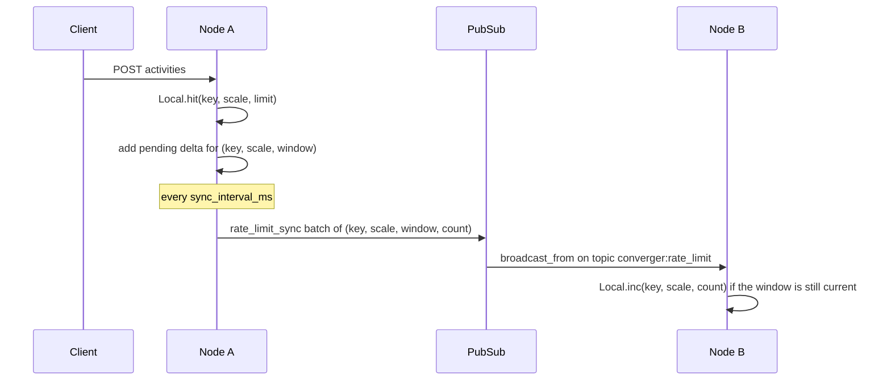

Converger limits the request rate of the endpoints that write data or mint credentials, and locks out repeated
failed logins. Counters are kept in memory (Hammer 7, ETS) on every node and, in a cluster, replicated between
nodes over Phoenix PubSub, so a limit check never costs a database or network round trip. The design and the
alternatives that were rejected (Redis, Postgres counters) are in
[ADR-0013](../adr/0013-cluster-wide-rate-limiting-with-hammer-and-pubsub.md).

## Architecture

| Module | Role |
| --- | --- |
| [`Converger.RateLimit`](https://github.com/AimTune/converger/blob/main/lib/converger/rate_limit.ex) | Public API: `check/3` (count and check), `peek/3` (check without counting), `record/3` (count without checking), limit resolution, telemetry |
| [`Converger.RateLimit.Local`](https://github.com/AimTune/converger/blob/main/lib/converger/rate_limit/local.ex) | `use Hammer, backend: :ets, algorithm: :fix_window`: node-local counters in fixed windows aligned to wall-clock time (`div(now_ms, scale_ms)`) |
| [`Converger.RateLimit.ClusterSync`](https://github.com/AimTune/converger/blob/main/lib/converger/rate_limit/cluster_sync.ex) | Only with the `cluster` backend: batches local increments and broadcasts them to the other nodes |
| [`Converger.RateLimit.Overrides`](https://github.com/AimTune/converger/blob/main/lib/converger/rate_limit/overrides.ex) | ETS cache of per-tenant overrides from `tenants.limits`, invalidated cluster-wide |
| [`Converger.RateLimit.LoginThrottle`](https://github.com/AimTune/converger/blob/main/lib/converger/rate_limit/login_throttle.ex) | Failed-login lockout for `/admin/login` and `/portal/login` |
| [`ConvergerWeb.Plugs.RateLimit`](https://github.com/AimTune/converger/blob/main/lib/converger_web/plugs/rate_limit.ex) | Plug used by the API controllers |
| `Converger.RateLimit.Supervisor` | Starts `Local`, `Overrides` and, for `cluster`, `ClusterSync`; started after `Converger.PubSub` |

### Backends

| Backend | Behaviour | When |
| --- | --- | --- |
| `local` | Counters per node. Exact on one node; behind a load balancer with N nodes a client can get up to N times the limit. | Default without clustering |
| `cluster` | Counters per node plus replication: every `sync_interval_ms` (default 100 ms) each node broadcasts its new increments, and receivers add them to their own counters. | Default when `DNS_CLUSTER_QUERY` is set |



Properties of the `cluster` backend:

- **Eventually consistent.** A burst can overshoot by what the other nodes accept within one sync interval plus
  PubSub latency.
- **Clock dependent.** Windows are derived from each node's wall clock, so keep node clocks NTP-synchronized.
  Deltas for a window that has already ended on the receiving node are dropped.
- **In memory.** A restarted or newly joined node starts with empty counters for the current window and catches up
  with the next syncs.
- **Netsplit.** Nodes that are not connected fall back to per-node limits.

Pending deltas are subtracted rather than deleted after each flush, so increments that arrive during a flush are
kept for the next one.

## Limited endpoints

| Bucket | Default | Counted per | Key | Endpoints | Tenant override |
| --- | --- | --- | --- | --- | --- |
| `activity_create` | 100 per 1 s | tenant | `activity_create:tenant:<tenant_id>` | `POST /api/v1/conversations/:id/activities`, `POST /api/v1/converger/conversations/:id/activities` | yes |
| `upload` | 10 per 1 s | tenant | `upload:tenant:<tenant_id>` | `POST /api/v1/converger/conversations/:id/upload` | yes |
| `inbound` | 500 per 1 s | channel | `inbound:channel:<channel_id>` | `POST /api/v1/channels/:channel_id/inbound`, `POST /api/v1/channels/:channel_id/status` | yes |
| `token_generate` | 10 per 60 s | channel | `token_generate:channel:<channel_id>` | `POST /api/v1/converger/tokens/generate`, `POST /api/v1/converger/tokens/refresh` | yes |
| `token_create` | 10 per 60 s | client IP | `token_create:ip:<ip>` | `POST /api/v1/tokens` (legacy) | no |
| `login_ip` | 5 failures per 60 s | client IP | `login_ip:<ip>` | `POST /admin/login`, `POST /portal/login` | no |
| `login_account` | 5 failures per 60 s | account | `login_account:admin:<email>` or `login_account:tenant:<tenant name>:<email>` (trimmed, lowercased) | `POST /admin/login`, `POST /portal/login` | no |

How the identity is found (`ConvergerWeb.Plugs.RateLimit`):

- `tenant`: `conn.assigns.tenant` (tenant API) or the `tenant_id` claim of the Converger token. The plug runs
  after authentication, so unauthenticated requests are rejected with `401` before they are counted.
- `channel`: `conn.assigns.channel` (channel secret), the `channel_id` claim of the Converger token, or, for the
  inbound endpoints, the `channel_id` path parameter. Inbound requests are counted **before** the signature is
  verified, so a flood of unsigned requests to one channel id is throttled too; the channel's tenant is looked up
  (and cached) to apply its overrides.
- `ip`: `conn.remote_ip` after `ConvergerWeb.Plugs.TrustedProxies`.

:::warning
Behind a reverse proxy, set `TRUSTED_PROXIES`. Otherwise `conn.remote_ip` is the proxy's address, every client
shares one `token_create` and `login_ip` counter, and five failed logins from anyone lock the login form for
everyone for a minute. See [../security.md](../security.md).
:::

Everything else is not rate limited today, including reads (`GET` endpoints, attachment downloads), conversation
creation, routing rule management, WebSocket connects and messages sent over the socket, and the admin password
change form.

## Limit resolution

For each check the `{limit, window_ms}` is taken from the first source that has one:

1. the tenant override in `tenants.limits` (only for `activity_create`, `upload`, `inbound`, `token_generate`);
2. `config :converger, Converger.RateLimit, limits: %{bucket => {limit, window_ms}}`;
3. the `:limit` / `:scale_ms` passed to the plug (ad-hoc limits);
4. the built-in defaults above.

## Per-tenant overrides

`tenants.limits` (JSONB, default `{}`) holds overrides keyed by bucket name:

```json
{
  "activity_create": {"limit": 200, "scale_ms": 1000},
  "inbound": {"limit": 2000, "scale_ms": 1000}
}
```

`Converger.Tenants.Tenant.limits_changeset/2` accepts only the four tenant buckets, positive integer `limit` and
`scale_ms`, and no other keys. There is no admin UI or API for it yet; set it from a remote console on a running
release:

```bash
bin/converger remote
```

```elixir
tenant = Converger.Tenants.get_tenant!("<tenant id>")
Converger.Tenants.update_tenant_limits(tenant, %{"inbound" => %{"limit" => 2000, "scale_ms" => 1000}})
# Pass an actor as the third argument to also write an audit log entry.
```

Overrides are read before the request touches the database, so `Converger.RateLimit.Overrides` caches them in ETS
for `override_cache_ttl_ms` (default 30 s) per node. `update_tenant_limits/3` drops the cached entry locally and
broadcasts an invalidation on the `converger:rate_limit_overrides` topic, so the new limits apply on every node
right away. Passing `%{}` removes all overrides.

## Login throttle and lockout

`Converger.RateLimit.LoginThrottle` protects both login forms:

1. Before the password is checked, `peek/3` looks at the `login_ip` and `login_account` counters. If either has
   reached its limit, the form is re-rendered with `429`, a `retry-after` header and "Too many failed login
   attempts. Try again in N seconds." The password is not verified, so a locked account cannot be brute-forced.
2. Only failed credential checks are counted (`record/3`). A successful login does not reset the counters; a
   deactivated account is not counted.
3. The window is fixed and aligned to the clock: a lockout lasts until the current 60-second window ends.

Anyone who knows an account's email (and, for the portal, tenant name) can trigger its lockout. The one-minute
window bounds that denial of service.

## Responses

A request rejected by the plug gets:

```http
HTTP/1.1 429 Too Many Requests
retry-after: 1
content-type: application/json

{"error": "Too many requests. Please try again later."}
```

`retry-after` is the remaining time of the current window in whole seconds, rounded up, at least 1. No
`X-RateLimit-*` headers are sent. Clients should back off for at least `retry-after` seconds.

Every rejection (including login lockouts) emits `[:converger, :rate_limit, :exceeded]` with measurement
`count: 1` and metadata `bucket`, `key`, `limit`, `scale_ms`, `retry_after_ms`. It is exported to Prometheus as
`converger_rate_limit_exceeded_count{bucket="..."}` (see [Observability](observability.md#exported-metrics)).

## Tuning

| Setting | Where | Default | Notes |
| --- | --- | --- | --- |
| Backend | `RATE_LIMIT_BACKEND` (`local` / `cluster`) | `cluster` if `DNS_CLUSTER_QUERY` is set, else `local` | Invalid values raise at boot. Ignored in test. |
| Sync interval | `RATE_LIMIT_SYNC_INTERVAL_MS` | `100` | Lower values reduce overshoot at the cost of more PubSub messages. |
| Installation-wide limits | `config :converger, Converger.RateLimit, limits: %{...}` | `%{}` | Atom bucket keys, `{limit, window_ms}` values. |
| Override cache TTL | `override_cache_ttl_ms` in the same config | `30_000` | Upper bound for stale overrides if an invalidation is missed. |
| Counter cleanup | `clean_period_ms` in the same config | `60_000` | How often Hammer deletes expired ETS entries. |

Example for `config/runtime.exs`:

```elixir
config :converger, Converger.RateLimit,
  limits: %{
    inbound: {2_000, 1_000},
    activity_create: {300, 1_000},
    login_account: {10, 300_000}
  }
```

Sizing hints:

- `inbound` is per channel: a WhatsApp number receiving a broadcast reply storm needs more than the default
  500/s; raise it for that tenant rather than globally.
- `activity_create` is per tenant and shared by the tenant API and the client API; a busy tenant with many
  widgets may need an override.
- With the `local` backend on N nodes, divide the intended global limit by N.

A Redis-backed or per-channel-configurable limiter is not implemented.
