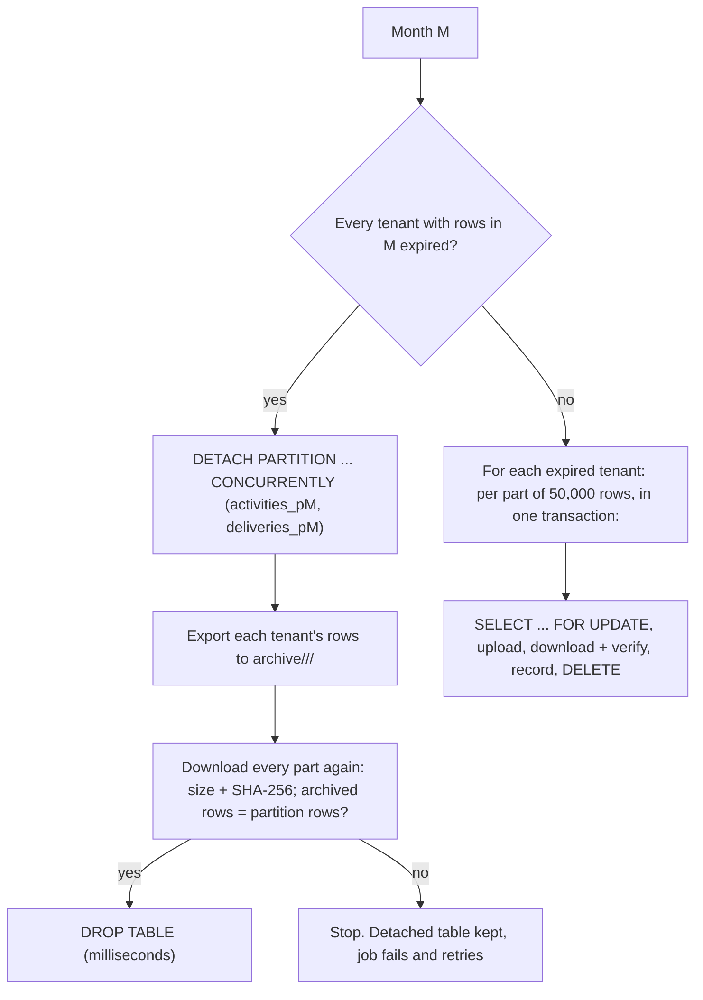

`activities` and `deliveries` grow with traffic, so they are stored in **monthly partitions** and old months are
**archived to object storage and removed** according to each tenant's retention. Smaller operational tables
(`channel_health_checks`, `audit_logs`) are pruned by age. The design and the options that were rejected are in
[ADR-0026](../adr/0026-monthly-partitioning-and-per-tenant-retention.md); the migration that converts an existing
installation is described in [Migrations](migrations.md#partitioning-activities-and-deliveries-20261010300100).

## Monthly partitions

| Table | Partition key | Partition name |
| --- | --- | --- |
| `activities` | `inserted_at` | `activities_pYYYY_MM` |
| `deliveries` | `activity_inserted_at` (the `inserted_at` of the delivery's activity) | `deliveries_pYYYY_MM` |

A partition covers one calendar month in UTC, `[YYYY-MM-01 00:00, first day of next month)`. A delivery always lives
in the same month as its activity, even when it is created weeks later by a retry, so a month of activities and
its deliveries are archived and dropped together.

Partitions are created ahead of time: the current month and the next `PARTITION_MONTHS_AHEAD` months (default 3).
This runs in the migration, once when the application boots, and daily at 00:15 UTC
(`Converger.Workers.PartitionMaintenanceWorker`). There is no `DEFAULT` partition (it would prevent the
non-blocking detach), so an insert into a month without a partition fails: keep at least one future month in
place. To check:

```sql
SELECT inhrelid::regclass FROM pg_inherits
WHERE inhparent = 'activities'::regclass ORDER BY 1 DESC LIMIT 3;
```

Unique indexes that cannot contain the partition key exist on every partition rather than on the parent:
`(conversation_id, seq)` and `(conversation_id, idempotency_key)`. The application keeps them unique across
partitions (the `seq` counter on `conversations`, and an idempotency re-check under the conversation lock); see
the ADR. The partitioned tables have **no foreign keys**: deleting a tenant, channel or conversation enqueues a
`Converger.Workers.PurgeWorker` job in the same transaction that deletes their activities and deliveries in
batches of 5,000 (see [Tenants](../concepts/tenants.md#deleting-a-tenant)).

## Per-tenant retention

Every tenant has `retention_days` (default **365**, editable in the admin tenant form; never below
`RETENTION_MIN_DAYS`, default 30). A row is expired once the whole month it belongs to is older than the tenant's
retention.

`Converger.Workers.RetentionWorker` runs on the 1st of every month at 02:00 UTC on the `maintenance` queue. For
every month that ended at least `RETENTION_MIN_DAYS` ago:



- **Whole month** (the common case, all tenants on the same retention): the partitions are detached with
  `DETACH PARTITION ... CONCURRENTLY`, which waits for transactions that started before it but never blocks reads
  or inserts, archived from the detached tables (which nobody writes any more), verified, and dropped.
- **Some tenants expired** (a tenant with a shorter retention than others in the same month): only that tenant's
  rows are archived and deleted from the live partitions, one verified part per transaction. The partition is
  dropped when the last tenant in it expires. A tenant with a much longer retention than everyone else keeps those
  months' partitions alive, and the others' rows are then deleted row by row: still correct, but slower.
- Rows of tenants that no longer exist count as expired (they are archived too, not silently dropped).

**Nothing is dropped or deleted unless its archive object exists with the recorded size and SHA-256 and the
archived row count equals the partition's row count.** On any failure (storage outage, checksum mismatch) the run
stops with an error, Oban retries it with backoff (up to about a day between attempts, 10 attempts) and the next
run continues where it stopped: a detached month whose archive has not finished is processed first, and parts
already uploaded and recorded are not exported again. While a month is detached its rows are not visible to the
API, exactly as after the drop, but they are still in the database.

Run it now instead of waiting for the 1st (on a running node; the job is unique, so it never runs twice at once):

```bash
bin/converger rpc "Converger.Release.run_retention()"
```

Inspect what has been archived:

```sql
SELECT table_name, month, mode, count(*) AS parts, sum(row_count) AS rows, max(verified_at)
FROM archive_parts GROUP BY 1, 2, 3 ORDER BY 2, 1;
```

### Retention archive

Archived rows are gzip-compressed [JSON Lines](https://jsonlines.org/): one row per line with every column, as
Postgres `row_to_json` writes it (timestamps are UTC without an offset, like the columns).

```text
archive/<tenant_id>/<YYYY-MM>/activities-00001.jsonl.gz
archive/<tenant_id>/<YYYY-MM>/activities-00002.jsonl.gz
archive/<tenant_id>/<YYYY-MM>/deliveries-00001.jsonl.gz
```

Each part holds at most `ARCHIVE_PART_ROWS` rows (default 50,000) in primary-key order; part numbers are
consecutive from 1. Every part is recorded in `archive_parts` with its object key, row count, size, SHA-256 and
mode (`detached` for whole months, `deleted` for per-tenant deletes). The archive is written through the attachment
storage backend ([File storage](../storage.md#retention-archive)): local disk, S3, MinIO, R2, GCS or Azure.

Protect the archive like a backup: enable bucket versioning or object lock, restrict delete permissions, and set
the bucket's own lifecycle rules (for example a move to a colder storage class) as needed. Converger never deletes
archive objects.

### Re-importing an archive

```bash
# every part of one tenant and month (activities, then deliveries)
mix converger.archive.import --tenant 6f1c2a0e-... --month 2025-01
# one object, or a local file downloaded from the bucket
mix converger.archive.import --key archive/6f1c2a0e-.../2025-01/activities-00001.jsonl.gz
mix converger.archive.import --file ./activities-00001.jsonl.gz

# in a release (no Mix)
bin/converger eval 'Converger.Release.import_archive(tenant: "6f1c2a0e-...", month: "2025-01")'
```

The importer creates the month's partitions if they were dropped, checks objects listed in `archive_parts`
against their SHA-256, and inserts with `ON CONFLICT DO NOTHING`, so an import can be repeated. It reads parts 1,
2, ... until one is missing, so it also works against a database restored without `archive_parts`. Re-imported
rows are subject to retention again on the next run: raise the tenant's `retention_days` first if they should stay,
or import into a separate database.

## Pruning other tables

`Converger.Workers.PruneWorker` runs daily at 01:30 UTC and deletes, 10,000 rows per statement:

| Table | Window | Variable |
| --- | --- | --- |
| `channel_health_checks` | 7 days (by `checked_at`) | `HEALTH_CHECK_RETENTION_DAYS` |
| `audit_logs` | 365 days (by `inserted_at`) | `AUDIT_LOG_RETENTION_DAYS` |

`0` disables a window. These rows are not archived; export them first if you need them longer (for example
`COPY (SELECT * FROM audit_logs WHERE inserted_at < ...) TO ...`).

## Configuration

| Variable | Default | Effect |
| --- | --- | --- |
| `RETENTION_MIN_DAYS` | `30` | Platform minimum for `tenants.retention_days`; months younger than this are never touched. |
| `HEALTH_CHECK_RETENTION_DAYS` | `7` | Health check pruning window, `0` disables. |
| `AUDIT_LOG_RETENTION_DAYS` | `365` | Audit log pruning window, `0` disables. |
| `PARTITION_MONTHS_AHEAD` | `3` | Months of future partitions kept in place. |
| `ARCHIVE_BUCKET` / `ARCHIVE_CONTAINER` / `ARCHIVE_DIR` | unset | Archive to a different bucket (S3, MinIO, R2, GCS), Azure container or local directory, with the attachment storage credentials. Unset: the attachment bucket. |
| `ARCHIVE_PREFIX` | `archive` | First path segment of archive keys. |
| `ARCHIVE_PART_ROWS` | `50000` | Rows per archive object. |

The application keys (`config :converger, Converger.Retention`, `Converger.Archive`, `Converger.Partitions`) are
listed in [Configuration](configuration.md#retention-partitions-and-archive). The cron schedule is in `config/config.exs`
(`Oban.Plugins.Cron`).

## Monitoring

- Oban jobs: a `Converger.Workers.RetentionWorker` in `retryable` or `discarded` (Oban dashboard, `/admin/oban`)
  means a month could not be archived; its error says why (`upload_failed`, `checksum_mismatch`,
  `archive_incomplete`).
- Detached months waiting for their archive:

  ```sql
  SELECT relname FROM pg_class c
  WHERE relkind = 'r' AND relname ~ '^(activities|deliveries)_p[0-9]{4}_[0-9]{2}$'
    AND NOT EXISTS (SELECT 1 FROM pg_inherits i WHERE i.inhrelid = c.oid);
  ```

- Telemetry: `[:converger, :archive, :part]` with `rows` and `bytes` per uploaded part.

To make a detached month visible again instead of archiving it (for example after raising a tenant's retention),
re-attach it: `ALTER TABLE activities ATTACH PARTITION activities_p2025_01 FOR VALUES FROM ('2025-01-01') TO
('2025-02-01');` (same for `deliveries`).
